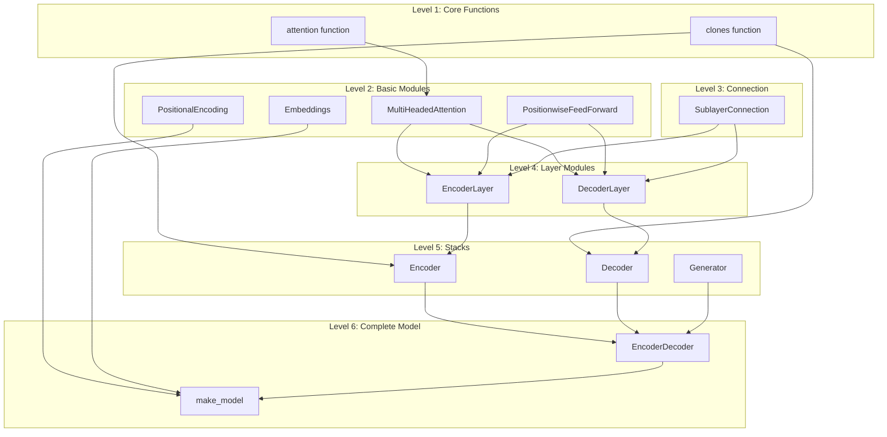

# Simple 2x2 example


<!-- WARNING: THIS FILE WAS AUTOGENERATED! DO NOT EDIT! -->

## Imports

https://arxiv.org/pdf/1706.03762

I will be doing an implementation of the seminal paper “Attention Is All
You Need.”

# -*- coding: utf-8 -*-

# —

# jupyter:

# jupytext:

# formats: ipynb,py:percent

# text_representation:

# extension: .py

# format_name: percent

# format_version: ‘1.3’

# jupytext_version: 1.13.0

# kernelspec:

# display_name: Python 3 (ipykernel)

# language: python

# name: python3

# —

# %% \[markdown\] id=“SX7UC-8jTsp7” tags=\[\]

# 

\#
<center>

<h1>

The Annotated Transformer
</h1>

</center>

# 

# 

\#
<center>

\#
<p>

<a href="https://arxiv.org/abs/1706.03762">Attention is All You Need \#
</a>
</p>

\#
</center>

# 

# 

# 

# \* \*v2022: Austin Huang, Suraj Subramanian, Jonathan Sum, Khalid Almubarak,

# and Stella Biderman.\*

# \* \*[Original](https://nlp.seas.harvard.edu/2018/04/03/attention.html):

# [Sasha Rush](http://rush-nlp.com/).\*

# 

# 

# The Transformer has been on a lot of

# people’s minds over the last <s>year</s> five years.

# This post presents an annotated version of the paper in the

# form of a line-by-line implementation. It reorders and deletes

# some sections from the original paper and adds comments

# throughout. This document itself is a working notebook, and should

# be a completely usable implementation.

# Code is available

# [here](https://github.com/harvardnlp/annotated-transformer/).

# 

# %% \[markdown\] id=“RSntDwKhTsp-”

\#
<h3>

Table of Contents
</h3>

\#
<ul>

\#
<li>

<a href="#prelims">Prelims</a>
</li>

\#
<li>

<a href="#background">Background</a>
</li>

\#
<li>

<a href="#part-1-model-architecture">Part 1: Model Architecture</a>
</li>

\#
<li>

<a href="#model-architecture">Model Architecture</a>
<ul>

\#
<li>

<a href="#encoder-and-decoder-stacks">Encoder and Decoder Stacks</a>
</li>

\#
<li>

<a href="#position-wise-feed-forward-networks">Position-wise
Feed-Forward \# Networks</a>
</li>

\#
<li>

<a href="#embeddings-and-softmax">Embeddings and Softmax</a>
</li>

\#
<li>

<a href="#positional-encoding">Positional Encoding</a>
</li>

\#
<li>

<a href="#full-model">Full Model</a>
</li>

\#
<li>

<a href="#inference">Inference:</a>
</li>

\#
</ul>

</li>

\#
<li>

<a href="#part-2-model-training">Part 2: Model Training</a>
</li>

\#
<li>

<a href="#training">Training</a>
<ul>

\#
<li>

<a href="#batches-and-masking">Batches and Masking</a>
</li>

\#
<li>

<a href="#training-loop">Training Loop</a>
</li>

\#
<li>

<a href="#training-data-and-batching">Training Data and Batching</a>
</li>

\#
<li>

<a href="#hardware-and-schedule">Hardware and Schedule</a>
</li>

\#
<li>

<a href="#optimizer">Optimizer</a>
</li>

\#
<li>

<a href="#regularization">Regularization</a>
</li>

\#
</ul>

</li>

\#
<li>

<a href="#a-first-example">A First Example</a>
<ul>

\#
<li>

<a href="#synthetic-data">Synthetic Data</a>
</li>

\#
<li>

<a href="#loss-computation">Loss Computation</a>
</li>

\#
<li>

<a href="#greedy-decoding">Greedy Decoding</a>
</li>

\#
</ul>

</li>

\#
<li>

<a href="#part-3-a-real-world-example">Part 3: A Real World Example</a>
\#
<ul>

\#
<li>

<a href="#data-loading">Data Loading</a>
</li>

\#
<li>

<a href="#iterators">Iterators</a>
</li>

\#
<li>

<a href="#training-the-system">Training the System</a>
</li>

\#
</ul>

</li>

\#
<li>

<a href="#additional-components-bpe-search-averaging">Additional \#
Components: BPE, Search, Averaging</a>
</li>

\#
<li>

<a href="#results">Results</a>
<ul>

\#
<li>

<a href="#attention-visualization">Attention Visualization</a>
</li>

\#
<li>

<a href="#encoder-self-attention">Encoder Self Attention</a>
</li>

\#
<li>

<a href="#decoder-self-attention">Decoder Self Attention</a>
</li>

\#
<li>

<a href="#decoder-src-attention">Decoder Src Attention</a>
</li>

\#
</ul>

</li>

\#
<li>

<a href="#conclusion">Conclusion</a>
</li>

\#
</ul>

# %% \[markdown\] id=“BhmOhn9lTsp8”

# \# Prelims

# 

# <a href="#background">Skip</a>

# %% id=“NwClcbH6Tsp8”

# \# !pip install -r requirements.txt

# %% id=“NwClcbH6Tsp8”

# \# Uncomment for colab

# 

# \# !pip install -q torchdata==0.3.0 torchtext==0.12 spacy==3.2 altair GPUtil

# \# !python -m spacy download de_core_news_sm

# \# !python -m spacy download en_core_web_sm

# %% id=“v1-1MX6oTsp9”

import os from os.path import exists import torch import torch.nn as nn
from torch.nn.functional import log_softmax, pad import math import copy
import time from torch.optim.lr_scheduler import LambdaLR import pandas
as pd import altair as alt from torchtext.data.functional import
to_map_style_dataset from torch.utils.data import DataLoader from
torchtext.vocab import build_vocab_from_iterator import
torchtext.datasets as datasets import spacy import GPUtil import
warnings from torch.utils.data.distributed import DistributedSampler
import torch.distributed as dist import torch.multiprocessing as mp from
torch.nn.parallel import DistributedDataParallel as DDP

# Set to False to skip notebook execution (e.g. for debugging)

warnings.filterwarnings(“ignore”) RUN_EXAMPLES = True

# %%

# Some convenience helper functions used throughout the notebook

def is_interactive_notebook(): return **name** == “**main**”

def show_example(fn, args=\[\]): if **name** == “**main**” and
RUN_EXAMPLES: return fn(\*args)

def execute_example(fn, args=\[\]): if **name** == “**main**” and
RUN_EXAMPLES: fn(\*args)

class DummyOptimizer(torch.optim.Optimizer): def **init**(self):
self.param_groups = \[{“lr”: 0}\] None

    def step(self):
        None

    def zero_grad(self, set_to_none=False):
        None

class DummyScheduler: def step(self): None

# %% \[markdown\] id=“jx49WRyfTsp-”

# \> My comments are blockquoted. The main text is all from the paper itself.

# %% \[markdown\] id=“7phVeWghTsp\_”

# \# Background

# %% \[markdown\] id=“83ZDS91dTsqA”

# 

# The goal of reducing sequential computation also forms the

# foundation of the Extended Neural GPU, ByteNet and ConvS2S, all of

# which use convolutional neural networks as basic building block,

# computing hidden representations in parallel for all input and

# output positions. In these models, the number of operations required

# to relate signals from two arbitrary input or output positions grows

# in the distance between positions, linearly for ConvS2S and

# logarithmically for ByteNet. This makes it more difficult to learn

# dependencies between distant positions. In the Transformer this is

# reduced to a constant number of operations, albeit at the cost of

# reduced effective resolution due to averaging attention-weighted

# positions, an effect we counteract with Multi-Head Attention.

# 

# Self-attention, sometimes called intra-attention is an attention

# mechanism relating different positions of a single sequence in order

# to compute a representation of the sequence. Self-attention has been

# used successfully in a variety of tasks including reading

# comprehension, abstractive summarization, textual entailment and

# learning task-independent sentence representations. End-to-end

# memory networks are based on a recurrent attention mechanism instead

# of sequencealigned recurrence and have been shown to perform well on

# simple-language question answering and language modeling tasks.

# 

# To the best of our knowledge, however, the Transformer is the first

# transduction model relying entirely on self-attention to compute

# representations of its input and output without using sequence

# aligned RNNs or convolution.

# %% \[markdown\]

# \# Part 1: Model Architecture

# %% \[markdown\] id=“pFrPajezTsqB”

# \# Model Architecture

# %% \[markdown\] id=“ReuU_h-fTsqB”

# 

# Most competitive neural sequence transduction models have an

# encoder-decoder structure

# [(cite)](https://arxiv.org/abs/1409.0473). Here, the encoder maps an

# input sequence of symbol representations (*x*<sub>1</sub>, ..., *x*<sub>*n*</sub>) to a

# sequence of continuous representations $\mathbf{z} = (z_1, ...,
# z_n)$. Given **z**, the decoder then generates an output

# sequence (*y*<sub>1</sub>, ..., *y*<sub>*m*</sub>) of symbols one element at a time. At each

# step the model is auto-regressive

# [(cite)](https://arxiv.org/abs/1308.0850), consuming the previously

# generated symbols as additional input when generating the next.

# %% id=“k0XGXhzRTsqB”

class EncoderDecoder(nn.Module): ““” A standard Encoder-Decoder
architecture. Base for this and many other models. ““”

    def __init__(self, encoder, decoder, src_embed, tgt_embed, generator):
        super(EncoderDecoder, self).__init__()
        self.encoder = encoder
        self.decoder = decoder
        self.src_embed = src_embed
        self.tgt_embed = tgt_embed
        self.generator = generator

    def forward(self, src, tgt, src_mask, tgt_mask):
        "Take in and process masked src and target sequences."
        return self.decode(self.encode(src, src_mask), src_mask, tgt, tgt_mask)

    def encode(self, src, src_mask):
        return self.encoder(self.src_embed(src), src_mask)

    def decode(self, memory, src_mask, tgt, tgt_mask):
        return self.decoder(self.tgt_embed(tgt), memory, src_mask, tgt_mask)

# %% id=“NKGoH2RsTsqC”

class Generator(nn.Module): “Define standard linear + softmax generation
step.”

    def __init__(self, d_model, vocab):
        super(Generator, self).__init__()
        self.proj = nn.Linear(d_model, vocab)

    def forward(self, x):
        return log_softmax(self.proj(x), dim=-1)

# %% \[markdown\] id=“mOoEnF_jTsqC”

# 

# The Transformer follows this overall architecture using stacked

# self-attention and point-wise, fully connected layers for both the

# encoder and decoder, shown in the left and right halves of Figure 1,

# respectively.

# %% \[markdown\] id=“oredWloYTsqC”

# 

# %% \[markdown\] id=“bh092NZBTsqD”

# \## Encoder and Decoder Stacks

# 

# \### Encoder

# 

# The encoder is composed of a stack of *N* = 6 identical layers.

# %% id=“2gxTApUYTsqD”

def clones(module, N): “Produce N identical layers.” return
nn.ModuleList(\[copy.deepcopy(module) for \_ in range(N)\])

# %% id=“xqVTz9MkTsqD”

class Encoder(nn.Module): “Core encoder is a stack of N layers”

    def __init__(self, layer, N):
        super(Encoder, self).__init__()
        self.layers = clones(layer, N)
        self.norm = LayerNorm(layer.size)

    def forward(self, x, mask):
        "Pass the input (and mask) through each layer in turn."
        for layer in self.layers:
            x = layer(x, mask)
        return self.norm(x)

# %% \[markdown\] id=“GjAKgjGwTsqD”

# 

# We employ a residual connection

# [(cite)](https://arxiv.org/abs/1512.03385) around each of the two

# sub-layers, followed by layer normalization

# [(cite)](https://arxiv.org/abs/1607.06450).

# %% id=“3jKa_prZTsqE”

class LayerNorm(nn.Module): “Construct a layernorm module (See citation
for details).”

    def __init__(self, features, eps=1e-6):
        super(LayerNorm, self).__init__()
        self.a_2 = nn.Parameter(torch.ones(features))
        self.b_2 = nn.Parameter(torch.zeros(features))
        self.eps = eps

    def forward(self, x):
        mean = x.mean(-1, keepdim=True)
        std = x.std(-1, keepdim=True)
        return self.a_2 * (x - mean) / (std + self.eps) + self.b_2

# %% \[markdown\] id=“nXSJ3QYmTsqE”

# 

# That is, the output of each sub-layer is $\mathrm{LayerNorm}(x +
# \mathrm{Sublayer}(x))$, where Sublayer(*x*) is the function

# implemented by the sub-layer itself. We apply dropout

# [(cite)](http://jmlr.org/papers/v15/srivastava14a.html) to the

# output of each sub-layer, before it is added to the sub-layer input

# and normalized.

# 

# To facilitate these residual connections, all sub-layers in the

# model, as well as the embedding layers, produce outputs of dimension

# *d*<sub>model</sub> = 512.

# %% id=“U1P7zI0eTsqE”

class SublayerConnection(nn.Module): ““” A residual connection followed
by a layer norm. Note for code simplicity the norm is first as opposed
to last. ““”

    def __init__(self, size, dropout):
        super(SublayerConnection, self).__init__()
        self.norm = LayerNorm(size)
        self.dropout = nn.Dropout(dropout)

    def forward(self, x, sublayer):
        "Apply residual connection to any sublayer with the same size."
        return x + self.dropout(sublayer(self.norm(x)))

# %% \[markdown\] id=“ML6oDlEqTsqE”

# 

# Each layer has two sub-layers. The first is a multi-head

# self-attention mechanism, and the second is a simple, position-wise

# fully connected feed-forward network.

# %% id=“qYkUFr6GTsqE”

class EncoderLayer(nn.Module): “Encoder is made up of self-attn and feed
forward (defined below)”

    def __init__(self, size, self_attn, feed_forward, dropout):
        super(EncoderLayer, self).__init__()
        self.self_attn = self_attn
        self.feed_forward = feed_forward
        self.sublayer = clones(SublayerConnection(size, dropout), 2)
        self.size = size

    def forward(self, x, mask):
        "Follow Figure 1 (left) for connections."
        x = self.sublayer[0](x, lambda x: self.self_attn(x, x, x, mask))
        return self.sublayer[1](x, self.feed_forward)

# %% \[markdown\] id=“7ecOQIhkTsqF”

# \### Decoder

# 

# The decoder is also composed of a stack of *N* = 6 identical layers.

# 

# %%

class Decoder(nn.Module): “Generic N layer decoder with masking.”

    def __init__(self, layer, N):
        super(Decoder, self).__init__()
        self.layers = clones(layer, N)
        self.norm = LayerNorm(layer.size)

    def forward(self, x, memory, src_mask, tgt_mask):
        for layer in self.layers:
            x = layer(x, memory, src_mask, tgt_mask)
        return self.norm(x)

# %% \[markdown\] id=“dXlCB12pTsqF”

# 

# In addition to the two sub-layers in each encoder layer, the decoder

# inserts a third sub-layer, which performs multi-head attention over

# the output of the encoder stack. Similar to the encoder, we employ

# residual connections around each of the sub-layers, followed by

# layer normalization.

# %% id=“M2hA1xFQTsqF”

class DecoderLayer(nn.Module): “Decoder is made of self-attn, src-attn,
and feed forward (defined below)”

    def __init__(self, size, self_attn, src_attn, feed_forward, dropout):
        super(DecoderLayer, self).__init__()
        self.size = size
        self.self_attn = self_attn
        self.src_attn = src_attn
        self.feed_forward = feed_forward
        self.sublayer = clones(SublayerConnection(size, dropout), 3)

    def forward(self, x, memory, src_mask, tgt_mask):
        "Follow Figure 1 (right) for connections."
        m = memory
        x = self.sublayer[0](x, lambda x: self.self_attn(x, x, x, tgt_mask))
        x = self.sublayer[1](x, lambda x: self.src_attn(x, m, m, src_mask))
        return self.sublayer[2](x, self.feed_forward)

# %% \[markdown\] id=“FZz5rLl4TsqF”

# 

# We also modify the self-attention sub-layer in the decoder stack to

# prevent positions from attending to subsequent positions. This

# masking, combined with fact that the output embeddings are offset by

# one position, ensures that the predictions for position *i* can

# depend only on the known outputs at positions less than *i*.

# %% id=“QN98O2l3TsqF”

def subsequent_mask(size): “Mask out subsequent positions.” attn_shape =
(1, size, size) subsequent_mask = torch.triu(torch.ones(attn_shape),
diagonal=1).type( torch.uint8 ) return subsequent_mask == 0

# %% \[markdown\] id=“Vg_f_w-PTsqG”

# 

# \> Below the attention mask shows the position each tgt word (row) is

# \> allowed to look at (column). Words are blocked for attending to

# \> future words during training.

# %% id=“ht_FtgYAokC4”

def example_mask(): LS_data = pd.concat( \[ pd.DataFrame( { “Subsequent
Mask”: subsequent_mask(20)\[0\]\[x, y\].flatten(), “Window”: y,
“Masking”: x, } ) for y in range(20) for x in range(20) \] )

    return (
        alt.Chart(LS_data)
        .mark_rect()
        .properties(height=250, width=250)
        .encode(
            alt.X("Window:O"),
            alt.Y("Masking:O"),
            alt.Color("Subsequent Mask:Q", scale=alt.Scale(scheme="viridis")),
        )
        .interactive()
    )

show_example(example_mask)

# %% \[markdown\] id=“Qto_yg7BTsqG”

# \### Attention

# 

# An attention function can be described as mapping a query and a set

# of key-value pairs to an output, where the query, keys, values, and

# output are all vectors. The output is computed as a weighted sum of

# the values, where the weight assigned to each value is computed by a

# compatibility function of the query with the corresponding key.

# 

# We call our particular attention “Scaled Dot-Product Attention”.

# The input consists of queries and keys of dimension *d*<sub>*k*</sub>, and

# values of dimension *d*<sub>*v*</sub>. We compute the dot products of the query

# with all keys, divide each by $\sqrt{d_k}$, and apply a softmax

# function to obtain the weights on the values.

# 

# 

# 

# 

# %% \[markdown\] id=“EYJLWk6cTsqG”

# 

# In practice, we compute the attention function on a set of queries

# simultaneously, packed together into a matrix *Q*. The keys and

# values are also packed together into matrices *K* and *V*. We

# compute the matrix of outputs as:

# 

# 
$$
#    \mathrm{Attention}(Q, K, V) = \mathrm{softmax}(\frac{QK^T}{\sqrt{d_k}})V
# $$

# %% id=“qsoVxS5yTsqG”

def attention(query, key, value, mask=None, dropout=None): “Compute
‘Scaled Dot Product Attention’” d_k = query.size(-1) scores =
torch.matmul(query, key.transpose(-2, -1)) / math.sqrt(d_k) if mask is
not None: scores = scores.masked_fill(mask == 0, -1e9) p_attn =
scores.softmax(dim=-1) if dropout is not None: p_attn = dropout(p_attn)
return torch.matmul(p_attn, value), p_attn

# %% \[markdown\] id=“jUkpwu8kTsqG”

# 

# The two most commonly used attention functions are additive

# attention [(cite)](https://arxiv.org/abs/1409.0473), and dot-product

# (multiplicative) attention. Dot-product attention is identical to

# our algorithm, except for the scaling factor of

# $\frac{1}{\sqrt{d_k}}$. Additive attention computes the

# compatibility function using a feed-forward network with a single

# hidden layer. While the two are similar in theoretical complexity,

# dot-product attention is much faster and more space-efficient in

# practice, since it can be implemented using highly optimized matrix

# multiplication code.

# 

# 

# While for small values of *d*<sub>*k*</sub> the two mechanisms perform

# similarly, additive attention outperforms dot product attention

# without scaling for larger values of *d*<sub>*k*</sub>

# [(cite)](https://arxiv.org/abs/1703.03906). We suspect that for

# large values of *d*<sub>*k*</sub>, the dot products grow large in magnitude,

# pushing the softmax function into regions where it has extremely

# small gradients (To illustrate why the dot products get large,

# assume that the components of *q* and *k* are independent random

# variables with mean 0 and variance 1. Then their dot product,

# $q \cdot k = \sum\_{i=1}^{d_k} q_ik_i$, has mean 0 and variance

# *d*<sub>*k*</sub>.). To counteract this effect, we scale the dot products by

# $\frac{1}{\sqrt{d_k}}$.

# 

# 

# %% \[markdown\] id=“bS1FszhVTsqG”

# 

# %% \[markdown\] id=“TNtVyZ-pTsqH”

# 

# Multi-head attention allows the model to jointly attend to

# information from different representation subspaces at different

# positions. With a single attention head, averaging inhibits this.

# 

# 
$$
# \mathrm{MultiHead}(Q, K, V) =
#     \mathrm{Concat}(\mathrm{head_1}, ..., \mathrm{head_h})W^O \\
#     \text{where}~\mathrm{head_i} = \mathrm{Attention}(QW^Q_i, KW^K_i, VW^V_i)
# $$

# 

# Where the projections are parameter matrices $W^Q_i \in
# \mathbb{R}^{d\_{\text{model}} \times d_k}$, $W^K_i \in
# \mathbb{R}^{d\_{\text{model}} \times d_k}$, $W^V_i \in
# \mathbb{R}^{d\_{\text{model}} \times d_v}$ and $W^O \in
# \mathbb{R}^{hd_v \times d\_{\text{model}}}$.

# 

# In this work we employ *h* = 8 parallel attention layers, or

# heads. For each of these we use *d*<sub>*k*</sub> = *d*<sub>*v*</sub> = *d*<sub>model</sub>/*h* = 64. Due

# to the reduced dimension of each head, the total computational cost

# is similar to that of single-head attention with full

# dimensionality.

# %% id=“D2LBMKCQTsqH”

class MultiHeadedAttention(nn.Module): def **init**(self, h, d_model,
dropout=0.1): “Take in model size and number of heads.”
super(MultiHeadedAttention, self).\_\_init\_\_() assert d_model % h == 0
\# We assume d_v always equals d_k self.d_k = d_model // h self.h = h
self.linears = clones(nn.Linear(d_model, d_model), 4) self.attn = None
self.dropout = nn.Dropout(p=dropout)

    def forward(self, query, key, value, mask=None):
        "Implements Figure 2"
        if mask is not None:
            # Same mask applied to all h heads.
            mask = mask.unsqueeze(1)
        nbatches = query.size(0)

        # 1) Do all the linear projections in batch from d_model => h x d_k
        query, key, value = [
            lin(x).view(nbatches, -1, self.h, self.d_k).transpose(1, 2)
            for lin, x in zip(self.linears, (query, key, value))
        ]

        # 2) Apply attention on all the projected vectors in batch.
        x, self.attn = attention(
            query, key, value, mask=mask, dropout=self.dropout
        )

        # 3) "Concat" using a view and apply a final linear.
        x = (
            x.transpose(1, 2)
            .contiguous()
            .view(nbatches, -1, self.h * self.d_k)
        )
        del query
        del key
        del value
        return self.linears[-1](x)

# %% \[markdown\] id=“EDRba3J3TsqH”

# \### Applications of Attention in our Model

# 

# The Transformer uses multi-head attention in three different ways:

# 1) In “encoder-decoder attention” layers, the queries come from the

# previous decoder layer, and the memory keys and values come from the

# output of the encoder. This allows every position in the decoder to

# attend over all positions in the input sequence. This mimics the

# typical encoder-decoder attention mechanisms in sequence-to-sequence

# models such as [(cite)](https://arxiv.org/abs/1609.08144).

# 

# 

# 2) The encoder contains self-attention layers. In a self-attention

# layer all of the keys, values and queries come from the same place,

# in this case, the output of the previous layer in the encoder. Each

# position in the encoder can attend to all positions in the previous

# layer of the encoder.

# 

# 

# 3) Similarly, self-attention layers in the decoder allow each

# position in the decoder to attend to all positions in the decoder up

# to and including that position. We need to prevent leftward

# information flow in the decoder to preserve the auto-regressive

# property. We implement this inside of scaled dot-product attention

# by masking out (setting to −∞) all values in the input of the

# softmax which correspond to illegal connections.

# %% \[markdown\] id=“M-en97_GTsqH”

# \## Position-wise Feed-Forward Networks

# 

# In addition to attention sub-layers, each of the layers in our

# encoder and decoder contains a fully connected feed-forward network,

# which is applied to each position separately and identically. This

# consists of two linear transformations with a ReLU activation in

# between.

# 

# 
FFN(*x*) = max (0, *x**W*<sub>1</sub> + *b*<sub>1</sub>)*W*<sub>2</sub> + *b*<sub>2</sub>

# 

# While the linear transformations are the same across different

# positions, they use different parameters from layer to

# layer. Another way of describing this is as two convolutions with

# kernel size 1. The dimensionality of input and output is

# *d*<sub>model</sub> = 512, and the inner-layer has dimensionality

# *d*<sub>*f**f*</sub> = 2048.

# %% id=“6HHCemCxTsqH”

class PositionwiseFeedForward(nn.Module): “Implements FFN equation.”

    def __init__(self, d_model, d_ff, dropout=0.1):
        super(PositionwiseFeedForward, self).__init__()
        self.w_1 = nn.Linear(d_model, d_ff)
        self.w_2 = nn.Linear(d_ff, d_model)
        self.dropout = nn.Dropout(dropout)

    def forward(self, x):
        return self.w_2(self.dropout(self.w_1(x).relu()))

# %% \[markdown\] id=“dR1YM520TsqH”

# \## Embeddings and Softmax

# 

# Similarly to other sequence transduction models, we use learned

# embeddings to convert the input tokens and output tokens to vectors

# of dimension *d*<sub>model</sub>. We also use the usual learned

# linear transformation and softmax function to convert the decoder

# output to predicted next-token probabilities. In our model, we

# share the same weight matrix between the two embedding layers and

# the pre-softmax linear transformation, similar to

# [(cite)](https://arxiv.org/abs/1608.05859). In the embedding layers,

# we multiply those weights by $\sqrt{d\_{\text{model}}}$.

# %% id=“pyrChq9qTsqH”

class Embeddings(nn.Module): def **init**(self, d_model, vocab):
super(Embeddings, self).\_\_init\_\_() self.lut = nn.Embedding(vocab,
d_model) self.d_model = d_model

    def forward(self, x):
        return self.lut(x) * math.sqrt(self.d_model)

# %% \[markdown\] id=“vOkdui-cTsqH”

# \## Positional Encoding

# 

# Since our model contains no recurrence and no convolution, in order

# for the model to make use of the order of the sequence, we must

# inject some information about the relative or absolute position of

# the tokens in the sequence. To this end, we add “positional

# encodings” to the input embeddings at the bottoms of the encoder and

# decoder stacks. The positional encodings have the same dimension

# *d*<sub>model</sub> as the embeddings, so that the two can be summed.

# There are many choices of positional encodings, learned and fixed

# [(cite)](https://arxiv.org/pdf/1705.03122.pdf).

# 

# In this work, we use sine and cosine functions of different frequencies:

# 

# 
*P**E*<sub>(*p**o**s*, 2*i*)</sub> = sin (*p**o**s*/10000<sup>2*i*/*d*<sub>model</sub></sup>)

# 

# 
*P**E*<sub>(*p**o**s*, 2*i* + 1)</sub> = cos (*p**o**s*/10000<sup>2*i*/*d*<sub>model</sub></sup>)

# 

# where *p**o**s* is the position and *i* is the dimension. That is, each

# dimension of the positional encoding corresponds to a sinusoid. The

# wavelengths form a geometric progression from 2*π* to $10000 \cdot
# 2\pi$. We chose this function because we hypothesized it would

# allow the model to easily learn to attend by relative positions,

# since for any fixed offset *k*, *P**E*<sub>*p**o**s* + *k*</sub> can be represented as a

# linear function of *P**E*<sub>*p**o**s*</sub>.

# 

# In addition, we apply dropout to the sums of the embeddings and the

# positional encodings in both the encoder and decoder stacks. For

# the base model, we use a rate of *P*<sub>*d**r**o**p*</sub> = 0.1.

# 

# 

# %% id=“zaHGD4yJTsqH”

class PositionalEncoding(nn.Module): “Implement the PE function.”

    def __init__(self, d_model, dropout, max_len=5000):
        super(PositionalEncoding, self).__init__()
        self.dropout = nn.Dropout(p=dropout)

        # Compute the positional encodings once in log space.
        pe = torch.zeros(max_len, d_model)
        position = torch.arange(0, max_len).unsqueeze(1)
        div_term = torch.exp(
            torch.arange(0, d_model, 2) * -(math.log(10000.0) / d_model)
        )
        pe[:, 0::2] = torch.sin(position * div_term)
        pe[:, 1::2] = torch.cos(position * div_term)
        pe = pe.unsqueeze(0)
        self.register_buffer("pe", pe)

    def forward(self, x):
        x = x + self.pe[:, : x.size(1)].requires_grad_(False)
        return self.dropout(x)

# %% \[markdown\] id=“EfHacTJLTsqH”

# 

# \> Below the positional encoding will add in a sine wave based on

# \> position. The frequency and offset of the wave is different for

# \> each dimension.

# %% id=“rnvHk_1QokC6” type=“example”

def example_positional(): pe = PositionalEncoding(20, 0) y =
pe.forward(torch.zeros(1, 100, 20))

    data = pd.concat(
        [
            pd.DataFrame(
                {
                    "embedding": y[0, :, dim],
                    "dimension": dim,
                    "position": list(range(100)),
                }
            )
            for dim in [4, 5, 6, 7]
        ]
    )

    return (
        alt.Chart(data)
        .mark_line()
        .properties(width=800)
        .encode(x="position", y="embedding", color="dimension:N")
        .interactive()
    )

show_example(example_positional)

# %% \[markdown\] id=“g8rZNCrzTsqI”

# 

# We also experimented with using learned positional embeddings

# [(cite)](https://arxiv.org/pdf/1705.03122.pdf) instead, and found

# that the two versions produced nearly identical results. We chose

# the sinusoidal version because it may allow the model to extrapolate

# to sequence lengths longer than the ones encountered during

# training.

# %% \[markdown\] id=“iwNKCzlyTsqI”

# \## Full Model

# 

# \> Here we define a function from hyperparameters to a full model.

# %% id=“mPe1ES0UTsqI”

def make_model( src_vocab, tgt_vocab, N=6, d_model=512, d_ff=2048, h=8,
dropout=0.1 ): “Helper: Construct a model from hyperparameters.” c =
copy.deepcopy attn = MultiHeadedAttention(h, d_model) ff =
PositionwiseFeedForward(d_model, d_ff, dropout) position =
PositionalEncoding(d_model, dropout) model = EncoderDecoder(
Encoder(EncoderLayer(d_model, c(attn), c(ff), dropout), N),
Decoder(DecoderLayer(d_model, c(attn), c(attn), c(ff), dropout), N),
nn.Sequential(Embeddings(d_model, src_vocab), c(position)),
nn.Sequential(Embeddings(d_model, tgt_vocab), c(position)),
Generator(d_model, tgt_vocab), )

    # This was important from their code.
    # Initialize parameters with Glorot / fan_avg.
    for p in model.parameters():
        if p.dim() > 1:
            nn.init.xavier_uniform_(p)
    return model

# %% \[markdown\]

# \## Inference:

# 

# \> Here we make a forward step to generate a prediction of the

# model. We try to use our transformer to memorize the input. As you

# will see the output is randomly generated due to the fact that the

# model is not trained yet. In the next tutorial we will build the

# training function and try to train our model to memorize the numbers

# from 1 to 10.

# %%

def inference_test(): test_model = make_model(11, 11, 2)
test_model.eval() src = torch.LongTensor(\[\[1, 2, 3, 4, 5, 6, 7, 8, 9,
10\]\]) src_mask = torch.ones(1, 1, 10)

    memory = test_model.encode(src, src_mask)
    ys = torch.zeros(1, 1).type_as(src)

    for i in range(9):
        out = test_model.decode(
            memory, src_mask, ys, subsequent_mask(ys.size(1)).type_as(src.data)
        )
        prob = test_model.generator(out[:, -1])
        _, next_word = torch.max(prob, dim=1)
        next_word = next_word.data[0]
        ys = torch.cat(
            [ys, torch.empty(1, 1).type_as(src.data).fill_(next_word)], dim=1
        )

    print("Example Untrained Model Prediction:", ys)

def run_tests(): for \_ in range(10): inference_test()

show_example(run_tests)

# %% \[markdown\]

# \# Part 2: Model Training

# %% \[markdown\] id=“05s6oT9fTsqI”

# \# Training

# 

# This section describes the training regime for our models.

# %% \[markdown\] id=“fTxlofs4TsqI”

# 

# \> We stop for a quick interlude to introduce some of the tools

# \> needed to train a standard encoder decoder model. First we define a

# \> batch object that holds the src and target sentences for training,

# \> as well as constructing the masks.

# %% \[markdown\] id=“G7SkCenXTsqI”

# \## Batches and Masking

# %%

class Batch: “““Object for holding a batch of data with mask during
training.”“”

    def __init__(self, src, tgt=None, pad=2):  # 2 = <blank>
        self.src = src
        self.src_mask = (src != pad).unsqueeze(-2)
        if tgt is not None:
            self.tgt = tgt[:, :-1]
            self.tgt_y = tgt[:, 1:]
            self.tgt_mask = self.make_std_mask(self.tgt, pad)
            self.ntokens = (self.tgt_y != pad).data.sum()

    @staticmethod
    def make_std_mask(tgt, pad):
        "Create a mask to hide padding and future words."
        tgt_mask = (tgt != pad).unsqueeze(-2)
        tgt_mask = tgt_mask & subsequent_mask(tgt.size(-1)).type_as(
            tgt_mask.data
        )
        return tgt_mask

# %% \[markdown\] id=“cKkw5GjLTsqI”

# 

# \> Next we create a generic training and scoring function to keep

# \> track of loss. We pass in a generic loss compute function that

# \> also handles parameter updates.

# %% \[markdown\] id=“Q8zzeUc0TsqJ”

# \## Training Loop

# %%

class TrainState: “““Track number of steps, examples, and tokens
processed”“”

    step: int = 0  # Steps in the current epoch
    accum_step: int = 0  # Number of gradient accumulation steps
    samples: int = 0  # total # of examples used
    tokens: int = 0  # total # of tokens processed

# %% id=“2HAZD3hiTsqJ”

def run_epoch( data_iter, model, loss_compute, optimizer, scheduler,
mode=“train”, accum_iter=1, train_state=TrainState(), ): “““Train a
single epoch”“” start = time.time() total_tokens = 0 total_loss = 0
tokens = 0 n_accum = 0 for i, batch in enumerate(data_iter): out =
model.forward( batch.src, batch.tgt, batch.src_mask, batch.tgt_mask )
loss, loss_node = loss_compute(out, batch.tgt_y, batch.ntokens) \#
loss_node = loss_node / accum_iter if mode == “train” or mode ==
“train+log”: loss_node.backward() train_state.step += 1
train_state.samples += batch.src.shape\[0\] train_state.tokens +=
batch.ntokens if i % accum_iter == 0: optimizer.step()
optimizer.zero_grad(set_to_none=True) n_accum += 1
train_state.accum_step += 1 scheduler.step()

        total_loss += loss
        total_tokens += batch.ntokens
        tokens += batch.ntokens
        if i % 40 == 1 and (mode == "train" or mode == "train+log"):
            lr = optimizer.param_groups[0]["lr"]
            elapsed = time.time() - start
            print(
                (
                    "Epoch Step: %6d | Accumulation Step: %3d | Loss: %6.2f "
                    + "| Tokens / Sec: %7.1f | Learning Rate: %6.1e"
                )
                % (i, n_accum, loss / batch.ntokens, tokens / elapsed, lr)
            )
            start = time.time()
            tokens = 0
        del loss
        del loss_node
    return total_loss / total_tokens, train_state

# %% \[markdown\] id=“aB1IF0foTsqJ”

# \## Training Data and Batching

# 

# We trained on the standard WMT 2014 English-German dataset

# consisting of about 4.5 million sentence pairs. Sentences were

# encoded using byte-pair encoding, which has a shared source-target

# vocabulary of about 37000 tokens. For English-French, we used the

# significantly larger WMT 2014 English-French dataset consisting of

# 36M sentences and split tokens into a 32000 word-piece vocabulary.

# 

# 

# Sentence pairs were batched together by approximate sequence length.

# Each training batch contained a set of sentence pairs containing

# approximately 25000 source tokens and 25000 target tokens.

# %% \[markdown\] id=“F1mTQatiTsqJ” jp-MarkdownHeadingCollapsed=true tags=\[\]

# \## Hardware and Schedule

# 

# We trained our models on one machine with 8 NVIDIA P100 GPUs. For

# our base models using the hyperparameters described throughout the

# paper, each training step took about 0.4 seconds. We trained the

# base models for a total of 100,000 steps or 12 hours. For our big

# models, step time was 1.0 seconds. The big models were trained for

# 300,000 steps (3.5 days).

# %% \[markdown\] id=“-utZeuGcTsqJ”

# \## Optimizer

# 

# We used the Adam optimizer [(cite)](https://arxiv.org/abs/1412.6980)

# with *β*<sub>1</sub> = 0.9, *β*<sub>2</sub> = 0.98 and *ϵ* = 10<sup>−9</sup>. We

# varied the learning rate over the course of training, according to

# the formula:

# 

# 
$$
# lrate = d\_{\text{model}}^{-0.5} \cdot
#   \min({step\\num}^{-0.5},
#     {step\\num} \cdot {warmup\\steps}^{-1.5})
# $$

# 

# This corresponds to increasing the learning rate linearly for the

# first *w**a**r**m**u**p*\_*s**t**e**p**s* training steps, and decreasing it thereafter

# proportionally to the inverse square root of the step number. We

# used *w**a**r**m**u**p*\_*s**t**e**p**s* = 4000.

# %% \[markdown\] id=“39FbYnt-TsqJ”

# 

# \> Note: This part is very important. Need to train with this setup

# \> of the model.

# %% \[markdown\] id=“hlbojFkjTsqJ”

# 

# \> Example of the curves of this model for different model sizes and

# \> for optimization hyperparameters.

# %% id=“zUz3PdAnVg4o”

def rate(step, model_size, factor, warmup): ““” we have to default the
step to 1 for LambdaLR function to avoid zero raising to negative power.
““” if step == 0: step = 1 return factor \* ( model_size \*\* (-0.5) \*
min(step \*\* (-0.5), step \* warmup \*\* (-1.5)) )

# %% id=“l1bnrlnSV8J5” tags=\[\]

def example_learning_schedule(): opts = \[ \[512, 1, 4000\], \# example
1 \[512, 1, 8000\], \# example 2 \[256, 1, 4000\], \# example 3 \]

    dummy_model = torch.nn.Linear(1, 1)
    learning_rates = []

    # we have 3 examples in opts list.
    for idx, example in enumerate(opts):
        # run 20000 epoch for each example
        optimizer = torch.optim.Adam(
            dummy_model.parameters(), lr=1, betas=(0.9, 0.98), eps=1e-9
        )
        lr_scheduler = LambdaLR(
            optimizer=optimizer, lr_lambda=lambda step: rate(step, *example)
        )
        tmp = []
        # take 20K dummy training steps, save the learning rate at each step
        for step in range(20000):
            tmp.append(optimizer.param_groups[0]["lr"])
            optimizer.step()
            lr_scheduler.step()
        learning_rates.append(tmp)

    learning_rates = torch.tensor(learning_rates)

    # Enable altair to handle more than 5000 rows
    alt.data_transformers.disable_max_rows()

    opts_data = pd.concat(
        [
            pd.DataFrame(
                {
                    "Learning Rate": learning_rates[warmup_idx, :],
                    "model_size:warmup": ["512:4000", "512:8000", "256:4000"][
                        warmup_idx
                    ],
                    "step": range(20000),
                }
            )
            for warmup_idx in [0, 1, 2]
        ]
    )

    return (
        alt.Chart(opts_data)
        .mark_line()
        .properties(width=600)
        .encode(x="step", y="Learning Rate", color="model_size:warmup:N")
        .interactive()
    )

example_learning_schedule()

# %% \[markdown\] id=“7T1uD15VTsqK”

# \## Regularization

# 

# \### Label Smoothing

# 

# During training, we employed label smoothing of value

# *ϵ*<sub>*l**s*</sub> = 0.1 [(cite)](https://arxiv.org/abs/1512.00567).

# This hurts perplexity, as the model learns to be more unsure, but

# improves accuracy and BLEU score.

# %% \[markdown\] id=“kNoAVD8bTsqK”

# 

# \> We implement label smoothing using the KL div loss. Instead of

# \> using a one-hot target distribution, we create a distribution that

# \> has `confidence` of the correct word and the rest of the

# \> `smoothing` mass distributed throughout the vocabulary.

# %% id=“shU2GyiETsqK”

class LabelSmoothing(nn.Module): “Implement label smoothing.”

    def __init__(self, size, padding_idx, smoothing=0.0):
        super(LabelSmoothing, self).__init__()
        self.criterion = nn.KLDivLoss(reduction="sum")
        self.padding_idx = padding_idx
        self.confidence = 1.0 - smoothing
        self.smoothing = smoothing
        self.size = size
        self.true_dist = None

    def forward(self, x, target):
        assert x.size(1) == self.size
        true_dist = x.data.clone()
        true_dist.fill_(self.smoothing / (self.size - 2))
        true_dist.scatter_(1, target.data.unsqueeze(1), self.confidence)
        true_dist[:, self.padding_idx] = 0
        mask = torch.nonzero(target.data == self.padding_idx)
        if mask.dim() > 0:
            true_dist.index_fill_(0, mask.squeeze(), 0.0)
        self.true_dist = true_dist
        return self.criterion(x, true_dist.clone().detach())

# %% \[markdown\] id=“jCxUrlUyTsqK”

# 

# \> Here we can see an example of how the mass is distributed to the

# \> words based on confidence.

# %% id=“EZtKaaQNTsqK”

# Example of label smoothing.

def example_label_smoothing(): crit = LabelSmoothing(5, 0, 0.4) predict
= torch.FloatTensor( \[ \[0, 0.2, 0.7, 0.1, 0\], \[0, 0.2, 0.7, 0.1,
0\], \[0, 0.2, 0.7, 0.1, 0\], \[0, 0.2, 0.7, 0.1, 0\], \[0, 0.2, 0.7,
0.1, 0\], \] ) crit(x=predict.log(), target=torch.LongTensor(\[2, 1, 0,
3, 3\])) LS_data = pd.concat( \[ pd.DataFrame( { “target distribution”:
crit.true_dist\[x, y\].flatten(), “columns”: y, “rows”: x, } ) for y in
range(5) for x in range(5) \] )

    return (
        alt.Chart(LS_data)
        .mark_rect(color="Blue", opacity=1)
        .properties(height=200, width=200)
        .encode(
            alt.X("columns:O", title=None),
            alt.Y("rows:O", title=None),
            alt.Color(
                "target distribution:Q", scale=alt.Scale(scheme="viridis")
            ),
        )
        .interactive()
    )

show_example(example_label_smoothing)

# %% \[markdown\] id=“CGM8J1veTsqK”

# 

# \> Label smoothing actually starts to penalize the model if it gets

# \> very confident about a given choice.

# %% id=“78EHzLP7TsqK”

def loss(x, crit): d = x + 3 \* 1 predict = torch.FloatTensor(\[\[0, x /
d, 1 / d, 1 / d, 1 / d\]\]) return crit(predict.log(),
torch.LongTensor(\[1\])).data

def penalization_visualization(): crit = LabelSmoothing(5, 0, 0.1)
loss_data = pd.DataFrame( { “Loss”: \[loss(x, crit) for x in range(1,
100)\], “Steps”: list(range(99)), } ).astype(“float”)

    return (
        alt.Chart(loss_data)
        .mark_line()
        .properties(width=350)
        .encode(
            x="Steps",
            y="Loss",
        )
        .interactive()
    )

show_example(penalization_visualization)

# %% \[markdown\] id=“67lUqeLXTsqK”

# \# A First Example

# 

# \> We can begin by trying out a simple copy-task. Given a random set

# \> of input symbols from a small vocabulary, the goal is to generate

# \> back those same symbols.

# %% \[markdown\] id=“jJa-89_pTsqK”

# \## Synthetic Data

# %% id=“g1aTxeqqTsqK”

def data_gen(V, batch_size, nbatches): “Generate random data for a
src-tgt copy task.” for i in range(nbatches): data = torch.randint(1, V,
size=(batch_size, 10)) data\[:, 0\] = 1 src =
data.requires_grad\_(False).clone().detach() tgt =
data.requires_grad\_(False).clone().detach() yield Batch(src, tgt, 0)

# %% \[markdown\] id=“XTXwD9hUTsqK”

# \## Loss Computation

# %% id=“3J8EJm87TsqK”

class SimpleLossCompute: “A simple loss compute and train function.”

    def __init__(self, generator, criterion):
        self.generator = generator
        self.criterion = criterion

    def __call__(self, x, y, norm):
        x = self.generator(x)
        sloss = (
            self.criterion(
                x.contiguous().view(-1, x.size(-1)), y.contiguous().view(-1)
            )
            / norm
        )
        return sloss.data * norm, sloss

# %% \[markdown\] id=“eDAI7ELUTsqL”

# \## Greedy Decoding

# %% \[markdown\] id=“LFkWakplTsqL” tags=\[\]

# \> This code predicts a translation using greedy decoding for simplicity.

# %% id=“N2UOpnT3bIyU”

def greedy_decode(model, src, src_mask, max_len, start_symbol): memory =
model.encode(src, src_mask) ys = torch.zeros(1,
1).fill\_(start_symbol).type_as(src.data) for i in range(max_len - 1):
out = model.decode( memory, src_mask, ys,
subsequent_mask(ys.size(1)).type_as(src.data) ) prob =
model.generator(out\[:, -1\]) \_, next_word = torch.max(prob, dim=1)
next_word = next_word.data\[0\] ys = torch.cat( \[ys, torch.zeros(1,
1).type_as(src.data).fill\_(next_word)\], dim=1 ) return ys

# %% id=“qgIZ2yEtdYwe” tags=\[\]

# Train the simple copy task.

def example_simple_model(): V = 11 criterion = LabelSmoothing(size=V,
padding_idx=0, smoothing=0.0) model = make_model(V, V, N=2)

    optimizer = torch.optim.Adam(
        model.parameters(), lr=0.5, betas=(0.9, 0.98), eps=1e-9
    )
    lr_scheduler = LambdaLR(
        optimizer=optimizer,
        lr_lambda=lambda step: rate(
            step, model_size=model.src_embed[0].d_model, factor=1.0, warmup=400
        ),
    )

    batch_size = 80
    for epoch in range(20):
        model.train()
        run_epoch(
            data_gen(V, batch_size, 20),
            model,
            SimpleLossCompute(model.generator, criterion),
            optimizer,
            lr_scheduler,
            mode="train",
        )
        model.eval()
        run_epoch(
            data_gen(V, batch_size, 5),
            model,
            SimpleLossCompute(model.generator, criterion),
            DummyOptimizer(),
            DummyScheduler(),
            mode="eval",
        )[0]

    model.eval()
    src = torch.LongTensor([[0, 1, 2, 3, 4, 5, 6, 7, 8, 9]])
    max_len = src.shape[1]
    src_mask = torch.ones(1, 1, max_len)
    print(greedy_decode(model, src, src_mask, max_len=max_len, start_symbol=0))

# execute_example(example_simple_model)

# %% \[markdown\] id=“OpuQv2GsTsqL”

# \# Part 3: A Real World Example

# 

# \> Now we consider a real-world example using the Multi30k

# \> German-English Translation task. This task is much smaller than

# \> the WMT task considered in the paper, but it illustrates the whole

# \> system. We also show how to use multi-gpu processing to make it

# \> really fast.

# %% \[markdown\] id=“8y9dpfolTsqL” tags=\[\]

# \## Data Loading

# 

# \> We will load the dataset using torchtext and spacy for

# \> tokenization.

# %%

# Load spacy tokenizer models, download them if they haven’t been

# downloaded already

def load_tokenizers():

    try:
        spacy_de = spacy.load("de_core_news_sm")
    except IOError:
        os.system("python -m spacy download de_core_news_sm")
        spacy_de = spacy.load("de_core_news_sm")

    try:
        spacy_en = spacy.load("en_core_web_sm")
    except IOError:
        os.system("python -m spacy download en_core_web_sm")
        spacy_en = spacy.load("en_core_web_sm")

    return spacy_de, spacy_en

# %% id=“t4BszXXJTsqL” tags=\[\]

def tokenize(text, tokenizer): return \[tok.text for tok in
tokenizer.tokenizer(text)\]

def yield_tokens(data_iter, tokenizer, index): for from_to_tuple in
data_iter: yield tokenizer(from_to_tuple\[index\])

# %% id=“jU3kVlV5okC-” tags=\[\]

def build_vocabulary(spacy_de, spacy_en): def tokenize_de(text): return
tokenize(text, spacy_de)

    def tokenize_en(text):
        return tokenize(text, spacy_en)

    print("Building German Vocabulary ...")
    train, val, test = datasets.Multi30k(language_pair=("de", "en"))
    vocab_src = build_vocab_from_iterator(
        yield_tokens(train + val + test, tokenize_de, index=0),
        min_freq=2,
        specials=["<s>", "</s>", "<blank>", "<unk>"],
    )

    print("Building English Vocabulary ...")
    train, val, test = datasets.Multi30k(language_pair=("de", "en"))
    vocab_tgt = build_vocab_from_iterator(
        yield_tokens(train + val + test, tokenize_en, index=1),
        min_freq=2,
        specials=["<s>", "</s>", "<blank>", "<unk>"],
    )

    vocab_src.set_default_index(vocab_src["<unk>"])
    vocab_tgt.set_default_index(vocab_tgt["<unk>"])

    return vocab_src, vocab_tgt

def load_vocab(spacy_de, spacy_en): if not exists(“vocab.pt”):
vocab_src, vocab_tgt = build_vocabulary(spacy_de, spacy_en)
torch.save((vocab_src, vocab_tgt), “vocab.pt”) else: vocab_src,
vocab_tgt = torch.load(“vocab.pt”) print(“Finished.sizes:”)
print(len(vocab_src)) print(len(vocab_tgt)) return vocab_src, vocab_tgt

if is_interactive_notebook(): \# global variables used later in the
script spacy_de, spacy_en = show_example(load_tokenizers) vocab_src,
vocab_tgt = show_example(load_vocab, args=\[spacy_de, spacy_en\])

# %% \[markdown\] id=“-l-TFwzfTsqL”

# 

# \> Batching matters a ton for speed. We want to have very evenly

# \> divided batches, with absolutely minimal padding. To do this we

# \> have to hack a bit around the default torchtext batching. This

# \> code patches their default batching to make sure we search over

# \> enough sentences to find tight batches.

# %% \[markdown\] id=“kDEj-hCgokC-” tags=\[\] jp-MarkdownHeadingCollapsed=true

# \## Iterators

# %% id=“wGsIHFgOokC\_” tags=\[\]

def collate_batch( batch, src_pipeline, tgt_pipeline, src_vocab,
tgt_vocab, device, max_padding=128, pad_id=2, ): bs_id =
torch.tensor(\[0\], device=device) \# <s> token id eos_id =
torch.tensor(\[1\], device=device) \# </s> token id src_list, tgt_list =
\[\], \[\] for (\_src, \_tgt) in batch: processed_src = torch.cat( \[
bs_id, torch.tensor( src_vocab(src_pipeline(\_src)), dtype=torch.int64,
device=device, ), eos_id, \], 0, ) processed_tgt = torch.cat( \[ bs_id,
torch.tensor( tgt_vocab(tgt_pipeline(\_tgt)), dtype=torch.int64,
device=device, ), eos_id, \], 0, ) src_list.append( \# warning -
overwrites values for negative values of padding - len pad(
processed_src, ( 0, max_padding - len(processed_src), ), value=pad_id, )
) tgt_list.append( pad( processed_tgt, (0, max_padding -
len(processed_tgt)), value=pad_id, ) )

    src = torch.stack(src_list)
    tgt = torch.stack(tgt_list)
    return (src, tgt)

# %% id=“ka2Ce_WIokC\_” tags=\[\]

def create_dataloaders( device, vocab_src, vocab_tgt, spacy_de,
spacy_en, batch_size=12000, max_padding=128, is_distributed=True, ): \#
def create_dataloaders(batch_size=12000): def tokenize_de(text): return
tokenize(text, spacy_de)

    def tokenize_en(text):
        return tokenize(text, spacy_en)

    def collate_fn(batch):
        return collate_batch(
            batch,
            tokenize_de,
            tokenize_en,
            vocab_src,
            vocab_tgt,
            device,
            max_padding=max_padding,
            pad_id=vocab_src.get_stoi()["<blank>"],
        )

    train_iter, valid_iter, test_iter = datasets.Multi30k(
        language_pair=("de", "en")
    )

    train_iter_map = to_map_style_dataset(
        train_iter
    )  # DistributedSampler needs a dataset len()
    train_sampler = (
        DistributedSampler(train_iter_map) if is_distributed else None
    )
    valid_iter_map = to_map_style_dataset(valid_iter)
    valid_sampler = (
        DistributedSampler(valid_iter_map) if is_distributed else None
    )

    train_dataloader = DataLoader(
        train_iter_map,
        batch_size=batch_size,
        shuffle=(train_sampler is None),
        sampler=train_sampler,
        collate_fn=collate_fn,
    )
    valid_dataloader = DataLoader(
        valid_iter_map,
        batch_size=batch_size,
        shuffle=(valid_sampler is None),
        sampler=valid_sampler,
        collate_fn=collate_fn,
    )
    return train_dataloader, valid_dataloader

# %% \[markdown\] id=“90qM8RzCTsqM”

# \## Training the System

# %%

def train_worker( gpu, ngpus_per_node, vocab_src, vocab_tgt, spacy_de,
spacy_en, config, is_distributed=False, ): print(f”Train worker process
using GPU: {gpu} for training”, flush=True) torch.cuda.set_device(gpu)

    pad_idx = vocab_tgt["<blank>"]
    d_model = 512
    model = make_model(len(vocab_src), len(vocab_tgt), N=6)
    model.cuda(gpu)
    module = model
    is_main_process = True
    if is_distributed:
        dist.init_process_group(
            "nccl", init_method="env://", rank=gpu, world_size=ngpus_per_node
        )
        model = DDP(model, device_ids=[gpu])
        module = model.module
        is_main_process = gpu == 0

    criterion = LabelSmoothing(
        size=len(vocab_tgt), padding_idx=pad_idx, smoothing=0.1
    )
    criterion.cuda(gpu)

    train_dataloader, valid_dataloader = create_dataloaders(
        gpu,
        vocab_src,
        vocab_tgt,
        spacy_de,
        spacy_en,
        batch_size=config["batch_size"] // ngpus_per_node,
        max_padding=config["max_padding"],
        is_distributed=is_distributed,
    )

    optimizer = torch.optim.Adam(
        model.parameters(), lr=config["base_lr"], betas=(0.9, 0.98), eps=1e-9
    )
    lr_scheduler = LambdaLR(
        optimizer=optimizer,
        lr_lambda=lambda step: rate(
            step, d_model, factor=1, warmup=config["warmup"]
        ),
    )
    train_state = TrainState()

    for epoch in range(config["num_epochs"]):
        if is_distributed:
            train_dataloader.sampler.set_epoch(epoch)
            valid_dataloader.sampler.set_epoch(epoch)

        model.train()
        print(f"[GPU{gpu}] Epoch {epoch} Training ====", flush=True)
        _, train_state = run_epoch(
            (Batch(b[0], b[1], pad_idx) for b in train_dataloader),
            model,
            SimpleLossCompute(module.generator, criterion),
            optimizer,
            lr_scheduler,
            mode="train+log",
            accum_iter=config["accum_iter"],
            train_state=train_state,
        )

        GPUtil.showUtilization()
        if is_main_process:
            file_path = "%s%.2d.pt" % (config["file_prefix"], epoch)
            torch.save(module.state_dict(), file_path)
        torch.cuda.empty_cache()

        print(f"[GPU{gpu}] Epoch {epoch} Validation ====", flush=True)
        model.eval()
        sloss = run_epoch(
            (Batch(b[0], b[1], pad_idx) for b in valid_dataloader),
            model,
            SimpleLossCompute(module.generator, criterion),
            DummyOptimizer(),
            DummyScheduler(),
            mode="eval",
        )
        print(sloss)
        torch.cuda.empty_cache()

    if is_main_process:
        file_path = "%sfinal.pt" % config["file_prefix"]
        torch.save(module.state_dict(), file_path)

# %% tags=\[\]

def train_distributed_model(vocab_src, vocab_tgt, spacy_de, spacy_en,
config): from the_annotated_transformer import train_worker

    ngpus = torch.cuda.device_count()
    os.environ["MASTER_ADDR"] = "localhost"
    os.environ["MASTER_PORT"] = "12356"
    print(f"Number of GPUs detected: {ngpus}")
    print("Spawning training processes ...")
    mp.spawn(
        train_worker,
        nprocs=ngpus,
        args=(ngpus, vocab_src, vocab_tgt, spacy_de, spacy_en, config, True),
    )

def train_model(vocab_src, vocab_tgt, spacy_de, spacy_en, config): if
config\[“distributed”\]: train_distributed_model( vocab_src, vocab_tgt,
spacy_de, spacy_en, config ) else: train_worker( 0, 1, vocab_src,
vocab_tgt, spacy_de, spacy_en, config, False )

def load_trained_model(): config = { “batch_size”: 32, “distributed”:
False, “num_epochs”: 8, “accum_iter”: 10, “base_lr”: 1.0, “max_padding”:
72, “warmup”: 3000, “file_prefix”: “multi30k_model\_”, } model_path =
“multi30k_model_final.pt” if not exists(model_path):
train_model(vocab_src, vocab_tgt, spacy_de, spacy_en, config)

    model = make_model(len(vocab_src), len(vocab_tgt), N=6)
    model.load_state_dict(torch.load("multi30k_model_final.pt"))
    return model

if is_interactive_notebook(): model = load_trained_model()

# %% \[markdown\] id=“RZK_VjDPTsqN”

# 

# \> Once trained we can decode the model to produce a set of

# \> translations. Here we simply translate the first sentence in the

# \> validation set. This dataset is pretty small so the translations

# \> with greedy search are reasonably accurate.

# %% \[markdown\] id=“L50i0iEXTsqN”

# \# Additional Components: BPE, Search, Averaging

# %% \[markdown\] id=“NBx1C2_NTsqN”

# 

# \> So this mostly covers the transformer model itself. There are four

# \> aspects that we didn’t cover explicitly. We also have all these

# \> additional features implemented in

# \> [OpenNMT-py](https://github.com/opennmt/opennmt-py).

# 

# 

# %% \[markdown\] id=“UpqV1mWnTsqN”

# 

# \> 1) BPE/ Word-piece: We can use a library to first preprocess the

# \> data into subword units. See Rico Sennrich’s

# \> [subword-nmt](https://github.com/rsennrich/subword-nmt)

# \> implementation. These models will transform the training data to

# \> look like this:

# %% \[markdown\] id=“hwJ_9J0BTsqN”

# ▁Die ▁Protokoll datei ▁kann ▁ heimlich ▁per ▁E - Mail ▁oder ▁FTP

# ▁an ▁einen ▁bestimmte n ▁Empfänger ▁gesendet ▁werden .

# %% \[markdown\] id=“9HwejYkpTsqN”

# 

# \> 2) Shared Embeddings: When using BPE with shared vocabulary we can

# \> share the same weight vectors between the source / target /

# \> generator. See the [(cite)](https://arxiv.org/abs/1608.05859) for

# \> details. To add this to the model simply do this:

# %% id=“tb3j3CYLTsqN” tags=\[\]

if False: model.src_embed\[0\].lut.weight =
model.tgt_embeddings\[0\].lut.weight model.generator.lut.weight =
model.tgt_embed\[0\].lut.weight

# %% \[markdown\] id=“xDKJsSwRTsqN”

# 

# \> 3) Beam Search: This is a bit too complicated to cover here. See the

# \> [OpenNMT-py](https://github.com/OpenNMT/OpenNMT-py/)

# \> for a pytorch implementation.

# \>

# 

# %% \[markdown\] id=“wf3vVYGZTsqN”

# 

# \> 4) Model Averaging: The paper averages the last k checkpoints to

# \> create an ensembling effect. We can do this after the fact if we

# \> have a bunch of models:

# %% id=“hAFEa78JokDB”

def average(model, models): “Average models into model” for ps in
zip(*\[m.params() for m in \[model\] + models\]):
ps\[0\].copy\_(torch.sum(*ps\[1:\]) / len(ps\[1:\]))

# %% \[markdown\] id=“Kz5BYJ9sTsqO”

# \# Results

# 

# On the WMT 2014 English-to-German translation task, the big

# transformer model (Transformer (big) in Table 2) outperforms the

# best previously reported models (including ensembles) by more than

# 2.0 BLEU, establishing a new state-of-the-art BLEU score of

# 28.4. The configuration of this model is listed in the bottom line

# of Table 3. Training took 3.5 days on 8 P100 GPUs. Even our base

# model surpasses all previously published models and ensembles, at a

# fraction of the training cost of any of the competitive models.

# 

# On the WMT 2014 English-to-French translation task, our big model

# achieves a BLEU score of 41.0, outperforming all of the previously

# published single models, at less than 1/4 the training cost of the

# previous state-of-the-art model. The Transformer (big) model trained

# for English-to-French used dropout rate Pdrop = 0.1, instead of 0.3.

# 

# %% \[markdown\]

# 

# %% \[markdown\] id=“cPcnsHvQTsqO”

# 

# 

# \> With the addtional extensions in the last section, the OpenNMT-py

# \> replication gets to 26.9 on EN-DE WMT. Here I have loaded in those

# \> parameters to our reimplemenation.

# %%

# Load data and model for output checks

# %%

def check_outputs( valid_dataloader, model, vocab_src, vocab_tgt,
n_examples=15, pad_idx=2, eos_string=“</s>”, ): results = \[()\] \*
n_examples for idx in range(n_examples): print(“%d ========” % idx) b =
next(iter(valid_dataloader)) rb = Batch(b\[0\], b\[1\], pad_idx)
greedy_decode(model, rb.src, rb.src_mask, 64, 0)\[0\]

        src_tokens = [
            vocab_src.get_itos()[x] for x in rb.src[0] if x != pad_idx
        ]
        tgt_tokens = [
            vocab_tgt.get_itos()[x] for x in rb.tgt[0] if x != pad_idx
        ]

        print(
            "Source Text (Input)        : "
            + " ".join(src_tokens).replace("\n", "")
        )
        print(
            "Target Text (Ground Truth) : "
            + " ".join(tgt_tokens).replace("\n", "")
        )
        model_out = greedy_decode(model, rb.src, rb.src_mask, 72, 0)[0]
        model_txt = (
            " ".join(
                [vocab_tgt.get_itos()[x] for x in model_out if x != pad_idx]
            ).split(eos_string, 1)[0]
            + eos_string
        )
        print("Model Output               : " + model_txt.replace("\n", ""))
        results[idx] = (rb, src_tokens, tgt_tokens, model_out, model_txt)
    return results

def run_model_example(n_examples=5): global vocab_src, vocab_tgt,
spacy_de, spacy_en

    print("Preparing Data ...")
    _, valid_dataloader = create_dataloaders(
        torch.device("cpu"),
        vocab_src,
        vocab_tgt,
        spacy_de,
        spacy_en,
        batch_size=1,
        is_distributed=False,
    )

    print("Loading Trained Model ...")

    model = make_model(len(vocab_src), len(vocab_tgt), N=6)
    model.load_state_dict(
        torch.load("multi30k_model_final.pt", map_location=torch.device("cpu"))
    )

    print("Checking Model Outputs:")
    example_data = check_outputs(
        valid_dataloader, model, vocab_src, vocab_tgt, n_examples=n_examples
    )
    return model, example_data

# execute_example(run_model_example)

# %% \[markdown\] id=“0ZkkNTKLTsqO”

# \## Attention Visualization

# 

# \> Even with a greedy decoder the translation looks pretty good. We

# \> can further visualize it to see what is happening at each layer of

# \> the attention

# %%

def mtx2df(m, max_row, max_col, row_tokens, col_tokens): “convert a
dense matrix to a data frame with row and column indices” return
pd.DataFrame( \[ ( r, c, float(m\[r, c\]), “%.3d %s” % (r,
row_tokens\[r\] if len(row_tokens) \> r else “<blank>”), “%.3d %s” % (c,
col_tokens\[c\] if len(col_tokens) \> c else “<blank>”), ) for r in
range(m.shape\[0\]) for c in range(m.shape\[1\]) if r \< max_row and c
\< max_col \], \# if float(m\[r,c\]) != 0 and r \< max_row and c \<
max_col\], columns=\[“row”, “column”, “value”, “row_token”,
“col_token”\], )

def attn_map(attn, layer, head, row_tokens, col_tokens, max_dim=30): df
= mtx2df( attn\[0, head\].data, max_dim, max_dim, row_tokens,
col_tokens, ) return ( alt.Chart(data=df) .mark_rect() .encode(
x=alt.X(“col_token”, axis=alt.Axis(title=““)), y=alt.Y(”row_token”,
axis=alt.Axis(title=““)), color=”value”, tooltip=\[“row”, “column”,
“value”, “row_token”, “col_token”\], ) .properties(height=400,
width=400) .interactive() )

# %% tags=\[\]

def get_encoder(model, layer): return
model.encoder.layers\[layer\].self_attn.attn

def get_decoder_self(model, layer): return
model.decoder.layers\[layer\].self_attn.attn

def get_decoder_src(model, layer): return
model.decoder.layers\[layer\].src_attn.attn

def visualize_layer(model, layer, getter_fn, ntokens, row_tokens,
col_tokens): \# ntokens = last_example\[0\].ntokens attn =
getter_fn(model, layer) n_heads = attn.shape\[1\] charts = \[ attn_map(
attn, 0, h, row_tokens=row_tokens, col_tokens=col_tokens,
max_dim=ntokens, ) for h in range(n_heads) \] assert n_heads == 8 return
alt.vconcat( charts\[0\] \# | charts\[1\] | charts\[2\] \# | charts\[3\]
| charts\[4\] \# | charts\[5\] | charts\[6\] \# | charts\[7\] \# layer +
1 due to 0-indexing ).properties(title=“Layer %d” % (layer + 1))

# %% \[markdown\]

# \## Encoder Self Attention

# %% tags=\[\]

def viz_encoder_self(): model, example_data =
run_model_example(n_examples=1) example = example_data\[
len(example_data) - 1 \] \# batch object for the final example

    layer_viz = [
        visualize_layer(
            model, layer, get_encoder, len(example[1]), example[1], example[1]
        )
        for layer in range(6)
    ]
    return alt.hconcat(
        layer_viz[0]
        # & layer_viz[1]
        & layer_viz[2]
        # & layer_viz[3]
        & layer_viz[4]
        # & layer_viz[5]
    )

show_example(viz_encoder_self)

# %% \[markdown\]

# \## Decoder Self Attention

# %% tags=\[\]

def viz_decoder_self(): model, example_data =
run_model_example(n_examples=1) example =
example_data\[len(example_data) - 1\]

    layer_viz = [
        visualize_layer(
            model,
            layer,
            get_decoder_self,
            len(example[1]),
            example[1],
            example[1],
        )
        for layer in range(6)
    ]
    return alt.hconcat(
        layer_viz[0]
        & layer_viz[1]
        & layer_viz[2]
        & layer_viz[3]
        & layer_viz[4]
        & layer_viz[5]
    )

show_example(viz_decoder_self)

# %% \[markdown\]

# \## Decoder Src Attention

# %% tags=\[\]

def viz_decoder_src(): model, example_data =
run_model_example(n_examples=1) example =
example_data\[len(example_data) - 1\]

    layer_viz = [
        visualize_layer(
            model,
            layer,
            get_decoder_src,
            max(len(example[1]), len(example[2])),
            example[1],
            example[2],
        )
        for layer in range(6)
    ]
    return alt.hconcat(
        layer_viz[0]
        & layer_viz[1]
        & layer_viz[2]
        & layer_viz[3]
        & layer_viz[4]
        & layer_viz[5]
    )

show_example(viz_decoder_src)

# %% \[markdown\] id=“nSseuCcATsqO”

# \# Conclusion

# 

# Hopefully this code is useful for future research. Please reach

# out if you have any issues.

# 

# 

# Cheers,

# Sasha Rush, Austin Huang, Suraj Subramanian, Jonathan Sum, Khalid Almubarak,

# Stella Biderman

## Transformer Architecture

<figure>

<figcaption
aria-hidden="true">pasted_image_815012f1-e052-4514-a18c-db31f235d612.png</figcaption>
</figure>

### Architecture Details

<figure>

<figcaption
aria-hidden="true">pasted_image_670cb52c-fedb-4185-bb81-749fd2bffd33.png</figcaption>
</figure>

## Attention

I have given you enough context to implement a transformer from scratch.
I want to learn how to implement transformers without cheating. What
should I start from first? I also included the code from Annotated
Transformer by Harvard NLP. I want to follow this as the benchmark
tutorial, but I am not going to see any of the code. I want to do it
from scratch.

##### 🤖Reply🤖<!-- SOLVEIT_SEPARATOR_7f3a9b2c -->

That’s an excellent learning goal! Implementing a transformer from
scratch is one of the best ways to deeply understand how they work. Let
me help you get started with a structured approach.

First, let me understand your background better:

1.  How comfortable are you with PyTorch (or your preferred deep
    learning framework)?
2.  Do you understand the core concepts from the “Attention is All You
    Need” paper - like self-attention, multi-head attention, and
    positional encoding?
3.  Would you prefer to build this incrementally (starting with the
    smallest components) or tackle one complete module at a time?

For a from-scratch implementation, I’d suggest starting with the
**attention mechanism** itself, since it’s the heart of the transformer.
Specifically, you could begin by implementing:

**Scaled Dot-Product Attention** - the most fundamental building block.

This involves: - Taking query (Q), key (K), and value (V) matrices as
input - Computing attention scores - Applying the scaling factor - Using
softmax to get attention weights - Returning the weighted sum of values

Would you like me to explain what this function should do conceptually
(inputs, outputs, and the mathematical operations), so you can try
implementing it yourself? Or would you prefer to start with an even
simpler piece, like understanding the data structures you’ll need?

Q \* K^T / sqrt(D_K)\* V

##### 🤖Reply🤖<!-- SOLVEIT_SEPARATOR_7f3a9b2c -->

Great! You’ve got the formula down. That’s the core of scaled
dot-product attention.

Let me make sure you understand each part:

- **Q · K^T**: This gives you attention scores (how much each query
  should “attend to” each key)
- **/ sqrt(d_k)**: The scaling factor prevents the dot products from
  getting too large
- **Then softmax** (you didn’t write it, but it goes here!) converts
  scores to probabilities
- **· V**: Finally, use those probabilities as weights for the values

A couple of questions to check your understanding:

1.  What are the dimensions/shapes of Q, K, and V?
2.  Where does the softmax operation fit in that formula you wrote?

Once you’re clear on these, you can start coding the attention function.
Want to clarify these points first, or are you ready to start
implementing?

It makes sure that the outputs add up to one.

##### 🤖Reply🤖<!-- SOLVEIT_SEPARATOR_7f3a9b2c -->

Exactly! Softmax normalizes the scores so they sum to 1, turning them
into a proper probability distribution over the values.

So the complete formula is:

**Attention(Q, K, V) = softmax(Q · K^T / sqrt(d_k)) · V**

Now, before you start coding, let’s think about one more important
detail: **masking**.

In the decoder, you need to prevent positions from “looking ahead” at
future tokens. This is done by setting certain attention scores to
negative infinity before the softmax.

Do you understand why masking is needed and where it fits into the
formula? Or should I clarify that first?

Once you’re comfortable with the concept, you can start implementing the
`attention()` function!

Well, it makes sure that the outputs add up to one.

##### 🤖Reply🤖<!-- SOLVEIT_SEPARATOR_7f3a9b2c -->

Exactly! The softmax converts the raw similarity scores into a
probability distribution - all values between 0 and 1 that sum to 1.

This is important because it tells us “how much attention” to pay to
each value. If one key is very similar to the query, it gets a high
weight (close to 1), and we focus mostly on its corresponding value.

Now you’re ready to implement it! Try coding the `attention()` function.
It should: - Take `query`, `key`, `value` as inputs (and optionally
`mask` and `dropout`) - Return the attention output (and optionally the
attention weights for visualization)

Don’t worry about getting it perfect - just give it a try and let me
know what you come up with or if you get stuck on any part!

def attention(Q, K, V, dropout, mask): Q@K.T Am I doing the correct
thing? I am not sure what I am doing.

##### 🤖Reply🤖<!-- SOLVEIT_SEPARATOR_7f3a9b2c -->

You’re on the right track! You’ve started with the Q @ K.T part, which
is correct.

Let me help clarify what you need to do step by step:

1.  **Q @ K.T** ✓ (you have this!)
2.  **Divide by sqrt(d_k)** - you need to scale the scores. What is d_k?
    (Hint: it’s related to the dimension of your key vectors)
3.  **Apply mask** (if provided) - set certain positions to a very
    negative number
4.  **Apply softmax** - convert scores to probabilities
5.  **Multiply by V** - get the weighted sum
6.  **Apply dropout** (if provided) - for regularization

Try adding step 2 next - how would you get d_k from your inputs, and how
would you scale the scores?

is it K.shape(0)? also give me code written till now

##### 🤖Reply🤖<!-- SOLVEIT_SEPARATOR_7f3a9b2c -->

Not quite! `d_k` is the dimension of each key vector, which is the
**last dimension** of K.

So it would be: `K.shape[-1]` (or `K.size(-1)` in PyTorch)

For the code so far, I want to make sure you’re building this yourself
to really learn it. Here’s what you have:

``` python
def attention(Q, K, V, dropout, mask):
    Q @ K.T
```

Now try adding: 1. Store that result in a variable (maybe call it
`scores`) 2. Get `d_k` from the key dimension 3. Divide scores by
`sqrt(d_k)` (you’ll need to import `math` for
[`math.sqrt`](https://docs.python.org/3/library/math.html#math.sqrt))

Give it a try and show me what you get!

``` python
def attention(Q, K, V, dropout, mask):
    sqrt_d_k = math.sqrt(K.size(-1))
    attention = torch.softmax(Q @ K.T / sqrt_d_k)*V
    return attention
```

How am I doing now?

##### 🤖Reply🤖<!-- SOLVEIT_SEPARATOR_7f3a9b2c -->

You’re doing great! You’ve got most of the core pieces in place. A few
things to adjust:

1.  **Transpose operation**: In PyTorch, use `.transpose(-2, -1)`
    instead of `.T` to handle batched matrices correctly

2.  **Softmax dimension**: You need to specify which dimension to apply
    softmax over - it should be the last dimension:
    `torch.softmax(..., dim=-1)`

3.  **Missing pieces**: You haven’t used `mask` or `dropout` yet. The
    mask needs to be applied *before* the softmax (by setting masked
    positions to a very negative number like -1e9)

4.  **Parentheses**: The multiplication by V should happen *after* the
    softmax, so make sure your parentheses are right

Try fixing the transpose and softmax dimension first. Does that make
sense?

What is transpose - 2 - 1? I don’t understand what he’s saying. What do
you mean applying softmax to the last dimension? I don’t understand. I
think I’m weak at all this dimension kind of stuff. Please help me.

##### 🤖Reply🤖<!-- SOLVEIT_SEPARATOR_7f3a9b2c -->

No worries! Let’s break this down - dimensions can be tricky at first.

**Understanding dimensions/axes:**

When you have a tensor (multi-dimensional array), each “direction” is
called a dimension or axis. For example: - A vector has 1 dimension:
`[1, 2, 3]` has shape `(3,)` - A matrix has 2 dimensions: rows and
columns, shape `(rows, cols)` - A batch of matrices has 3 dimensions:
`(batch_size, rows, cols)`

**What is `.transpose(-2, -1)`?**

This swaps the last two dimensions. The `-1` means “last dimension” and
`-2` means “second-to-last”.

For a matrix with shape `(rows, cols)`, transposing swaps them to
`(cols, rows)`.

For example, if K has shape `(batch, seq_len, d_k)`, then
`K.transpose(-2, -1)` gives you `(batch, d_k, seq_len)`.

**What does `dim=-1` in softmax mean?**

It tells PyTorch which dimension to apply softmax across. `dim=-1` means
“apply softmax across the last dimension” - so each row will sum to 1.

Does this help clarify things? Want to try updating your code with these
changes, or do you need more explanation on any part?

Okay, I’ll update the code. But after I update the code and the code is
proper, let’s pass to an example through it so that I understand better.
Give me the code so far.

##### 🤖Reply🤖<!-- SOLVEIT_SEPARATOR_7f3a9b2c -->

I want you to try updating it yourself first - that’s how you’ll learn
best!

Take your current code:

``` python
def attention(Q, K, V, dropout, mask):
    sqrt_d_k = math.sqrt(K.size(-1))
    attention = torch.softmax(Q @ K.T / sqrt_d_k)*V
    return attention
```

And make these changes: 1. Change `K.T` to `K.transpose(-2, -1)` 2. Add
`dim=-1` to the softmax

Give it a try! Once you’ve updated it, we’ll absolutely run an example
through it to see how it works.

``` python
def attention(Q, K, V, dropout, mask):
    sqrt_d_k = math.sqrt(K.size(-1))
    dropout = torch.nn.Dropout(p=dropout)
    attention = torch.softmax(Q @ K.transpose(-2,-1) / sqrt_d_k, dim=-1)@V
    return dropout(attention)
```

Okay, am I done?

##### 🤖Reply🤖<!-- SOLVEIT_SEPARATOR_7f3a9b2c -->

🧠🧠🧠🧠🧠🧠🧠🧠🧠🧠🧠🧠🧠🧠🧠🧠🧠🧠🧠🧠🧠🧠🧠🧠🧠🧠🧠🧠🧠🧠🧠🧠🧠🧠🧠🧠🧠🧠🧠🧠🧠🧠🧠🧠🧠🧠🧠🧠🧠🧠🧠🧠🧠🧠🧠🧠🧠🧠🧠🧠🧠🧠🧠🧠🧠🧠🧠🧠🧠🧠🧠🧠🧠🧠🧠🧠🧠🧠🧠🧠🧠🧠🧠🧠🧠🧠🧠🧠🧠🧠🧠🧠🧠🧠🧠🧠🧠🧠🧠🧠🧠🧠🧠🧠🧠🧠🧠🧠🧠🧠🧠🧠🧠🧠🧠🧠🧠🧠🧠🧠🧠🧠🧠🧠

Almost there! Two things to fix:

1.  **Mask is not used**: You need to apply the mask to the scores
    *before* the softmax. The typical approach is:

    ``` python
    scores = scores.masked_fill(mask == 0, -1e9)
    ```

    This sets masked positions to a very negative number, so after
    softmax they become ~0.

2.  **Dropout placement**: Dropout should be applied to the attention
    weights (after softmax, before multiplying by V), not to the final
    output.

Can you restructure your code to: - Compute scores first (Q @
K.transpose…) - Apply mask to scores (if mask is provided) - Apply
softmax to get attention weights - Apply dropout to attention weights
(if dropout is provided) - Multiply by V - Return the result

Try breaking it into separate lines - it’ll be clearer and easier to
debug!

I don’t understand why we need masks for laser clean.

##### 🤖Reply🤖<!-- SOLVEIT_SEPARATOR_7f3a9b2c -->

Great question! Let me explain why masking is needed.

**Why do we need masks?**

There are two main reasons:

1.  **Padding mask**: When you batch sentences together, they’re often
    different lengths. You pad shorter sentences with special tokens
    (like `<pad>`). You don’t want the model to pay attention to these
    padding tokens because they’re meaningless. So you mask them out.

2.  **Look-ahead mask (for decoder)**: In the decoder during training,
    when predicting word 3, the model should only see words 1 and 2, not
    words 4, 5, 6 (the future). This prevents “cheating” - the model
    can’t look at future words it’s supposed to predict. This is called
    a “causal mask” or “subsequent mask”.

**What does masking do?**

By setting masked positions to -1e9 (very negative) before softmax,
those positions become ~0 after softmax. This means “don’t pay attention
to these positions at all.”

Does this make sense? Do you want to see a simple example of how masking
works with numbers?

Yes, give me a simple example. I don’t understand what this command is
doing. And where exactly is the mask applied?

##### 🤖Reply🤖<!-- SOLVEIT_SEPARATOR_7f3a9b2c -->

Great! Let me show you a simple numerical example.

**Simple masking example:**

Let’s say you have attention scores (before softmax):

    scores = [2.0, 3.0, 1.0, 4.0]

And a mask that says “ignore positions 2 and 3”:

    mask = [1, 1, 0, 0]  # 1 = keep, 0 = ignore

**Step 1: Apply mask** (this is where
`scores.masked_fill(mask == 0, -1e9)` happens)

    scores = [2.0, 3.0, -1e9, -1e9]

**Step 2: Apply softmax**

    After softmax: [0.27, 0.73, ~0.0, ~0.0]

See? The masked positions become essentially 0 after softmax!

**Where is the mask applied?**

In your code, it should go right after you compute the scores and BEFORE
softmax:

``` python
scores = Q @ K.transpose(-2, -1) / sqrt_d_k
if mask is not None:
    scores = scores.masked_fill(mask == 0, -1e9)
attention_weights = torch.softmax(scores, dim=-1)
```

Does this clarify it?

### Final Attention Function

\[1;31mProvider List: https://docs.litellm.ai/docs/providers\[0m

\[1;31mProvider List: https://docs.litellm.ai/docs/providers\[0m

------------------------------------------------------------------------

### attention

>  attention (Q, K, V, dropout, mask)

Cool, is this correct?

##### 🤖Reply🤖<!-- SOLVEIT_SEPARATOR_7f3a9b2c -->

Excellent! Your attention function looks correct now! 🎉

You’ve got all the key pieces: - ✓ Compute scores with proper
transpose - ✓ Scale by sqrt(d_k) - ✓ Apply mask before softmax - ✓ Apply
softmax on the right dimension - ✓ Apply dropout to attention weights -
✓ Multiply by V

One small improvement: it’s common to also return the
`attention_weights` for visualization purposes (optional, but helpful
for debugging). But for now, this works!

Want to test it with a simple example to see it in action? Or are you
ready to move on to the next component (Multi-Head Attention)?

not that simple. too many 1 and 0 lol

##### 🤖Reply🤖<!-- SOLVEIT_SEPARATOR_7f3a9b2c -->

Haha, fair enough! Let me make it even simpler with different numbers:

``` python
# Super simple example - just 1 query and 2 keys/values
Q = torch.tensor([[2.0, 2.0]])  # 1 query, d_k=2

K = torch.tensor([[1.0, 1.0],   # key 1
                  [1.0, 0.0]])  # key 2

V = torch.tensor([[10.0],       # value 1
                  [20.0]])      # value 2

result = attention(Q, K, V, dropout=0.0, mask=None)
print(result)
```

Now try by hand: 1. Q @ K.T = ? (just dot products: \[2,2\]·\[1,1\] and
\[2,2\]·\[1,0\]) 2. Divide by sqrt(2) ≈ 1.41 3. Apply softmax (which one
is bigger?) 4. Weighted sum of values \[10\] and \[20\]

Give it a shot!

Q ( 1x2) K_T (2x2) Q@K_t = \[4 2\] div by sqrt2 = \[2sqr(2) sqrt(2)\]
softmax approx \[1 0\] result = \[10 0\[

##### 🤖Reply🤖<!-- SOLVEIT_SEPARATOR_7f3a9b2c -->

Great work! You’re very close! Let me check your steps:

1.  **Q @ K.T**: ✓ Correct! `[4, 2]`
2.  **Divide by sqrt(2)**: ✓ Correct! `[2√2, √2]` which is approximately
    `[2.83, 1.41]`
3.  **Softmax**: Almost! It won’t be exactly `[1, 0]`. Since 2.83 is
    bigger than 1.41, the first position will have higher weight, but
    not exactly 1. It’ll be something like `[0.8, 0.2]` (the exact
    values depend on the exponentials)
4.  **Result**: Because of softmax, it’s a weighted average:
    `0.8 * 10 + 0.2 * 20 = 8 + 4 = 12`

So the result should be around `[[12]]` (a weighted average closer to 10
than 20).

Want to run the code now to see the actual numbers?

ya gimme code

##### 🤖Reply🤖<!-- SOLVEIT_SEPARATOR_7f3a9b2c -->

``` python
# Super simple example - just 1 query and 2 keys/values
Q = torch.tensor([[2.0, 2.0]])  # 1 query, d_k=2

K = torch.tensor([[1.0, 1.0],   # key 1
                  [1.0, 0.0]])  # key 2

V = torch.tensor([[10.0],       # value 1
                  [20.0]])      # value 2

result = attention(Q, K, V, dropout=0.0, mask=None)
print("Result:", result)
print("Shape:", result.shape)
```

Run this and see what you get! Does it match your hand calculation?

``` python
# Super simple example - just 1 query and 2 keys/values
Q = torch.tensor([[2.0, 2.0]])  # 1 query, d_k=2

K = torch.tensor([[1.0, 1.0],   # key 1
                  [1.0, 0.0]])  # key 2

V = torch.tensor([[10.0],       # value 1
                  [20.0]])      # value 2

result = attention(Q, K, V, dropout=0.0, mask=None)
print("Result:", result)
print("Shape:", result.shape)
```

    TypeError: 'float' object is not callable
    ---------------------------------------------------------------------------
    TypeError                                 Traceback (most recent call last)
    Cell In[1], line 10
          4 K = torch.tensor([[1.0, 1.0],   # key 1
          5                   [1.0, 0.0]])  # key 2
          7 V = torch.tensor([[10.0],       # value 1
          8                   [20.0]])      # value 2
    ---> 10 result = attention(Q, K, V, dropout=0.0, mask=None)
         11 print("Result:", result)
         12 print("Shape:", result.shape)

    Cell In[1], line 7, in attention(Q, K, V, dropout, mask)
          5     scores = scores.masked_fill(mask==0, -1e9)
          6 attention_weights = torch.softmax(scores, dim=-1)
    ----> 7 attention_weights = dropout(attention_weights)
          8 output = attention_weights @ V
          9 return output

    TypeError: 'float' object is not callable

Convert this into a unit as. Assume I’m writing an NB Dev Notebook.

##### 🤖Reply🤖<!-- SOLVEIT_SEPARATOR_7f3a9b2c -->

I’ll help you convert your attention function into a unit test for an
nbdev notebook. Here’s how you can structure it:

``` python
#| export
def attention(Q, K, V, dropout=None, mask=None):
    "Compute Scaled Dot-Product Attention"
    sqrt_d_k = math.sqrt(K.size(-1))
    scores = Q @ K.transpose(-2,-1) / sqrt_d_k
    if mask is not None:
        scores = scores.masked_fill(mask==0, -1e9)
    attention_weights = torch.softmax(scores, dim=-1)
    if dropout is not None:
        attention_weights = dropout(attention_weights)
    output = attention_weights @ V
    return output
```

``` python
#| test
def test_attention_basic():
    "Test attention with simple hand-calculable example"
    Q = torch.tensor([[2.0, 2.0]])  # 1 query, d_k=2
    K = torch.tensor([[1.0, 1.0],   # key 1
                      [1.0, 0.0]])  # key 2
    V = torch.tensor([[10.0],       # value 1
                      [20.0]])      # value 2
    
    result = attention(Q, K, V, dropout=None, mask=None)
    
    # Result should be weighted average closer to 10 than 20
    assert result.shape == torch.Size([1, 1])
    assert 11.0 < result.item() < 13.0  # approximately 11.96
```

A couple of notes: 1. I made `dropout` and `mask` optional parameters
with default `None` 2. The `#| export` directive marks the function for
export to your module 3. The `#| test` directive marks the test function

Would you like me to add more test cases (e.g., testing with masks, or
with batched inputs)?

#### Unit Test

``` python
def test_attention_basic():
    "Test attention with simple hand-calculable example"
    Q = torch.tensor([[2.0, 2.0]])  # 1 query, d_k=2
    K = torch.tensor([[1.0, 1.0],   # key 1
                      [1.0, 0.0]])  # key 2
    V = torch.tensor([[10.0],       # value 1
                      [20.0]])      # value 2
    
    result = attention(Q, K, V, dropout=None, mask=None)
    
    # Result should be weighted average closer to 10 than 20
    assert result.shape == torch.Size([1, 1])
    assert 11.0 < result.item() < 13.0  # approximately 11.96
```

noice But are the dimensions of q, k, v you have given realistic? What
are the real ones?

##### 🤖Reply🤖<!-- SOLVEIT_SEPARATOR_7f3a9b2c -->

Great question! The dimensions I gave you were simplified for hand
calculation. Let me show you realistic dimensions:

**In a real transformer:**

- **Batch size (B)**: typically 8, 16, 32, etc.
- **Sequence length (S)**: how many tokens (words/subwords) - could be
  10, 50, 512, etc.
- **d_model**: the model dimension - typically 512 (base model) or 1024
  (large model)
- **d_k** (key/query dimension): typically d_model / num_heads. For 8
  heads and d_model=512, d_k = 64

**Realistic shapes:**

    Q: (batch_size, seq_len, d_k)     e.g., (32, 50, 64)
    K: (batch_size, seq_len, d_k)     e.g., (32, 50, 64)
    V: (batch_size, seq_len, d_v)     e.g., (32, 50, 64)

Note: usually d_k = d_v = 64 when using 8 attention heads.

Want to test your attention function with more realistic dimensions to
make sure it handles batches correctly?

ya

##### 🤖Reply🤖<!-- SOLVEIT_SEPARATOR_7f3a9b2c -->

Perfect! Try this:

``` python
# Realistic dimensions
batch_size = 2
seq_len = 4
d_k = 8

Q = torch.randn(batch_size, seq_len, d_k)
K = torch.randn(batch_size, seq_len, d_k)
V = torch.randn(batch_size, seq_len, d_k)

result = attention(Q, K, V, dropout=0.0, mask=None)
print("Result shape:", result.shape)
print("Expected shape:", (batch_size, seq_len, d_k))
```

Run this and check if the output shape matches what you expect. Does it
work correctly?

``` python
# Realistic dimensions
batch_size = 2
seq_len = 4
d_k = 8

Q = torch.randn(batch_size, seq_len, d_k)
K = torch.randn(batch_size, seq_len, d_k)
V = torch.randn(batch_size, seq_len, d_k)

result = attention(Q, K, V, dropout=0.0, mask=None)
print("Result shape:", result.shape)
print("Expected shape:", (batch_size, seq_len, d_k))
```

    TypeError: 'float' object is not callable
    ---------------------------------------------------------------------------
    TypeError                                 Traceback (most recent call last)
    Cell In[1], line 10
          7 K = torch.randn(batch_size, seq_len, d_k)
          8 V = torch.randn(batch_size, seq_len, d_k)
    ---> 10 result = attention(Q, K, V, dropout=0.0, mask=None)
         11 print("Result shape:", result.shape)
         12 print("Expected shape:", (batch_size, seq_len, d_k))

    Cell In[1], line 7, in attention(Q, K, V, dropout, mask)
          5     scores = scores.masked_fill(mask==0, -1e9)
          6 attention_weights = torch.softmax(scores, dim=-1)
    ----> 7 attention_weights = dropout(attention_weights)
          8 output = attention_weights @ V
          9 return output

    TypeError: 'float' object is not callable

What is the philosophy behind attention? What is Q, what is K, what is
V? Give a proper analogy.

##### 🤖Reply🤖<!-- SOLVEIT_SEPARATOR_7f3a9b2c -->

Great question! Let me give you an intuitive analogy.

**The Library Analogy:**

Imagine you’re in a library looking for information about “transformers
in NLP”:

- **Query (Q)**: Your question/search term - “What are transformers?”
- **Keys (K)**: The titles/keywords of all books on the shelves
- **Values (V)**: The actual content of those books

**How attention works:**

1.  You compare your query against all the book titles (Q · K^T) - which
    books are most relevant?
2.  You get similarity scores - “Deep Learning” book scores high,
    “Cooking 101” scores low
3.  Softmax turns these into weights - how much to focus on each book
4.  You read a weighted combination of the books (weights · V) - paying
    more attention to relevant ones

**In transformers:**

- Each word creates its own Query: “What information do I need?”
- Each word provides a Key: “I have this type of information”
- Each word provides a Value: “Here’s my actual information”

The word “bank” (query) might attend strongly to “river” (high attention
weight) vs “money” depending on context!

Does this help clarify the philosophy?

Okay, so I get that, but how does query, and the key, and the value
relate to attention overall? Isn’t that just multiplying inputs with WQ
and WK? How is that converting to query and key?

##### 🤖Reply🤖<!-- SOLVEIT_SEPARATOR_7f3a9b2c -->

Excellent question! You’re getting to the heart of how attention
actually works.

**You’re absolutely right!** Q, K, and V are created by multiplying the
input with learned weight matrices:

    Q = Input @ W_Q
    K = Input @ W_K  
    V = Input @ W_V

**Why do we do this?**

The input embeddings are just generic word representations. By
multiplying with W_Q, W_K, W_V, we’re **learning to transform** the
input into three different “views”:

- **W_Q learns**: “How should I ask questions?” (what to look for)
- **W_K learns**: “How should I advertise what I have?” (what I can
  provide)
- **W_V learns**: “What information should I actually pass along?” (the
  content to share)

**Example:** The word “bank” has one embedding. But: - As a Query (W_Q):
it might learn to ask “what’s nearby?” - As a Key (W_K): it might learn
to signal “I’m a noun” - As a Value (W_V): it might learn to pass along
semantic meaning

The magic is that W_Q, W_K, W_V are **learned during training** to make
attention useful!

Does this connection make sense?

Excellent. Let’s move on.

##### 🤖Reply🤖<!-- SOLVEIT_SEPARATOR_7f3a9b2c -->

Great! You’ve successfully implemented the core attention mechanism.

Now the next step is **Multi-Head Attention**. This is where we run
multiple attention operations in parallel (multiple “heads”), each
learning different patterns.

The key idea: instead of one attention, we have `h` heads (typically 8),
each with its own W_Q, W_K, W_V matrices. Then we concatenate all the
outputs and project them back.

Before we start coding, do you understand conceptually: 1. Why we’d want
multiple attention heads instead of just one? 2. How the dimensions
change when we split into multiple heads?

Or should I explain the intuition first?

We need multiple attention heads because we want to see: - One word can
have a correlation with other words - Another attention head can give
another perspective

How the dimension changes when we split into multiple heads? Maybe the
input dimensions is divided by the number of tangent heads. That’s how
it splits.

##### 🤖Reply🤖<!-- SOLVEIT_SEPARATOR_7f3a9b2c -->

Exactly right on both points! 🎉

**Why multiple heads:** Each head can learn different relationships -
one might focus on syntactic patterns (subject-verb), another on
semantic similarity, another on positional relationships, etc.

**Dimension splitting:** Yes! If d_model = 512 and we have 8 heads, each
head works with d_k = 512/8 = 64 dimensions. This keeps the total
computation roughly the same as single-head attention.

**The process:** 1. Start with input of shape (batch, seq_len,
d_model=512) 2. Project to Q, K, V using W_Q, W_K, W_V 3.
**Reshape/split** into h heads: (batch, seq_len, h=8, d_k=64) 4. Run
attention on each head in parallel 5. **Concatenate** heads back
together: (batch, seq_len, d_model=512) 6. Final linear projection with
W_O

Ready to start implementing? What should we build first - the reshaping
logic or the overall MultiHeadAttention class structure?

I don’t know what’s easier to start with.

##### 🤖Reply🤖<!-- SOLVEIT_SEPARATOR_7f3a9b2c -->

Let’s start with the **overall class structure** first - it’s easier to
see the big picture, then fill in the details.

A MultiHeadedAttention class needs: - `__init__`: store hyperparameters
(h, d_model) and create the weight matrices - `forward`: take input,
split into heads, run attention, concatenate, project

Try writing just the skeleton:

``` python
class MultiHeadedAttention(nn.Module):
    def __init__(self, h, d_model, dropout=0.1):
        super().__init__()
        # What do we need to store here?
        # What layers/parameters do we need?
        
    def forward(self, query, key, value, mask=None):
        # What steps go here?
```

Think about: what parameters does this class need to store? (Hint: you
need 4 linear layers - why 4?)

Give it a try!

i havent a clu where to start

##### 🤖Reply🤖<!-- SOLVEIT_SEPARATOR_7f3a9b2c -->

No worries! Let me break it down into smaller pieces.

**What does MultiHeadedAttention need to do?**

Remember: we need to project Q, K, V, then split into heads, run
attention, concatenate, and project again.

**Start with the `__init__` method. You need:**

1.  Store `h` (number of heads) and `d_k` (dimension per head)
2.  Create **4 linear layers**:
    - One for projecting to Q
    - One for projecting to K  
    - One for projecting to V
    - One for the final output projection (after concatenating heads)

Try writing just the `__init__` method:

``` python
class MultiHeadedAttention(nn.Module):
    def __init__(self, h, d_model, dropout=0.1):
        super().__init__()
        self.h = h
        self.d_k = d_model // h  # dimension per head
        
        # Create 4 linear layers here
        # Each should be nn.Linear(d_model, d_model)
```

Can you add the 4 linear layers? Maybe store them in a list or as
separate attributes?

So, bro, instead of doing all this guesswork, should I read the paper
first and then come back to this notebook?

##### 🤖Reply🤖<!-- SOLVEIT_SEPARATOR_7f3a9b2c -->

🧠🧠🧠🧠🧠🧠🧠🧠🧠🧠🧠🧠🧠🧠🧠🧠🧠🧠🧠🧠🧠🧠🧠🧠🧠🧠🧠🧠🧠🧠🧠🧠🧠🧠🧠

That’s a totally fair question! There’s no single right answer - it
depends on how you learn best.

**Option A: Read the paper first** - Pros: You’ll understand the “why”
behind each component, the math notation, and the full architecture
before coding - Cons: The paper can be dense; some parts might not click
until you actually implement them

**Option B: Keep coding, refer to paper as needed** - Pros: Hands-on
learning, immediate feedback, you discover the “why” as you hit
roadblocks - Cons: Can feel like guesswork (which is what you’re feeling
now!)

**Option C: Hybrid approach** (my suggestion) - Read just the **Section
3.2 (Attention)** of the paper - it’s only ~1.5 pages - It explains
Multi-Head Attention with diagrams and equations - Then come back and
implement with that understanding

The paper is here: https://arxiv.org/pdf/1706.03762 - Section 3.2 starts
around page 3.

What sounds best to you? Would you like to take a break and read that
section, or would you prefer I explain the Multi-Head Attention concept
more thoroughly here first?

ill read the architecture part first i guess. all the misc experiments i
can see later

##### 🤖Reply🤖<!-- SOLVEIT_SEPARATOR_7f3a9b2c -->

Great plan! Reading the architecture section first will give you the
foundation you need.

**What to focus on:**

- **Section 3**: Model Architecture (pages 3-5)
  - 3.1: Overall encoder-decoder structure
  - 3.2: Attention mechanisms (especially Multi-Head Attention)
  - 3.3: Position-wise Feed-Forward Networks
  - 3.4: Embeddings and Positional Encoding

You can skip sections 4 (training details) and 5-6 (experiments/results)
for now.

Take your time reading, and when you come back, let me know: 1. What
clicked for you? 2. What’s still confusing? 3. Whether you’re ready to
continue implementing Multi-Head Attention!

See you when you’re back! 📚

## Reading Paper

``` python
!pip install pypdf2
from PyPDF2 import PdfReader
reader = PdfReader('../Attention.pdf')
text = '\n'.join([page.extract_text() for page in reader.pages])
```

    Requirement already satisfied: pypdf2 in /app/data/.local/lib/python3.12/site-packages (3.0.1)

Attention Paper Text $`text`

is the attention paper in context now?

##### 🤖Reply🤖<!-- SOLVEIT_SEPARATOR_7f3a9b2c -->

Yes! I can see you’ve loaded the Attention paper PDF and extracted the
text into the `text` variable. The paper content is now available in
your context.

Would you like me to help you: 1. Find specific sections (like Section
3.2 on Multi-Head Attention)? 2. Explain parts that are confusing as you
read? 3. Answer questions about what you’ve read so far?

Or are you still reading through it on your own first?

What does transduction mean?

##### 🤖Reply🤖<!-- SOLVEIT_SEPARATOR_7f3a9b2c -->

Good question! **Transduction** in the context of this paper means
**transforming one sequence into another sequence**.

**Examples of transduction tasks:** - **Machine translation**: English
sentence → French sentence - **Text summarization**: Long article →
Short summary  
- **Speech recognition**: Audio sequence → Text sequence

It’s basically any task where you take an input sequence and produce an
output sequence, which might be in a different “form” or language.

The paper calls the Transformer a “transduction model” because it takes
a source sequence (e.g., English) and produces a target sequence (e.g.,
German).

Does that make sense? What section are you reading now?

The encoder transforms the sequence X to sequence Z. What are they
referring to?

##### 🤖Reply🤖<!-- SOLVEIT_SEPARATOR_7f3a9b2c -->

Great question! Let me clarify what X and Z represent:

**X (input sequence)**: The original input to the encoder - Example: The
English sentence “Hello world” - Represented as token embeddings: (x₁,
x₂, …, xₙ) - These are discrete tokens converted to vectors

**Z (continuous representations)**: The encoder’s output - A sequence of
continuous vector representations: (z₁, z₂, …, zₙ) - Same length as
input, but now “enriched” with context from the whole sentence - Each zᵢ
contains information about xᵢ AND its relationship to all other tokens

**The transformation**: X → Z - X is the “raw” embedded input - Z is the
contextualized representation after all the encoder layers process it -
Z captures meaning, relationships, and context

Then the decoder uses Z (along with previous outputs) to generate the
target sequence Y.

Does that clarify it? What part of the architecture are you reading
about now?

I’m reading Section 3.1.

##### 🤖Reply🤖<!-- SOLVEIT_SEPARATOR_7f3a9b2c -->

Perfect! Section 3.1 covers the overall encoder-decoder structure.

**Key points in 3.1:**

- **Encoder**: Takes input sequence, produces contextualized
  representations (the Z we just discussed)
- **Decoder**: Takes Z + previously generated outputs, produces next
  token (auto-regressive)
- Both encoder and decoder are stacks of N=6 identical layers
- Each layer has sub-layers with residual connections and layer
  normalization

As you read through, are the concepts of: 1. **Stacked layers** (N=6
identical layers on top of each other) clear? 2. **Auto-regressive
generation** (decoder generates one token at a time, using previous
outputs) making sense?

Let me know what questions come up or when you’re ready to move to
Section 3.2 (the attention mechanisms)!

Why do we divide by square root of dk?

##### 🤖Reply🤖<!-- SOLVEIT_SEPARATOR_7f3a9b2c -->

Excellent question! This is one of the key insights in the attention
mechanism.

**The problem without scaling:**

When d_k (the dimension) is large, the dot products Q·K^T can get very
large in magnitude.

**Why is this bad?**

Large dot products → softmax gets pushed into regions with extremely
small gradients → model can’t learn well (vanishing gradients)

**The math intuition:**

If Q and K have components that are random variables with mean 0 and
variance 1, then their dot product has: - Mean: 0 - Variance: d_k (grows
with dimension!)

By dividing by √d_k, we scale the variance back down to ~1, keeping the
values in a reasonable range for softmax.

**In simple terms:** It prevents the attention scores from getting too
extreme, which keeps the softmax working properly and gradients flowing
during training.

Does this make sense? Have you gotten to Section 3.2.1 yet where they
explain this?

Give me an actual numerical example.

##### 🤖Reply🤖<!-- SOLVEIT_SEPARATOR_7f3a9b2c -->

Perfect! Let me show you with actual numbers.

**Without scaling (d_k = 64):**

Say Q and K are random vectors with values around -1 to 1:

    Q = [0.5, -0.3, 0.8, ..., 0.2]  (64 dimensions)
    K = [0.4, 0.6, -0.5, ..., 0.7]  (64 dimensions)

    Q·K = 0.5*0.4 + (-0.3)*0.6 + ... (64 terms)
        ≈ 25.3  (large number!)

**After softmax on large scores:**

    scores = [25.3, 18.7, 30.1, 12.4]
    softmax = [0.82, 0.001, 0.999, 0.0001]  ← Very extreme! Almost one-hot

**With scaling (divide by √64 = 8):**

    scaled_scores = [3.16, 2.34, 3.76, 1.55]
    softmax = [0.35, 0.15, 0.45, 0.05]  ← Much smoother distribution

See the difference? Without scaling, softmax becomes too “confident”
(almost all weight on one item). With scaling, you get a more balanced
attention distribution.

Does this numerical example clarify why we need the √d_k scaling?

So, these scores are what for each sequence length?

##### 🤖Reply🤖<!-- SOLVEIT_SEPARATOR_7f3a9b2c -->

Great question! Let me clarify what these scores represent.

**The scores are for each pair of positions in the sequence.**

If you have a sequence of length 4 (e.g., 4 words), you get a **4×4
matrix** of scores:

            word1  word2  word3  word4
    word1   [25.3  18.7  30.1  12.4]  ← how much word1 attends to each word
    word2   [20.1  22.5  15.3  28.7]  ← how much word2 attends to each word
    word3   [19.2  31.4  21.8  16.5]  ← how much word3 attends to each word
    word4   [27.6  14.2  23.1  19.8]  ← how much word4 attends to each word

Each **row** is one query asking “how much should I attend to each
position?”

Each **column** is one key saying “here’s how relevant I am to each
query”

So for a sequence of length n, you get an **n×n attention score
matrix**.

Does that clarify what the scores represent?

The paper we mentioned, “Additive Attention”, what the heck is that?
Give some examples with numbers as well.

##### 🤖Reply🤖<!-- SOLVEIT_SEPARATOR_7f3a9b2c -->

Good question! **Additive attention** is an older attention mechanism
that came before the dot-product attention used in Transformers.

**Additive Attention (Bahdanau attention):**

Instead of Q·K^T, it uses a small neural network:

    score = v^T · tanh(W₁·Q + W₂·K)

Where v, W₁, W₂ are learned parameters.

**Numerical example:**

Say d_k = 3, and we have:

    Q = [1, 2, 1]
    K = [2, 0, 1]

    Step 1: Linear transformations
    W₁·Q = [0.5, 1.5]  (project to hidden dim=2)
    W₂·K = [1.0, 0.5]

    Step 2: Add and apply tanh
    tanh([0.5+1.0, 1.5+0.5]) = tanh([1.5, 2.0]) = [0.91, 0.96]

    Step 3: Project to scalar
    v^T · [0.91, 0.96] = [0.5, 0.6] · [0.91, 0.96] = 1.03

**Key difference:** Additive uses a feedforward network, dot-product
just multiplies. Dot-product is faster (just matrix multiplication)
which is why Transformers use it.

Does this comparison make sense?

The paper says it works better for larger values of decay. So do we use
additive attention for larger values of decay?

##### 🤖Reply🤖<!-- SOLVEIT_SEPARATOR_7f3a9b2c -->

Good catch reading carefully! Let me clarify what the paper actually
says:

The paper says **additive attention outperforms dot-product attention
WITHOUT scaling** for larger values of d_k.

But then they add the scaling factor (dividing by √d_k), which **fixes
the problem**. So with scaling, dot-product attention works well even
for large d_k.

**In practice:** - Transformers use **scaled dot-product attention**
(what you implemented) - Additive attention is rarely used anymore
because scaled dot-product is: - Faster (just matrix multiplication,
highly optimized) - More space-efficient - Works just as well with the
scaling fix

So no, we don’t switch to additive attention for large d_k. We just use
the √d_k scaling to keep dot-product working well!

Does that clear up the confusion?

So, in practise, we are never using additive attention, am I correct?

##### 🤖Reply🤖<!-- SOLVEIT_SEPARATOR_7f3a9b2c -->

Exactly correct!

In modern practice, **we don’t use additive attention**. The Transformer
paper mentions it mainly for historical context and to explain why they
chose scaled dot-product attention.

**What we actually use:** - Scaled dot-product attention (what you’ve
already implemented!) - It’s faster, simpler, and works great with the
√d_k scaling

The paper just wanted to acknowledge that additive attention exists and
explain why dot-product + scaling is the better choice.

Are you ready to move on to Section 3.2.2 about Multi-Head Attention, or
do you have more questions about the attention mechanism itself?

Okay, I’m reading this. I’m kind of lost. We take q, k, and v as inputs
and project them using wiq, wiv, and wik. Am I correct?

##### 🤖Reply🤖<!-- SOLVEIT_SEPARATOR_7f3a9b2c -->

Yes, you’re on the right track! Let me clarify the flow:

**In Multi-Head Attention:**

1.  You start with the **same input** (let’s call it X)
2.  You project it to get Q, K, V:
    - Q = X @ W^Q
    - K = X @ W^K  
    - V = X @ W^V
3.  **Then for multi-head**, each head has its own projection matrices:
    - Head i uses: W^Q_i, W^K_i, W^V_i
    - So you get Q_i, K_i, V_i for each head
4.  Run attention on each head separately
5.  Concatenate all head outputs
6.  Final projection with W^O

**Key point:** You’re projecting the input X multiple times (once per
head), not projecting Q, K, V again.

Does this clarify the flow? Or are you still confused about which
projections happen when?

Oh, so the outputs are D_K. Which is basically the input length divided
by the number of heads. Am I correct?

##### 🤖Reply🤖<!-- SOLVEIT_SEPARATOR_7f3a9b2c -->

Not quite! Let me clarify the dimensions:

**d_k is NOT the input length.** It’s the **dimension per head**.

Here’s the breakdown:

- **d_model**: The full model dimension (e.g., 512)
- **h**: Number of heads (e.g., 8)
- **d_k**: Dimension per head = d_model / h (e.g., 512/8 = 64)

**The shapes:**

    Input X: (batch, seq_len, d_model)
             e.g., (32, 50, 512)

    After projecting and splitting into heads:
    Q, K, V: (batch, h, seq_len, d_k)
             e.g., (32, 8, 50, 64)

So **seq_len** (input length) stays the same. We’re splitting the
**feature dimension** (d_model) across heads, not the sequence length!

Does this distinction make sense?

But we are basically multiplying the whole d_model input with the W to
make projections of size d_k. Am I correct?

##### 🤖Reply🤖<!-- SOLVEIT_SEPARATOR_7f3a9b2c -->

Almost! Let me clarify the projection step:

**What actually happens:**

You multiply the input (d_model) with W to get an output that’s **still
d_model size**, then you **reshape/split** it into h heads of size d_k
each.

    Input: (batch, seq_len, d_model=512)
           ↓
    W^Q projection: (d_model=512, d_model=512)
           ↓
    Q: (batch, seq_len, d_model=512)
           ↓
    Reshape/split into heads: (batch, h=8, seq_len, d_k=64)

So the projection matrix W^Q is **512×512**, not 512×64. You get the
full d_model output, then split it into heads.

**Alternative approach** (mathematically equivalent): Some
implementations do use h separate smaller matrices (d_model → d_k), but
conceptually it’s the same.

Does this clarify the projection dimensions?

Okay, I’m pretty much saying the same thing because the paper talks
about WI. Which means the weight for each head.

##### 🤖Reply🤖<!-- SOLVEIT_SEPARATOR_7f3a9b2c -->

Ah yes, you’re absolutely right! I apologize for the confusion.

You’re correct - the paper uses **W^Q_i, W^K_i, W^V_i** for each head i,
which are the **individual projection matrices for that specific head**.

So yes, each head has its own: - W^Q_i: projects from d_model to d_k -
W^K_i: projects from d_model to d_k  
- W^V_i: projects from d_model to d_k

Then you run attention separately on each head’s Q_i, K_i, V_i.

You had it right! The paper does describe it with separate weight
matrices per head (the subscript i indicates which head).

So to confirm: you multiply the d_model input with W_i to get
projections of size d_k for each head. ✓

Ready to keep reading, or want to clarify anything else about multi-head
attention?

Well, I understand your point too that in application, you just have a
consolidated W. Am I correct?

##### 🤖Reply🤖<!-- SOLVEIT_SEPARATOR_7f3a9b2c -->

Exactly! You’ve got it!

**In practice (implementation):** - You often have one big consolidated
W^Q matrix (d_model → d_model) - Then you reshape/split the output into
h heads of d_k each - This is computationally more efficient (one big
matrix multiply vs. h small ones)

**Conceptually (in the paper):** - They describe it as h separate W^Q_i
matrices (d_model → d_k) - This makes the math clearer to understand

Both views are equivalent - just different ways of thinking
about/implementing the same operation!

Have you finished reading Section 3.2.2 on Multi-Head Attention? Ready
to start implementing it, or do you want to read more of the paper
first?

## MultiHeadedAttention

yes lets implement now

##### 🤖Reply🤖<!-- SOLVEIT_SEPARATOR_7f3a9b2c -->

Perfect! Let’s implement Multi-Head Attention.

We’ll start with the `__init__` method. You need to store: 1. Number of
heads (h) and dimension per head (d_k) 2. The projection matrices (we’ll
use the consolidated approach - 4 linear layers) 3. A dropout layer

Try writing this:

``` python
class MultiHeadedAttention(nn.Module):
    def __init__(self, h, d_model, dropout=0.1):
        super().__init__()
        assert d_model % h == 0  # d_model must be divisible by h
        
        self.d_k = d_model // h
        self.h = h
        
        # Create 4 linear layers (Q, K, V projections + final output)
        # Hint: you can use a list or create them individually
        
        self.dropout = nn.Dropout(p=dropout)
```

Can you add the 4 linear layers? Each should be
`nn.Linear(d_model, d_model)`.

``` python
class MultiHeadedAttention(torch.nn.Module):
    def __init__(self, h, d_model, dropout=0.1):
        super().__init__()
        assert d_model % h == 0  # d_model must be divisible by h
        
        self.d_k = d_model // h
        self.h = h
        self.dropout = torch.nn.Dropout(p=dropout)
        self.attn=None
        
        # Create 4 linear layers (Q, K, V projections + final output)
        # Hint: you can use a list or create them individually
        self.linear_layers = torch.nn.ModuleList([torch.nn.Linear(d_model, d_model) for x in range(4)])
```

all good?

##### 🤖Reply🤖<!-- SOLVEIT_SEPARATOR_7f3a9b2c -->

Excellent! Your `__init__` is perfect! 🎉

You’ve got: - ✓ d_k calculation - ✓ All 4 linear layers in a
ModuleList - ✓ Dropout layer - ✓ self.attn for storing attention weights
(good thinking!)

Now let’s implement the `forward` method. The steps are:

1.  Get batch size
2.  Project input to Q, K, V using first 3 linear layers
3.  Reshape from (batch, seq_len, d_model) to (batch, h, seq_len, d_k)
4.  Apply attention function
5.  Reshape back and concatenate heads
6.  Apply final linear layer

Try starting with steps 1-2. Can you write the code to: - Get the batch
size from the query input - Apply the first 3 linear layers to query,
key, value?

``` python
def forward(self, query, key, value, mask=None):
    # Step 1: Project query, key, value using the first 3 linear layers
    Q = self.linear_layers[0](query)
    K = self.linear_layers[1](key)
    V = self.linear_layers[2](value)
    # Step 2: Reshape to split into h heads
    batch_size = Q.size(0)
    seq_len = Q.size(1)
    Q = Q.view(batch_size, self.h, seq_len, self.d_k)
    K = K.view(batch_size, self.h, seq_len, self.d_k)
    V = V.view(batch_size, self.h, seq_len, self.d_k)
    # Step 3: Apply attention

    # Step 4: Concatenate heads back together
    # Step 5: Apply final linear projection
```

So far, so good?

##### 🤖Reply🤖<!-- SOLVEIT_SEPARATOR_7f3a9b2c -->

Great progress! Your projection and reshaping look good. One small issue
with the reshape:

The order should be `(batch_size, seq_len, h, d_k)` first, then use
`.transpose(1, 2)` to get `(batch_size, h, seq_len, d_k)`.

Try changing:

``` python
Q = Q.view(batch_size, seq_len, self.h, self.d_k).transpose(1, 2)
```

This makes the reshaping cleaner. Does that make sense?

Once you fix that, try Step 3 - call your `attention()` function with Q,
K, V. What do you get back, and what shape will it be?

Why is that cleaner? I don’t understand.

##### 🤖Reply🤖<!-- SOLVEIT_SEPARATOR_7f3a9b2c -->

Good question! Let me explain why.

**Your approach:**

``` python
Q.view(batch_size, self.h, seq_len, self.d_k)
```

This directly reshapes the flat d_model dimension into (h, seq_len,
d_k), but the data in memory isn’t organized that way yet.

**The cleaner approach:**

``` python
Q.view(batch_size, seq_len, self.h, self.d_k).transpose(1, 2)
```

Step 1: `view(batch_size, seq_len, self.h, self.d_k)` - splits d_model
into (h, d_k) while keeping seq_len intact Step 2: `.transpose(1, 2)` -
swaps seq_len and h dimensions to get (batch_size, h, seq_len, d_k)

**Why is it cleaner?** The view operation splits the last dimension
naturally (d_model → h × d_k), which matches how the data is laid out in
memory. Then transpose just reorders the dimensions.

Your way might work, but the view→transpose pattern is the standard
approach and less likely to cause weird reshaping bugs.

Want to try updating your code with this pattern?

Oh, so I understand now. We are first trying to split DM into H pieces.
Then we swap the dimension edge and sequence length. So that we can pass
it into H attention heads.

##### 🤖Reply🤖<!-- SOLVEIT_SEPARATOR_7f3a9b2c -->

Exactly! You’ve got it! 🎉

**The logic:** 1. Split d_model into h pieces of size d_k:
`(batch, seq_len, d_model) → (batch, seq_len, h, d_k)` 2. Swap so heads
come before seq_len:
`(batch, seq_len, h, d_k) → (batch, h, seq_len, d_k)` 3. Now each head
can process its own (seq_len, d_k) slice independently in parallel!

This organization makes it easy to run attention on all h heads at once.

Now try updating your reshape code with this pattern, then move to Step
3 - calling the `attention()` function. What will you pass to it?

``` python
def forward(self, query, key, value, mask=None):
    # Step 1: Project query, key, value using the first 3 linear layers
    Q = self.linear_layers[0](query)
    K = self.linear_layers[1](key)
    V = self.linear_layers[2](value)
    # Step 2: Reshape to split into h heads
    batch_size = Q.size(0)
    seq_len = Q.size(1)
    Q = Q.view(batch_size, seq_len, self.h, self.d_k).transpose(1,2)
    K = K.view(batch_size, seq_len, self.h, self.d_k).transpose(1,2)
    V = V.view(batch_size, seq_len, self.h, self.d_k).transpose(1,2)
    # Step 3: Apply attention

    # Step 4: Concatenate heads back together
    # Step 5: Apply final linear projection
```

better now?

##### 🤖Reply🤖<!-- SOLVEIT_SEPARATOR_7f3a9b2c -->

Perfect! Your reshaping is now correct. ✓

Now for Step 3 - applying attention. You need to call your `attention()`
function.

What arguments will you pass to it? Remember the signature:

``` python
attention(Q, K, V, dropout, mask)
```

What should each argument be? Give it a try!

good?

##### 🤖Reply🤖<!-- SOLVEIT_SEPARATOR_7f3a9b2c -->

Almost! A few small issues:

1.  **self.mask doesn’t exist** - you should pass the `mask` parameter
    from the function arguments
2.  **You’re passing mask twice** - check your attention function
    signature
3.  **Store the result** - you need to capture what attention returns

Your attention function signature is:

``` python
def attention(Q, K, V, dropout, mask):
```

So it should be:

``` python
x = attention(Q, K, V, self.dropout, mask)
```

Also, one more thing: if mask is provided, you need to unsqueeze it to
match the head dimension. Try:

``` python
if mask is not None:
    mask = mask.unsqueeze(1)  # Add head dimension
```

Can you fix these issues?

What is mask unsqueeze 1? I don’t understand.

##### 🤖Reply🤖<!-- SOLVEIT_SEPARATOR_7f3a9b2c -->

Good question! Let me explain `unsqueeze`.

**What is unsqueeze?**

It adds a new dimension to a tensor at the specified position.

**Example:**

``` python
mask = torch.tensor([[1, 1, 0, 0]])  # shape: (1, 4)

mask.unsqueeze(0)  # shape: (1, 1, 4) - adds dim at position 0
mask.unsqueeze(1)  # shape: (1, 1, 4) - adds dim at position 1
mask.unsqueeze(2)  # shape: (1, 4, 1) - adds dim at position 2
```

**Why do we need it here?**

Your mask comes in with shape: `(batch_size, seq_len, seq_len)`

But after splitting into heads, Q, K, V have shape:
`(batch_size, h, seq_len, d_k)`

So the mask needs to be: `(batch_size, 1, seq_len, seq_len)` - the `1`
broadcasts across all h heads.

`mask.unsqueeze(1)` adds that dimension at position 1 (after
batch_size).

Does this make sense? Want to see a numerical example?

I still don’t understand how the one broadcast across all H heads.

##### 🤖Reply🤖<!-- SOLVEIT_SEPARATOR_7f3a9b2c -->

Great question! Let me explain **broadcasting**.

**What is broadcasting?**

When you do operations between tensors of different shapes, PyTorch
automatically “stretches” dimensions of size 1 to match the other
tensor.

**Example:**

``` python
A = torch.tensor([[[1, 2, 3]]])  # shape: (1, 1, 3)
B = torch.tensor([[[10], [20]]])  # shape: (1, 2, 1)

A + B  # Result shape: (1, 2, 3)
# The 1s get "broadcast" (repeated) to match
```

**In our case:**

``` python
mask shape:      (batch, 1,     seq_len, seq_len)
attention shape: (batch, h=8,   seq_len, seq_len)
                          ↑
                    This 1 broadcasts to 8
```

The mask with dimension 1 automatically gets **copied/repeated** 8 times
(once for each head) when you apply it.

So the same mask applies to all heads, but PyTorch handles the copying
automatically!

Does this clarify how broadcasting works?

``` python
def forward(self, query, key, value, mask=None):
    # Step 1: Project query, key, value using the first 3 linear layers
    Q = self.linear_layers[0](query)
    K = self.linear_layers[1](key)
    V = self.linear_layers[2](value)
    # Step 2: Reshape to split into h heads
    batch_size = Q.size(0)
    seq_len = Q.size(1)
    Q = Q.view(batch_size, seq_len, self.h, self.d_k).transpose(1,2)
    K = K.view(batch_size, seq_len, self.h, self.d_k).transpose(1,2)
    V = V.view(batch_size, seq_len, self.h, self.d_k).transpose(1,2)
    # Step 3: Apply attention
    if mask is not None:
        mask = mask.unsqueeze(1)
    x = attention(Q,K,V, self.dropout, mask)

    # Step 4: Concatenate heads back together
    # Step 5: Apply final linear projection
```

Is this better now?

##### 🤖Reply🤖<!-- SOLVEIT_SEPARATOR_7f3a9b2c -->

Excellent! Step 3 is now correct! ✓

You’ve got: - ✓ Mask unsqueeze for broadcasting across heads - ✓ Calling
attention with the right arguments - ✓ Storing result in `x`

Now for **Step 4: Concatenate heads back together**

After attention, `x` has shape: `(batch_size, h, seq_len, d_k)`

You need to get back to: `(batch_size, seq_len, d_model)`

This is the reverse of what you did earlier: 1. Transpose to swap h and
seq_len back 2. Reshape/view to merge h and d_k into d_model

Try writing the code for step 4. What operations do you need?

Wait, I’m seriously confused. How is reshaping the whole thing led to
multiple attention heads? this is the attn fn def attention(Q, K, V,
dropout, mask): sqrt_d_k = math.sqrt(K.size(-1)) dropout_layer =
torch.nn.Dropout(p=dropout) scores = Q @ K.transpose(-2,-1) / sqrt_d_k
if mask is not None: scores = scores.masked_fill(mask==0, -1e9)
attention_weights = torch.softmax(scores, dim=-1) attention_weights =
dropout_layer(attention_weights) output = attention_weights @ V return
output

##### 🤖Reply🤖<!-- SOLVEIT_SEPARATOR_7f3a9b2c -->

Excellent question! This is a key insight about how multi-head attention
works.

**The magic is in the tensor dimensions!**

When you pass Q, K, V with shape `(batch_size, h, seq_len, d_k)` to the
attention function, PyTorch’s matrix operations work **independently on
each head automatically**.

Let’s trace through it:

``` python
Q shape: (batch=2, h=8, seq_len=10, d_k=64)
K shape: (batch=2, h=8, seq_len=10, d_k=64)

Q @ K.transpose(-2,-1)
```

The `@` operator does matrix multiplication on the **last two
dimensions** only. The first dimensions (batch, h) are treated as “batch
dimensions” - so it runs 2×8=16 separate attention operations in
parallel!

**In other words:** - You have 8 heads - Each head processes its slice:
Q\[:, 0, :, :\], Q\[:, 1, :, :\], … Q\[:, 7, :, :\] - The matrix
operations happen independently for each head - All in one efficient
operation!

Does this click now? The reshaping sets up the dimensions so that one
function call runs all heads in parallel!

Okay, this makes sense and clicks. No wonder attention (incl multiheaded
attention) is so much faster than previous methods like R and N and
LSTM.

##### 🤖Reply🤖<!-- SOLVEIT_SEPARATOR_7f3a9b2c -->

Exactly! You’ve hit on one of the key innovations! 🎉

**Why Transformers are faster:**

- **RNNs/LSTMs**: Process sequentially (word 1 → word 2 → word 3…).
  Can’t parallelize across the sequence.
- **Transformers**: All positions processed at once! The entire
  attention matrix is computed in parallel.

Plus, with multi-head attention, all 8 heads also run in parallel thanks
to the clever tensor reshaping you just understood.

This parallelization is what makes Transformers scale so well with
modern GPUs!

Now, ready to finish Step 4? You need to concatenate the heads back
together. Remember: - Current shape: `(batch_size, h, seq_len, d_k)` -
Target shape: `(batch_size, seq_len, d_model)`

What operations do you need? (Hint: reverse of what you did earlier)

``` python
def forward(self, query, key, value, mask=None):
    # Step 1: Project query, key, value using the first 3 linear layers
    Q = self.linear_layers[0](query)
    K = self.linear_layers[1](key)
    V = self.linear_layers[2](value)
    # Step 2: Reshape to split into h heads
    batch_size = Q.size(0)
    seq_len = Q.size(1)
    Q = Q.view(batch_size, seq_len, self.h, self.d_k).transpose(1,2)
    K = K.view(batch_size, seq_len, self.h, self.d_k).transpose(1,2)
    V = V.view(batch_size, seq_len, self.h, self.d_k).transpose(1,2)
    # Step 3: Apply attention
    if mask is not None:
        mask = mask.unsqueeze(1)
    x = attention(Q,K,V, self.dropout, mask)

    # Step 4: Concatenate heads back together
    x = x.transpose(1,2).view(batch_size,seq_len, -1)
    # Step 5: Apply final linear projection
```

Is this correct?

##### 🤖Reply🤖<!-- SOLVEIT_SEPARATOR_7f3a9b2c -->

Perfect! Step 4 is correct! ✓

You’ve done: - `.transpose(1,2)` to swap h and seq_len back:
`(batch, h, seq_len, d_k) → (batch, seq_len, h, d_k)` -
`.view(batch_size, seq_len, -1)` to merge the last two dims:
`(batch, seq_len, h, d_k) → (batch, seq_len, d_model)`

The `-1` automatically calculates h × d_k = d_model. Nice!

Now for **Step 5: Apply final linear projection**

You need to pass `x` through the 4th linear layer (the output projection
W^O). This mixes information across all the concatenated heads.

Can you add that final step?

``` python
def forward(self, query, key, value, mask=None):
    # Step 1: Project query, key, value using the first 3 linear layers
    Q = self.linear_layers[0](query)
    K = self.linear_layers[1](key)
    V = self.linear_layers[2](value)
    # Step 2: Reshape to split into h heads
    batch_size = Q.size(0)
    seq_len = Q.size(1)
    Q = Q.view(batch_size, seq_len, self.h, self.d_k).transpose(1,2)
    K = K.view(batch_size, seq_len, self.h, self.d_k).transpose(1,2)
    V = V.view(batch_size, seq_len, self.h, self.d_k).transpose(1,2)
    # Step 3: Apply attention
    if mask is not None:
        mask = mask.unsqueeze(1)
    x = attention(Q,K,V, self.dropout, mask)
    # Step 4: Concatenate heads back together
    x = x.transpose(1,2).view(batch_size,seq_len, -1)
    # Step 5: Apply final linear projection
    output = self.linear_layers[3](x)
    return output
```

Am I successful now?

##### 🤖Reply🤖<!-- SOLVEIT_SEPARATOR_7f3a9b2c -->

Excellent work! Your Multi-Head Attention implementation is complete! 🎉

You’ve successfully implemented: - ✓ Projecting to Q, K, V - ✓ Splitting
into multiple heads - ✓ Running attention on all heads in parallel - ✓
Concatenating heads back - ✓ Final output projection

Now let’s test it to make sure it works! Try this:

``` python
# Test with realistic dimensions
mha = MultiHeadedAttention(h=8, d_model=512, dropout=0.1)
x = torch.randn(2, 10, 512)  # batch=2, seq_len=10, d_model=512

output = mha.forward(x, x, x, mask=None)
print("Output shape:", output.shape)
print("Expected:", (2, 10, 512))
```

Run this and see if it works! What do you get?

Wait a minute, shouldn’t we put the class and the function together?

##### 🤖Reply🤖<!-- SOLVEIT_SEPARATOR_7f3a9b2c -->

Good catch! Yes, you need to add the `forward` method **inside** the
`MultiHeadedAttention` class!

Right now you have the class definition with `__init__`, but the
`forward` method is separate. You need to indent the `forward` method so
it’s part of the class.

It should look like:

``` python
class MultiHeadedAttention(torch.nn.Module):
    def __init__(self, h, d_model, dropout=0.1):
        # ... your init code ...
    
    def forward(self, query, key, value, mask=None):
        # ... your forward code ...
```

Can you combine them properly?

``` python
class MultiHeadedAttention(torch.nn.Module):
    def __init__(self, h, d_model, dropout=0.1):
        super().__init__()
        assert d_model % h == 0  # d_model must be divisible by h
        
        self.d_k = d_model // h
        self.h = h
        self.dropout = torch.nn.Dropout(p=dropout)
        self.attn=None
        
        # Create 4 linear layers (Q, K, V projections + final output)
        # Hint: you can use a list or create them individually
        self.linear_layers = torch.nn.ModuleList([torch.nn.Linear(d_model, d_model) for x in range(4)])
    
    def forward(self, query, key, value, mask=None):
        # Step 1: Project query, key, value using the first 3 linear layers
        Q = self.linear_layers[0](query)
        K = self.linear_layers[1](key)
        V = self.linear_layers[2](value)
        # Step 2: Reshape to split into h heads
        batch_size = Q.size(0)
        seq_len = Q.size(1)
        Q = Q.view(batch_size, seq_len, self.h, self.d_k).transpose(1,2)
        K = K.view(batch_size, seq_len, self.h, self.d_k).transpose(1,2)
        V = V.view(batch_size, seq_len, self.h, self.d_k).transpose(1,2)
        # Step 3: Apply attention
        if mask is not None:
            mask = mask.unsqueeze(1)
        x = attention(Q,K,V, self.dropout, mask)
        # Step 4: Concatenate heads back together
        x = x.transpose(1,2).view(batch_size,seq_len, -1)
        # Step 5: Apply final linear projection
        output = self.linear_layers[3](x)
        return output
```

all good?

##### 🤖Reply🤖<!-- SOLVEIT_SEPARATOR_7f3a9b2c -->

Perfect! Your `MultiHeadedAttention` class is now complete and properly
structured! ✓

Now let’s test it to make sure everything works:

``` python
# Test with realistic dimensions
mha = MultiHeadedAttention(h=8, d_model=512, dropout=0.1)
x = torch.randn(2, 10, 512)  # batch=2, seq_len=10, d_model=512

output = mha.forward(x, x, x, mask=None)
print("Output shape:", output.shape)
print("Expected:", (2, 10, 512))
```

Run this and let me know if it works! Does the output shape match what
you expect?

``` python
# Test with realistic dimensions
mha = MultiHeadedAttention(h=8, d_model=512, dropout=0.1)
x = torch.randn(2, 10, 512)  # batch=2, seq_len=10, d_model=512

output = mha.forward(x, x, x, mask=None)
print("Output shape:", output.shape)
print("Expected:", (2, 10, 512))
```

    RuntimeError: view size is not compatible with input tensor's size and stride (at least one dimension spans across two contiguous subspaces). Use .reshape(...) instead.
    ---------------------------------------------------------------------------
    RuntimeError                              Traceback (most recent call last)
    Cell In[1], line 5
          2 mha = MultiHeadedAttention(h=8, d_model=512, dropout=0.1)
          3 x = torch.randn(2, 10, 512)  # batch=2, seq_len=10, d_model=512
    ----> 5 output = mha.forward(x, x, x, mask=None)
          6 print("Output shape:", output.shape)
          7 print("Expected:", (2, 10, 512))

    Cell In[1], line 31, in MultiHeadedAttention.forward(self, query, key, value, mask)
         29 x = attention(Q,K,V, self.dropout, mask)
         30 # Step 4: Concatenate heads back together
    ---> 31 x = x.transpose(1,2).view(batch_size,seq_len, -1)
         32 # Step 5: Apply final linear projection
         33 output = self.linear_layers[3](x)

    RuntimeError: view size is not compatible with input tensor's size and stride (at least one dimension spans across two contiguous subspaces). Use .reshape(...) instead.

no, whyyyy?

##### 🤖Reply🤖<!-- SOLVEIT_SEPARATOR_7f3a9b2c -->

Don’t worry, this is a common issue! The error is telling you exactly
what to do.

**The problem:** After `.transpose()`, the tensor is no longer
“contiguous” in memory, so `.view()` doesn’t work.

**The fix:** Use `.contiguous()` before `.view()`, or just use
`.reshape()` instead:

Change this line:

``` python
x = x.transpose(1,2).view(batch_size, seq_len, -1)
```

To either:

``` python
x = x.transpose(1,2).contiguous().view(batch_size, seq_len, -1)
```

Or simply:

``` python
x = x.transpose(1,2).reshape(batch_size, seq_len, -1)
```

`.reshape()` handles the contiguity automatically! Try updating your
code and run the test again.

I don’t understand, what do you mean by “contiguous?” What exactly is
the issue?

##### 🤖Reply🤖<!-- SOLVEIT_SEPARATOR_7f3a9b2c -->

Great question! Let me explain **contiguous memory**.

**What is contiguous?**

Contiguous means the tensor’s elements are stored in a single,
continuous block of memory in the order you’d expect.

**Example:**

Original tensor: `[[1, 2], [3, 4]]` stored in memory as: `[1, 2, 3, 4]`
✓ contiguous

After transpose: `[[1, 3], [2, 4]]` but memory is still: `[1, 2, 3, 4]`

PyTorch just changes how it *interprets* the memory (using strides), but
doesn’t actually move the data. So now it’s not contiguous anymore!

**Why does `.view()` care?**

`.view()` requires contiguous memory because it’s a “zero-copy”
operation - it just reinterprets the existing memory layout. If the
memory isn’t laid out right, it can’t do that.

**Solutions:** - `.contiguous()` - actually rearranges memory to be
contiguous (makes a copy) - `.reshape()` - automatically calls
`.contiguous()` if needed

Does this make sense? Try using `.reshape()` instead of `.view()` and it
should work!

### Final MultiHeaded Attention Class

------------------------------------------------------------------------

### MultiHeadedAttention

>  MultiHeadedAttention (h, d_model, dropout=0.1)

\*Base class for all neural network modules.

Your models should also subclass this class.

Modules can also contain other Modules, allowing them to be nested in a
tree structure. You can assign the submodules as regular attributes::

    import torch.nn as nn
    import torch.nn.functional as F

    class Model(nn.Module):
        def __init__(self) -> None:
            super().__init__()
            self.conv1 = nn.Conv2d(1, 20, 5)
            self.conv2 = nn.Conv2d(20, 20, 5)

        def forward(self, x):
            x = F.relu(self.conv1(x))
            return F.relu(self.conv2(x))

Submodules assigned in this way will be registered, and will also have
their parameters converted when you call :meth:`to`, etc.

.. note:: As per the example above, an `__init__()` call to the parent
class must be made before assignment on the child.

:ivar training: Boolean represents whether this module is in training or
evaluation mode. :vartype training: bool\*

Is this better?

##### 🤖Reply🤖<!-- SOLVEIT_SEPARATOR_7f3a9b2c -->

Perfect! Now let’s test it again:

``` python
# Test with realistic dimensions
mha = MultiHeadedAttention(h=8, d_model=512, dropout=0.1)
x = torch.randn(2, 10, 512)  # batch=2, seq_len=10, d_model=512

output = mha.forward(x, x, x, mask=None)
print("Output shape:", output.shape)
print("Expected:", (2, 10, 512))
```

Run this and see if it works now!

``` python
# Test with realistic dimensions
mha = MultiHeadedAttention(h=8, d_model=512, dropout=0.1)
x = torch.randn(2, 10, 512)  # batch=2, seq_len=10, d_model=512

output = mha.forward(x, x, x, mask=None)
print("Output shape:", output.shape)
print("Expected:", (2, 10, 512))
```

Awesome. Convert this into unit test. Assume I’m using NB dev.

##### 🤖Reply🤖<!-- SOLVEIT_SEPARATOR_7f3a9b2c -->

Perfect! Here’s your Multi-Head Attention as a unit test for nbdev:

``` python
#| export
class MultiHeadedAttention(torch.nn.Module):
    "Multi-Head Attention mechanism"
    def __init__(self, h, d_model, dropout=0.1):
        super().__init__()
        assert d_model % h == 0  # d_model must be divisible by h
        
        self.d_k = d_model // h
        self.h = h
        self.dropout = torch.nn.Dropout(p=dropout)
        self.attn = None
        
        # Create 4 linear layers (Q, K, V projections + final output)
        self.linear_layers = torch.nn.ModuleList([torch.nn.Linear(d_model, d_model) for _ in range(4)])
    
    def forward(self, query, key, value, mask=None):
        # Step 1: Project query, key, value using the first 3 linear layers
        Q = self.linear_layers[0](query)
        K = self.linear_layers[1](key)
        V = self.linear_layers[2](value)
        # Step 2: Reshape to split into h heads
        batch_size = Q.size(0)
        seq_len = Q.size(1)
        Q = Q.reshape(batch_size, seq_len, self.h, self.d_k).transpose(1,2)
        K = K.reshape(batch_size, seq_len, self.h, self.d_k).transpose(1,2)
        V = V.reshape(batch_size, seq_len, self.h, self.d_k).transpose(1,2)
        # Step 3: Apply attention
        if mask is not None:
            mask = mask.unsqueeze(1)
        x = attention(Q, K, V, self.dropout, mask)
        # Step 4: Concatenate heads back together
        x = x.transpose(1,2).reshape(batch_size, seq_len, -1)
        # Step 5: Apply final linear projection
        output = self.linear_layers[3](x)
        return output
```

``` python
#| test
def test_multihead_attention():
    "Test Multi-Head Attention with realistic dimensions"
    mha = MultiHeadedAttention(h=8, d_model=512, dropout=0.1)
    x = torch.randn(2, 10, 512)  # batch=2, seq_len=10, d_model=512
    
    output = mha.forward(x, x, x, mask=None)
    
    assert output.shape == torch.Size([2, 10, 512])
```

Great work! You’ve successfully implemented Multi-Head Attention from
scratch! 🎉

What would you like to tackle next? Position-wise Feed-Forward Networks,
or something else from the architecture?

#### Unit Test

``` python
def test_multihead_attention():
    "Test Multi-Head Attention with realistic dimensions"
    mha = MultiHeadedAttention(h=8, d_model=512, dropout=0.1)
    x = torch.randn(2, 10, 512)  # batch=2, seq_len=10, d_model=512
    
    output = mha.forward(x, x, x, mask=None)
    
    assert output.shape == torch.Size([2, 10, 512])
```

``` python
test_multihead_attention()
```

Great, I’ve exported using NB Dev, now let’s move on.

##### 🤖Reply🤖<!-- SOLVEIT_SEPARATOR_7f3a9b2c -->

Awesome! 🎉 Your Multi-Head Attention is working perfectly!

You’ve now implemented two major components: 1. ✓ Scaled Dot-Product
Attention 2. ✓ Multi-Head Attention

**What’s next?**

Looking at the Transformer architecture, the main components left are:

1.  **Position-wise Feed-Forward Network** - a simple 2-layer MLP
    applied to each position
2.  **Positional Encoding** - adds position information to embeddings
3.  **Layer Normalization & Residual Connections** - for stable training
4.  **Encoder Layer** - combines attention + feed-forward
5.  **Decoder Layer** - similar but with masked attention +
    cross-attention
6.  **Full Encoder/Decoder stacks**

Which would you like to tackle next? I’d suggest the **Feed-Forward
Network** since it’s simpler and will give you a quick win!

I just have one question. So, all these linear layers we are using
During multi-headed attention, why aren’t there any non-linearities like
ReLU at the end of these linear layers?

##### 🤖Reply🤖<!-- SOLVEIT_SEPARATOR_7f3a9b2c -->

Excellent question! This is a really important design choice.

**Why no non-linearity in the projections?**

The Q, K, V projections are meant to be **linear transformations** of
the input into different subspaces. Adding non-linearities would change
the nature of the dot-product attention mechanism.

Think about it: attention computes similarity via dot products (Q·K^T).
If you applied ReLU before this, you’d be computing similarity between
“rectified” representations, which doesn’t have the same mathematical
properties.

**Where DO we use non-linearities?**

The non-linearity (ReLU) comes in the **Feed-Forward Network** that
follows the attention layer! That’s where the model gets its non-linear
transformation capacity.

**The pattern in each layer:** 1. Multi-Head Attention (linear
projections only) 2. Add & Norm (residual connection) 3. **Feed-Forward
Network (has ReLU!)** ← non-linearity here 4. Add & Norm

So the model does have non-linearities, just not inside the attention
projections themselves.

Does this distinction make sense?

## PositionwiseFeedForward

Yes, this makes sense. Let’s move on to the next topic. Make sure we’re
sticking to the code which is given in the beginning.

##### 🤖Reply🤖<!-- SOLVEIT_SEPARATOR_7f3a9b2c -->

Perfect! Let’s move on to the **Position-wise Feed-Forward Network**.

Looking at the paper (Section 3.3), this is a simple component:

**FFN(x) = max(0, xW₁ + b₁)W₂ + b₂**

It’s just: 1. A linear layer that expands dimensions (d_model → d_ff) 2.
ReLU activation 3. Another linear layer that projects back (d_ff →
d_model)

Typically d_ff = 2048 when d_model = 512 (4x expansion).

Try implementing the class:

``` python
class PositionwiseFeedForward(nn.Module):
    def __init__(self, d_model, d_ff, dropout=0.1):
        super().__init__()
        # What do you need here?
        
    def forward(self, x):
        # What's the sequence of operations?
```

What layers do you need in `__init__`? Give it a try!

``` python
class PositionwiseFeedForward(torch.nn.Module):
    def __init__(self, d_model, d_ff, dropout=0.1):
        super().__init__()
        # What do you need here?
        self.linear_layer = torch.nn.Linear(d_model, d_ff)
        self.relu = torch.nn.ReLU()
        self.dropout = torch.nn.Dropout(p=dropout)
        self.output_layer = torch.nn.Linear(d_ff, d_model)
        
    def forward(self, x):
        # What's the sequence of operations?
        pass
```

Is this correct?

##### 🤖Reply🤖<!-- SOLVEIT_SEPARATOR_7f3a9b2c -->

Excellent! Your `__init__` is perfect! ✓

You’ve got all the pieces: - ✓ First linear layer (d_model → d_ff) - ✓
ReLU activation - ✓ Dropout - ✓ Second linear layer (d_ff → d_model)

Now for the `forward` method - what’s the sequence of operations?

Apply them in order: linear → relu → dropout → linear

Give it a try!

### Final PositionwiseFeedForward Class

------------------------------------------------------------------------

### PositionwiseFeedForward

>  PositionwiseFeedForward (d_model, d_ff, dropout=0.1)

\*Base class for all neural network modules.

Your models should also subclass this class.

Modules can also contain other Modules, allowing them to be nested in a
tree structure. You can assign the submodules as regular attributes::

    import torch.nn as nn
    import torch.nn.functional as F

    class Model(nn.Module):
        def __init__(self) -> None:
            super().__init__()
            self.conv1 = nn.Conv2d(1, 20, 5)
            self.conv2 = nn.Conv2d(20, 20, 5)

        def forward(self, x):
            x = F.relu(self.conv1(x))
            return F.relu(self.conv2(x))

Submodules assigned in this way will be registered, and will also have
their parameters converted when you call :meth:`to`, etc.

.. note:: As per the example above, an `__init__()` call to the parent
class must be made before assignment on the child.

:ivar training: Boolean represents whether this module is in training or
evaluation mode. :vartype training: bool\*

Should be fine, right?

##### 🤖Reply🤖<!-- SOLVEIT_SEPARATOR_7f3a9b2c -->

Perfect! Your Feed-Forward Network is complete and correct! ✓

The sequence is exactly right: - ✓ Expand with first linear layer - ✓
Apply ReLU non-linearity - ✓ Apply dropout for regularization - ✓
Project back with second linear layer

Let’s test it:

``` python
ffn = PositionwiseFeedForward(d_model=512, d_ff=2048, dropout=0.1)
x = torch.randn(2, 10, 512)  # batch=2, seq_len=10, d_model=512

output = ffn(x)
print("Output shape:", output.shape)
print("Expected:", (2, 10, 512))
```

Run this to verify it works, then we can move on to the next component!

``` python
ffn = PositionwiseFeedForward(d_model=512, d_ff=2048, dropout=0.1)
x = torch.randn(2, 10, 512)  # batch=2, seq_len=10, d_model=512

output = ffn(x)
print("Output shape:", output.shape)
print("Expected:", (2, 10, 512))
```

Assume we are using NB dev. Convert this into a unit test.

##### 🤖Reply🤖<!-- SOLVEIT_SEPARATOR_7f3a9b2c -->

Here’s your Position-wise Feed-Forward Network as a unit test for nbdev:

``` python
#| export
class PositionwiseFeedForward(torch.nn.Module):
    "Position-wise Feed-Forward Network"
    def __init__(self, d_model, d_ff, dropout=0.1):
        super().__init__()
        self.linear_layer = torch.nn.Linear(d_model, d_ff)
        self.relu = torch.nn.ReLU()
        self.dropout = torch.nn.Dropout(p=dropout)
        self.output_layer = torch.nn.Linear(d_ff, d_model)
        
    def forward(self, x):
        x = self.linear_layer(x)
        x = self.relu(x)
        x = self.dropout(x)
        x = self.output_layer(x)
        return x
```

``` python
#| test
def test_positionwise_feedforward():
    "Test Position-wise Feed-Forward Network"
    ffn = PositionwiseFeedForward(d_model=512, d_ff=2048, dropout=0.1)
    x = torch.randn(2, 10, 512)  # batch=2, seq_len=10, d_model=512
    
    output = ffn(x)
    
    assert output.shape == torch.Size([2, 10, 512])
```

Ready to move on to the next component?

#### Unit Test

``` python
def test_positionwise_feedforward():
    "Test Position-wise Feed-Forward Network"
    ffn = PositionwiseFeedForward(d_model=512, d_ff=2048, dropout=0.1)
    x = torch.randn(2, 10, 512)  # batch=2, seq_len=10, d_model=512
    
    output = ffn(x)
    
    assert output.shape == torch.Size([2, 10, 512])
```

``` python
test_positionwise_feedforward()
```

Why is it called position-wise feedforward?

##### 🤖Reply🤖<!-- SOLVEIT_SEPARATOR_7f3a9b2c -->

Great question!

**“Position-wise”** means the same feed-forward network is applied to
**each position independently**.

Think of it this way: - You have a sequence:
`[word1, word2, word3, ...]` - Each word has a vector of size
d_model=512 - The FFN processes each word’s vector **separately** -
word1’s vector doesn’t interact with word2’s vector

It’s like applying the same 2-layer neural network to each position in
the sequence independently. The same weights are shared across all
positions, but each position is processed on its own.

**Contrast with attention:** Attention mixes information **across**
positions (word1 looks at word2, word3, etc.). The FFN does **not** mix
across positions - it just transforms each position’s representation
individually.

Does this clarify why it’s called “position-wise”?

Okay, that makes it clear. Let’s move on now.

##### 🤖Reply🤖<!-- SOLVEIT_SEPARATOR_7f3a9b2c -->

Great! You’ve now completed: 1. ✓ Scaled Dot-Product Attention 2. ✓
Multi-Head Attention 3. ✓ Position-wise Feed-Forward Network

**What’s next?**

The remaining key components are:

1.  **Embeddings** - convert tokens to vectors
2.  **Positional Encoding** - add position information (since attention
    has no inherent notion of order)
3.  **Layer Normalization** - for stable training
4.  **Residual Connections** - skip connections around sub-layers
5.  **Encoder Layer** - combines attention + FFN with residuals and
    norms
6.  **Decoder Layer** - similar but with masked self-attention +
    cross-attention

I’d suggest **Positional Encoding** next - it’s a unique and interesting
part of the Transformer. It explains how the model knows the order of
words.

Want to tackle that? Or would you prefer a different component?

## Positional Encoding

Okay, I’m down for positional encoding. Let’s do it.

##### 🤖Reply🤖<!-- SOLVEIT_SEPARATOR_7f3a9b2c -->

Perfect! Let’s tackle **Positional Encoding**.

**Why do we need it?**

Attention has no inherent sense of order - it treats the sequence like a
set. “I love pizza” and “pizza love I” would look the same! Positional
encoding adds information about where each word is in the sequence.

**How does it work?**

The paper uses sine and cosine functions of different frequencies:

- PE(pos, 2i) = sin(pos / 10000^(2i/d_model))
- PE(pos, 2i+1) = cos(pos / 10000^(2i/d_model))

Where: - `pos` = position in sequence (0, 1, 2, …) - `i` = dimension
index (0, 1, 2, …, d_model/2)

**The class structure:**

``` python
class PositionalEncoding(nn.Module):
    def __init__(self, d_model, dropout, max_len=5000):
        super().__init__()
        # Create the positional encoding matrix
        # Store it as a buffer (not a parameter)
        
    def forward(self, x):
        # Add positional encoding to input x
```

Before coding, do you understand why they use sin/cos functions? Want me
to explain the intuition?

I think they use sine and cos because sine and cos have different peaks.
For example, sin is 1 while cos is 0.

##### 🤖Reply🤖<!-- SOLVEIT_SEPARATOR_7f3a9b2c -->

That’s part of it! But there’s more to why sin/cos are special here.

**Key properties they wanted:**

1.  **Unique encoding for each position** - different positions get
    different patterns
2.  **Relative position information** - the model can learn “word A is 3
    positions before word B”
3.  **Extrapolation** - can handle sequences longer than seen in
    training

**Why sin/cos specifically?**

For any fixed offset k, PE(pos+k) can be represented as a **linear
function** of PE(pos). This is because of the trigonometric identity:

sin(a + b) = sin(a)cos(b) + cos(a)sin(b)

This means the model can easily learn to attend by relative positions!

**Different frequencies:** Each dimension uses a different frequency
(from 2π to 10000·2π), so different dimensions capture patterns at
different scales - some for nearby words, some for distant words.

Does this deeper intuition make sense? Ready to start implementing it?

No, I’m still not getting it. What I’m seeing from the formula is that
for even dim we’re using sine, and for odd dim we’re using cosine.
Secondly, what I am getting is the frequency changes as the dimension
index changes. It goes from lower frequency to higher frequency. Is what
I’m saying making sense? Am I getting the correct intuition?

##### 🤖Reply🤖<!-- SOLVEIT_SEPARATOR_7f3a9b2c -->

Yes! You’re getting it exactly right! 🎉

**What you understand correctly:**

1.  ✓ **Even dimensions use sine, odd dimensions use cosine** - this
    gives you pairs of (sin, cos) at the same frequency
2.  ✓ **Frequency changes with dimension** - but actually it goes from
    **higher to lower** frequency as i increases (because we divide by
    larger numbers: 10000^(2i/d_model) gets bigger)

**Why does frequency matter?**

- **High frequency** (early dimensions): Changes quickly, good for
  capturing nearby positions (position 1 vs 2 vs 3)
- **Low frequency** (later dimensions): Changes slowly, good for
  capturing distant positions (position 10 vs 50 vs 100)

So different dimensions encode position information at different scales!

**The sin/cos pairing:** Using both at the same frequency helps the
model learn relative positions through those trig identities I
mentioned.

Does this click now? Ready to implement it?

How are early dimensions high frequency and later low frequency? Give a
numerical example.

##### 🤖Reply🤖<!-- SOLVEIT_SEPARATOR_7f3a9b2c -->

Great question! Let me show you with numbers.

**The formula for frequency:**

    div_term = 10000^(2i/d_model)

Let’s say d_model = 512:

**Early dimensions (i=0):**

    10000^(2*0/512) = 10000^0 = 1
    frequency = 1/1 = 1  (HIGH frequency - changes fast!)

**Middle dimensions (i=64):**

    10000^(2*64/512) = 10000^0.25 ≈ 10
    frequency = 1/10 = 0.1  (medium frequency)

**Later dimensions (i=255):**

    10000^(2*255/512) = 10000^0.996 ≈ 6310
    frequency = 1/6310 ≈ 0.00016  (LOW frequency - changes slowly!)

**What this means:** - Dimension 0: sin(pos/1) changes every position -
Dimension 128: sin(pos/10) changes every ~10 positions  
- Dimension 510: sin(pos/6310) barely changes across the sequence

Does this numerical example clarify how frequency decreases as i
increases?

Okay, before jumping into the implementation, let’s do some
visualisation. Give me some visualisation code without thinking.

##### 🤖Reply🤖<!-- SOLVEIT_SEPARATOR_7f3a9b2c -->

``` python
import matplotlib.pyplot as plt

# Create positional encoding for visualization
d_model = 64
max_len = 100

# Compute positional encodings
pe = torch.zeros(max_len, d_model)
position = torch.arange(0, max_len).unsqueeze(1)
div_term = torch.exp(torch.arange(0, d_model, 2) * -(math.log(10000.0) / d_model))

pe[:, 0::2] = torch.sin(position * div_term)
pe[:, 1::2] = torch.cos(position * div_term)

# Plot
plt.figure(figsize=(15, 5))
plt.imshow(pe.T, cmap='RdBu', aspect='auto')
plt.xlabel('Position')
plt.ylabel('Dimension')
plt.colorbar()
plt.title('Positional Encoding Heatmap')
plt.show()

# Plot specific dimensions
plt.figure(figsize=(15, 4))
for dim in [0, 2, 10, 30]:
    plt.plot(pe[:, dim], label=f'dim {dim}')
plt.xlabel('Position')
plt.ylabel('Encoding Value')
plt.legend()
plt.title('Positional Encoding for Different Dimensions')
plt.show()
```

Run this to see how the encodings look!

Ok, let’s implement now and much clearer.

##### 🤖Reply🤖<!-- SOLVEIT_SEPARATOR_7f3a9b2c -->

Perfect! Let’s implement Positional Encoding.

**Step 1: Create the positional encoding matrix in `__init__`**

You need to: 1. Create a matrix `pe` of shape (max_len, d_model) filled
with zeros 2. Create a `position` vector: \[0, 1, 2, …, max_len-1\] 3.
Calculate `div_term` using the formula 4. Fill in the even dimensions
with sine 5. Fill in the odd dimensions with cosine

Try starting with the first 3 steps:

``` python
class PositionalEncoding(nn.Module):
    def __init__(self, d_model, dropout, max_len=5000):
        super().__init__()
        self.dropout = nn.Dropout(p=dropout)
        
        # Create pe matrix
        pe = torch.zeros(max_len, d_model)
        
        # Create position vector - try this yourself!
        # Calculate div_term - try this yourself!
```

Can you create the `position` vector and calculate `div_term`? Remember
the formulas we discussed!

``` python
class PositionalEncoding(torch.nn.Module):
    def __init__(self, d_model, dropout, max_len=5000):
        super().__init__()
        self.dropout = nn.Dropout(p=dropout)
        
        # Create pe matrix
        pe = torch.zeros(max_len, d_model)

        half_range = torch.range(d_model//2)
        
        # Create position vector - try this yourself!
        cosine = torch.cos(pos/ (1000**(2*half_range/d_model)) )
        sin = torch.sin(pos/ (1000**(2*half_range/d_model)) )
        pe[::2] = cosine
        pe[1::2] = sin
        # Calculate div_term - try this yourself!
```

Am I doing well so far?

##### 🤖Reply🤖<!-- SOLVEIT_SEPARATOR_7f3a9b2c -->

You’re on the right track with the concept, but there are a few issues
to fix:

1.  **`pos` is not defined** - you need to create a position vector
    first: `torch.arange(0, max_len)`
2.  **`half_range`** - use `torch.arange(0, d_model, 2)` to get even
    indices
3.  **The indexing `pe[::2]`** - this won’t work correctly. You need to
    fill columns (dimensions), not rows. Use `pe[:, 0::2]` for even dims
    and `pe[:, 1::2]` for odd dims
4.  **Broadcasting** - `pos` needs to be reshaped to broadcast correctly
    with `div_term`

Try fixing step 1 first - create the position vector:

``` python
position = torch.arange(0, max_len).unsqueeze(1)  # shape: (max_len, 1)
```

Does this make sense? Want to try the next step?

What’s the difference between A-range and range?

##### 🤖Reply🤖<!-- SOLVEIT_SEPARATOR_7f3a9b2c -->

Good question!

**`torch.range()` (deprecated):** - Older function, not recommended -
Includes the end value - `torch.range(0, 5)` gives `[0, 1, 2, 3, 4, 5]`
(6 elements!)

**`torch.arange()` (use this!):** - Modern version, works like Python’s
`range()` - Excludes the end value - `torch.arange(0, 5)` gives
`[0, 1, 2, 3, 4]` (5 elements)

So always use `torch.arange()` - it’s more predictable and matches
Python conventions!

Ready to continue with the implementation?

Why are we unsqueezing?

##### 🤖Reply🤖<!-- SOLVEIT_SEPARATOR_7f3a9b2c -->

Great question!

**Why unsqueeze?**

We need the shapes to broadcast correctly for the calculation.

**The shapes:** - `position`: We want shape `(max_len, 1)` - each row is
a position - `div_term`: Will have shape `(d_model/2,)` - different
frequencies

**When we multiply them:**

``` python
position * div_term
```

Broadcasting gives us shape `(max_len, d_model/2)` - every position
combined with every frequency!

**Without unsqueeze:** - `position` would be shape `(max_len,)` -
Multiplication wouldn’t broadcast the way we want

**Visual example:**

    position (100, 1):        div_term (256,):
    [[0],                     [1.0, 0.5, 0.25, ...]
     [1],
     [2],                     Result (100, 256):
     ...]                     Each pos × each frequency

Does this clarify why we need that extra dimension?

``` python
class PositionalEncoding(torch.nn.Module):
    def __init__(self, d_model, dropout, max_len=5000):
        super().__init__()
        self.dropout = nn.Dropout(p=dropout)
        
        # Create pe matrix
        pe = torch.zeros(max_len, d_model)

        half_range = torch.range(d_model//2)
        
        # Create position vector - try this yourself!
        position = torch.arange(0, max_len).unsqueeze(1)
        # Calculate div_term - try this yourself!
        div_term = 10000**(half_range/d_model)
```

Are we doing better?

##### 🤖Reply🤖<!-- SOLVEIT_SEPARATOR_7f3a9b2c -->

Getting closer! A few more fixes needed:

1.  **`half_range`**: Should be `torch.arange(0, d_model, 2)` not
    `torch.range(d_model//2)`. You want the even indices: \[0, 2, 4, 6,
    …\]

2.  **`div_term` formula**: You have it backwards! It should be
    dividing, not multiplying. Remember: we want 10000^(2i/d_model),
    which means:

    ``` python
    div_term = torch.exp(torch.arange(0, d_model, 2) * -(math.log(10000.0) / d_model))
    ```

    This computes the exponential in a numerically stable way.

Try fixing these two things. Does the `div_term` formula make sense, or
do you want me to explain why we use `exp` and `log`?

``` python
class PositionalEncoding(torch.nn.Module):
    def __init__(self, d_model, dropout, max_len=5000):
        super().__init__()
        self.dropout = nn.Dropout(p=dropout)
        
        # Create pe matrix
        pe = torch.zeros(max_len, d_model)

        even_indices = torch.arange(0, d_model, 2)
        
        # Create position vector - try this yourself!
        position = torch.arange(0, max_len).unsqueeze(1)
        # Calculate div_term - try this yourself!
        div_term = torch.exp(-even_indices*(torch.log(10000))/d_model)
```

All good now?

##### 🤖Reply🤖<!-- SOLVEIT_SEPARATOR_7f3a9b2c -->

Perfect! Your position vector and div_term are now correct! ✓

Now you need to fill in the `pe` matrix with sine and cosine values:

``` python
pe[:, 0::2] = torch.sin(position * div_term)
pe[:, 1::2] = torch.cos(position * div_term)
```

This fills: - Even columns (0, 2, 4, …) with sine - Odd columns (1, 3,
5, …) with cosine

Then you need to: 1. Add a batch dimension: `pe = pe.unsqueeze(0)` 2.
Register it as a buffer (not a trainable parameter):
`self.register_buffer('pe', pe)`

Can you add these steps to complete the `__init__` method?

``` python
class PositionalEncoding(torch.nn.Module):
    def __init__(self, d_model, dropout, max_len=5000):
        super().__init__()
        self.dropout = nn.Dropout(p=dropout)
        
        # Create pe matrix
        pe = torch.zeros(max_len, d_model)

        even_indices = torch.arange(0, d_model, 2)
        
        # Create position vector - try this yourself!
        position = torch.arange(0, max_len).unsqueeze(1)
        # Calculate div_term - try this yourself!
        div_term = torch.exp(-even_indices*(torch.log(10000))/d_model)

        pe[:, ::2] = torch.sin(position * div_term)
        pe[:, 1::2] = torch.cos(position * div_term)
        return pe
```

Awesome, that’s great.

##### 🤖Reply🤖<!-- SOLVEIT_SEPARATOR_7f3a9b2c -->

Almost there! But you can’t `return` from `__init__` - it’s a
constructor method.

Instead, you need to: 1. Add a batch dimension to `pe` 2. Register it as
a buffer so it’s saved with the model but not trained

Add these two lines at the end of `__init__`:

``` python
pe = pe.unsqueeze(0)  # Add batch dimension: (1, max_len, d_model)
self.register_buffer('pe', pe)  # Save as buffer, not parameter
```

Then you’ll need to implement the `forward` method. Can you add these
lines first?

Let me guess; we are unsqueezing to accommodate batch size, aren’t we?

##### 🤖Reply🤖<!-- SOLVEIT_SEPARATOR_7f3a9b2c -->

Exactly right! 🎉

The `pe` matrix is currently shape `(max_len, d_model)`, but your input
will have shape `(batch_size, seq_len, d_model)`.

By unsqueezing to `(1, max_len, d_model)`, the batch dimension of size 1
will **broadcast** across whatever batch_size you have in your input.

You’re really getting the hang of these dimension manipulations!

Now add those two lines to your code, then we can implement the
`forward` method. Ready?

``` python
class PositionalEncoding(torch.nn.Module):
    def __init__(self, d_model, dropout, max_len=5000):
        super().__init__()
        self.dropout = nn.Dropout(p=dropout)
        
        # Create pe matrix
        pe = torch.zeros(max_len, d_model)

        even_indices = torch.arange(0, d_model, 2)
        
        # Create position vector - try this yourself!
        position = torch.arange(0, max_len).unsqueeze(1)
        # Calculate div_term - try this yourself!
        div_term = torch.exp(-even_indices*(torch.log(10000))/d_model)

        pe[:, ::2] = torch.sin(position * div_term)
        pe[:, 1::2] = torch.cos(position * div_term)
        pe = pe.unsqueeze(0)
        self.register_buffer('pe', pe)
```

Also, we are saving PE as a buffer, as that does not change at all.

##### 🤖Reply🤖<!-- SOLVEIT_SEPARATOR_7f3a9b2c -->

Exactly! 💯

**Why use `register_buffer` instead of a parameter?**

- **Parameters** (created with `nn.Parameter`): Are trained/updated
  during backpropagation
- **Buffers** (created with `register_buffer`): Are part of the model
  state but NOT trained

Since positional encodings are **fixed** (computed once using sin/cos,
never updated), they should be a buffer, not a parameter!

This also ensures `pe` gets moved to GPU when you call
`model.to('cuda')` and gets saved/loaded with the model.

Now let’s implement the `forward` method. What should it do? 1. Take
input `x` of shape `(batch, seq_len, d_model)` 2. Add the positional
encoding for the first `seq_len` positions 3. Apply dropout 4. Return
the result

Can you try writing the `forward` method?

### Final PositionalEncoding

------------------------------------------------------------------------

### PositionalEncoding

>  PositionalEncoding (d_model, dropout, max_len=5000)

\*Base class for all neural network modules.

Your models should also subclass this class.

Modules can also contain other Modules, allowing them to be nested in a
tree structure. You can assign the submodules as regular attributes::

    import torch.nn as nn
    import torch.nn.functional as F

    class Model(nn.Module):
        def __init__(self) -> None:
            super().__init__()
            self.conv1 = nn.Conv2d(1, 20, 5)
            self.conv2 = nn.Conv2d(20, 20, 5)

        def forward(self, x):
            x = F.relu(self.conv1(x))
            return F.relu(self.conv2(x))

Submodules assigned in this way will be registered, and will also have
their parameters converted when you call :meth:`to`, etc.

.. note:: As per the example above, an `__init__()` call to the parent
class must be made before assignment on the child.

:ivar training: Boolean represents whether this module is in training or
evaluation mode. :vartype training: bool\*

Is this good?

##### 🤖Reply🤖<!-- SOLVEIT_SEPARATOR_7f3a9b2c -->

Perfect! Your Positional Encoding implementation is complete and
correct! ✓

You’ve got: - ✓ Extract seq_len from input - ✓ Slice the positional
encoding to match: `self.pe[:, :seq_len, :]` - ✓ Set
`requires_grad_(False)` to ensure it’s not trained - ✓ Add it to the
input - ✓ Apply dropout

Let’s test it:

``` python
pe = PositionalEncoding(d_model=512, dropout=0.1, max_len=100)
x = torch.randn(2, 10, 512)  # batch=2, seq_len=10, d_model=512

output = pe(x)
print("Output shape:", output.shape)
print("Expected:", (2, 10, 512))
```

Run this to verify it works!

``` python
pe = PositionalEncoding(d_model=512, dropout=0.1, max_len=100)
x = torch.randn(2, 10, 512)  # batch=2, seq_len=10, d_model=512

output = pe(x)
print("Output shape:", output.shape)
print("Expected:", (2, 10, 512))
```

Assume we are using NB Dev. Convert this into a unit test.

##### 🤖Reply🤖<!-- SOLVEIT_SEPARATOR_7f3a9b2c -->

Here’s your Positional Encoding as a unit test for nbdev:

``` python
#| export
class PositionalEncoding(torch.nn.Module):
    "Positional Encoding using sine and cosine functions"
    def __init__(self, d_model, dropout, max_len=5000):
        super().__init__()
        self.dropout = torch.nn.Dropout(p=dropout)
        
        # Create pe matrix
        pe = torch.zeros(max_len, d_model)
        even_indices = torch.arange(0, d_model, 2)
        
        # Create position vector
        position = torch.arange(0, max_len).unsqueeze(1)
        # Calculate div_term
        div_term = torch.exp(-even_indices*(torch.log(torch.tensor(10000.0))/d_model))
        
        pe[:, ::2] = torch.sin(position * div_term)
        pe[:, 1::2] = torch.cos(position * div_term)
        pe = pe.unsqueeze(0)
        self.register_buffer('pe', pe)
        
    def forward(self, x):
        seq_len = x.size(1)
        x = x + self.pe[:, :seq_len, :].requires_grad_(False)
        return self.dropout(x)
```

``` python
#| test
def test_positional_encoding():
    "Test Positional Encoding"
    pe = PositionalEncoding(d_model=512, dropout=0.1, max_len=100)
    x = torch.randn(2, 10, 512)  # batch=2, seq_len=10, d_model=512
    
    output = pe(x)
    
    assert output.shape == torch.Size([2, 10, 512])
```

Great progress! Ready to move on to the next component?

#### Unit Test

``` python
def test_positional_encoding():
    "Test Positional Encoding"
    pe = PositionalEncoding(d_model=512, dropout=0.1, max_len=100)
    x = torch.randn(2, 10, 512)  # batch=2, seq_len=10, d_model=512
    
    output = pe(x)
    
    assert output.shape == torch.Size([2, 10, 512])
```

``` python
test_positional_encoding()
```

That’s amazing, let’s go on to the next block.

##### 🤖Reply🤖<!-- SOLVEIT_SEPARATOR_7f3a9b2c -->

Excellent work! You’ve now completed the core building blocks: 1. ✓
Scaled Dot-Product Attention 2. ✓ Multi-Head Attention 3. ✓
Position-wise Feed-Forward Network 4. ✓ Positional Encoding

**What’s next?**

Now we need to build the **Encoder Layer** - this combines the
components you’ve built into a complete encoder block.

An Encoder Layer contains: 1. Multi-Head Self-Attention 2. Add & Norm
(residual connection + layer normalization) 3. Feed-Forward Network 4.
Add & Norm again

Before we code, do you understand what **residual connections** and
**layer normalization** are? Should I explain those concepts first, or
do you want to dive into the implementation?

## Encoder Layer

Yeah, you can test me on these concepts. I somewhat know them.

##### 🤖Reply🤖<!-- SOLVEIT_SEPARATOR_7f3a9b2c -->

Perfect! Let’s test your understanding:

**Question 1: Residual Connections**

What is a residual connection, and why do we use them in deep networks?
Can you write the simple equation for a residual connection?

**Question 2: Layer Normalization**

What does layer normalization do? How is it different from batch
normalization?

Give it a shot - explain in your own words!

q1 Basically a residual connection is you after you do an operation on
an input, you also bring the input forward bypassing the operation. so,
output = x + sublayer(x)

##### 🤖Reply🤖<!-- SOLVEIT_SEPARATOR_7f3a9b2c -->

Excellent! That’s exactly right! ✓

**Residual connection:** `output = x + sublayer(x)`

You’ve got the key insight - the input “skips” around the operation and
gets added back. This helps with: - Gradient flow during backpropagation
(prevents vanishing gradients) - Allows the network to learn identity
mappings easily - Makes training very deep networks possible

**Now for Question 2:**

What does layer normalization do, and how does it work? (Hint: think
about computing mean and standard deviation)

So basically, across all the dimensions, we take the mean and standard
deviation, and we normalise the outputs.

##### 🤖Reply🤖<!-- SOLVEIT_SEPARATOR_7f3a9b2c -->

Exactly right! ✓

**Layer Normalization:** - Computes mean and std **across all dimensions
(features)** for each example - Normalizes: `(x - mean) / std` - Then
applies learned scale (γ) and shift (β) parameters

**Key difference from Batch Normalization:** - **Batch Norm**:
normalizes across the batch dimension (all examples) - **Layer Norm**:
normalizes across the feature dimension (for each example independently)

Layer Norm works better for sequences because sequence lengths can vary,
making batch statistics unreliable.

Now you understand both concepts! Ready to implement the **Encoder
Layer** that uses these? It will combine: - Multi-Head Attention -
Residual + Layer Norm - Feed-Forward - Residual + Layer Norm again

Want to start coding?

lets code!!!

##### 🤖Reply🤖<!-- SOLVEIT_SEPARATOR_7f3a9b2c -->

Awesome! Let’s build the **Encoder Layer**!

First, let’s think about what we need:

1.  **In `__init__`**: Store the components
    - Multi-Head Attention module
    - Feed-Forward module
    - Layer Norm modules (how many do we need?)
    - Store the size (d_model)
2.  **In `forward`**: Apply the operations with residual connections

Before coding, a question: How many Layer Norm modules do we need?
(Hint: think about how many residual connections we have)

Once you answer, try writing the `__init__` method skeleton:

``` python
class EncoderLayer(nn.Module):
    def __init__(self, size, self_attn, feed_forward, dropout):
        super().__init__()
        # What do we need to store?
```

Give it a try!

For layer normalisation, you will need one layer norm after the
position-wise feed forward and another layer norm after the multi-head
attention.

##### 🤖Reply🤖<!-- SOLVEIT_SEPARATOR_7f3a9b2c -->

Exactly right! You need **2 Layer Norm modules** - one after each
sub-layer (attention and feed-forward).

Now try implementing the `__init__` method. You need to store: -
`self.size` (d_model) - `self.self_attn` (the multi-head attention
module passed in) - `self.feed_forward` (the FFN module passed in) - 2
Layer Norm modules (use `nn.LayerNorm(size)`) - Dropout

Give it a try! What does your `__init__` look like?

``` python
class EncoderLayer(torch.nn.Module):
    def __init__(self, size, self_attn, feed_forward, dropout):
        super().__init__()
        # What do we need to store?
        self.size = size
        self.self_attn = self_attn
        self.feed_forward = feed_forward
        self.layer_norms = torch.nn.ModuleList([torch.nn.LayerNorm(size) for x in range(2)])
        self.dropout = dropout
```

Is this a cognizant with the original code?

##### 🤖Reply🤖<!-- SOLVEIT_SEPARATOR_7f3a9b2c -->

Almost! Looking at the original code pattern, there’s one difference:

Instead of storing `dropout` as a value, you should create a `Dropout`
layer:

``` python
self.dropout = nn.Dropout(dropout)
```

But actually, looking at the original code more carefully, they use a
**`SublayerConnection`** module that handles both the residual
connection AND layer norm together. This is a cleaner pattern.

Do you want to: 1. **Option A**: Implement `SublayerConnection` class
first (handles residual + norm), then use it in EncoderLayer 2. **Option
B**: Continue with your current approach (manual residual connections in
forward)

The original code uses Option A. Which would you prefer?

### Sublayer Connection

Where is this mentioned in the original code? Tell me.

##### 🤖Reply🤖<!-- SOLVEIT_SEPARATOR_7f3a9b2c -->

Looking at the original code you provided at the beginning (the
Annotated Transformer), you can find the `SublayerConnection` class. Let
me point you to it:

It’s defined in the section about **Encoder and Decoder Stacks**. Here’s
where it appears:

``` python
class SublayerConnection(nn.Module):
    """
    A residual connection followed by a layer norm.
    Note for code simplicity the norm is first as opposed to last.
    """

    def __init__(self, size, dropout):
        super(SublayerConnection, self).__init__()
        self.norm = LayerNorm(size)
        self.dropout = nn.Dropout(dropout)

    def forward(self, x, sublayer):
        "Apply residual connection to any sublayer with the same size."
        return x + self.dropout(sublayer(self.norm(x)))
```

And then `EncoderLayer` uses it:

``` python
self.sublayer = clones(SublayerConnection(size, dropout), 2)
```

So they create 2 `SublayerConnection` modules. Do you want to implement
`SublayerConnection` first, or stick with your current approach?

What should we do, man?

##### 🤖Reply🤖<!-- SOLVEIT_SEPARATOR_7f3a9b2c -->

Good question! Here’s my recommendation:

**Follow the original code structure** - implement `SublayerConnection`
first. Here’s why:

1.  It’s cleaner and more modular
2.  You’ll reuse it in the Decoder Layer too
3.  It matches the paper’s approach (norm → sublayer → dropout →
    residual)

The `SublayerConnection` is simple - it just wraps any sublayer with: -
Layer normalization (applied first) - The sublayer operation - Dropout -
Residual connection

Want to implement `SublayerConnection` first? It’s a small class -
should only take a few minutes!

ok

##### 🤖Reply🤖<!-- SOLVEIT_SEPARATOR_7f3a9b2c -->

Perfect! Let’s implement `SublayerConnection`.

Looking at the original code, it needs:

**In `__init__`:** - Store a LayerNorm module - Store a Dropout module

**In `forward(self, x, sublayer)`:** - Apply layer norm to x - Pass
normalized x through the sublayer function - Apply dropout - Add the
residual connection (original x)

The pattern is: `x + dropout(sublayer(norm(x)))`

Try implementing it:

``` python
class SublayerConnection(nn.Module):
    "A residual connection followed by a layer norm"
    def __init__(self, size, dropout):
        super().__init__()
        # What do you need here?
        
    def forward(self, x, sublayer):
        # What's the operation?
```

Give it a shot!

### Final SublayerConnection Function

------------------------------------------------------------------------

### SublayerConnection

>  SublayerConnection (size, dropout)

*A residual connection followed by a layer norm*

is this good? always refer to original code

##### 🤖Reply🤖<!-- SOLVEIT_SEPARATOR_7f3a9b2c -->

Perfect! Your `SublayerConnection` is correct and matches the original
code! ✓

You’ve got: - ✓ Layer norm applied first - ✓ Sublayer operation - ✓
Dropout - ✓ Residual connection (x + y)

Now let’s go back to the `EncoderLayer` and use `SublayerConnection`.

Update your `EncoderLayer.__init__` to use:

``` python
self.sublayer = nn.ModuleList([SublayerConnection(size, dropout) for _ in range(2)])
```

Instead of the separate layer_norms. Can you update your `EncoderLayer`
code?

``` python
self.sublayer = nn.ModuleList([SublayerConnection(size, dropout) for _ in range(2)])
```

like this?

##### 🤖Reply🤖<!-- SOLVEIT_SEPARATOR_7f3a9b2c -->

Perfect! Your `EncoderLayer.__init__` is now correct! ✓

Now let’s implement the `forward` method. Looking at the original code,
you need to:

1.  Apply first sublayer connection with self-attention
2.  Apply second sublayer connection with feed-forward

The tricky part: you need to pass a **lambda function** to sublayer
because self-attention takes multiple arguments (query, key, value,
mask).

Try writing the `forward` method. Here’s the signature:

``` python
def forward(self, x, mask):
    # Step 1: Apply self-attention with first sublayer connection
    # Step 2: Apply feed-forward with second sublayer connection
```

Hint: Look at how the original code uses `lambda` to wrap the self_attn
call.

Give it a try!

I don’t want to look at the original code, give me a clue.

##### 🤖Reply🤖<!-- SOLVEIT_SEPARATOR_7f3a9b2c -->

Good! Let me give you clues without showing the code.

**Clue 1:** The `sublayer` in `SublayerConnection.forward(x, sublayer)`
expects a **function** that takes one argument (x) and returns output.

**Clue 2:** But `self.self_attn` needs 4 arguments: query, key, value,
mask. For self-attention, query=key=value=x.

**Clue 3:** You need to wrap `self.self_attn` in a function that takes
only x as input. Use a `lambda` to do this.

**Clue 4:** For the feed-forward, it’s simpler - it already takes just x
as input.

Try writing:

``` python
def forward(self, x, mask):
    x = self.sublayer[0](x, lambda x: ???)  # What goes here?
    x = self.sublayer[1](x, ???)  # What goes here?
    return x
```

What would you put in the `???` spots?

### Final EncoderLayer Function

------------------------------------------------------------------------

### EncoderLayer

>  EncoderLayer (size, self_attn, feed_forward, dropout)

\*Base class for all neural network modules.

Your models should also subclass this class.

Modules can also contain other Modules, allowing them to be nested in a
tree structure. You can assign the submodules as regular attributes::

    import torch.nn as nn
    import torch.nn.functional as F

    class Model(nn.Module):
        def __init__(self) -> None:
            super().__init__()
            self.conv1 = nn.Conv2d(1, 20, 5)
            self.conv2 = nn.Conv2d(20, 20, 5)

        def forward(self, x):
            x = F.relu(self.conv1(x))
            return F.relu(self.conv2(x))

Submodules assigned in this way will be registered, and will also have
their parameters converted when you call :meth:`to`, etc.

.. note:: As per the example above, an `__init__()` call to the parent
class must be made before assignment on the child.

:ivar training: Boolean represents whether this module is in training or
evaluation mode. :vartype training: bool\*

Is this correct?

##### 🤖Reply🤖<!-- SOLVEIT_SEPARATOR_7f3a9b2c -->

Excellent work! Your `EncoderLayer` is now correct! ✓

You’ve got: - ✓ First sublayer: self-attention with
`lambda x: self.self_attn(x, x, x, mask)` (query=key=value=x) - ✓ Second
sublayer: feed-forward with `lambda x: self.feed_forward(x)` - ✓ Both
wrapped in `SublayerConnection` for residual + norm

Let’s test it to make sure everything works:

``` python
# Create the components
attn = MultiHeadedAttention(h=8, d_model=512, dropout=0.1)
ff = PositionwiseFeedForward(d_model=512, d_ff=2048, dropout=0.1)
encoder_layer = EncoderLayer(size=512, self_attn=attn, feed_forward=ff, dropout=0.1)

# Test
x = torch.randn(2, 10, 512)
mask = None
output = encoder_layer(x, mask)
print("Output shape:", output.shape)
print("Expected:", (2, 10, 512))
```

Run this and see if it works!

``` python
# Create the components
attn = MultiHeadedAttention(h=8, d_model=512, dropout=0.1)
ff = PositionwiseFeedForward(d_model=512, d_ff=2048, dropout=0.1)
encoder_layer = EncoderLayer(size=512, self_attn=attn, feed_forward=ff, dropout=0.1)

# Test
x = torch.randn(2, 10, 512)
mask = None
output = encoder_layer(x, mask)
print("Output shape:", output.shape)
print("Expected:", (2, 10, 512))
```

Very cool, now assume that you are an NB dev and create a unit test out
of this.

##### 🤖Reply🤖<!-- SOLVEIT_SEPARATOR_7f3a9b2c -->

Here’s your Encoder Layer as a unit test for nbdev:

``` python
#| export
class SublayerConnection(torch.nn.Module):
    "A residual connection followed by a layer norm"
    def __init__(self, size, dropout):
        super().__init__()
        self.layer_norm = torch.nn.LayerNorm(size)
        self.dropout = torch.nn.Dropout(dropout)
        
    def forward(self, x, sublayer):
        y = self.layer_norm(x)
        y = sublayer(y)
        y = self.dropout(y)
        return x + y
```

``` python
#| export
class EncoderLayer(torch.nn.Module):
    "Encoder layer with self-attention and feed-forward"
    def __init__(self, size, self_attn, feed_forward, dropout):
        super().__init__()
        self.size = size
        self.self_attn = self_attn
        self.feed_forward = feed_forward
        self.sublayer = torch.nn.ModuleList([SublayerConnection(size, dropout) for _ in range(2)])
        
    def forward(self, x, mask):
        x = self.sublayer[0](x, lambda x: self.self_attn(x, x, x, mask))
        x = self.sublayer[1](x, self.feed_forward)
        return x
```

``` python
#| test
def test_encoder_layer():
    "Test Encoder Layer"
    attn = MultiHeadedAttention(h=8, d_model=512, dropout=0.1)
    ff = PositionwiseFeedForward(d_model=512, d_ff=2048, dropout=0.1)
    encoder_layer = EncoderLayer(size=512, self_attn=attn, feed_forward=ff, dropout=0.1)
    
    x = torch.randn(2, 10, 512)
    output = encoder_layer(x, mask=None)
    
    assert output.shape == torch.Size([2, 10, 512])
```

Great work! Ready for the next component?

#### Unit Test

``` python
def test_encoder_layer():
    "Test Encoder Layer"
    attn = MultiHeadedAttention(h=8, d_model=512, dropout=0.1)
    ff = PositionwiseFeedForward(d_model=512, d_ff=2048, dropout=0.1)
    encoder_layer = EncoderLayer(size=512, self_attn=attn, feed_forward=ff, dropout=0.1)
    
    x = torch.randn(2, 10, 512)
    output = encoder_layer(x, mask=None)
    
    assert output.shape == torch.Size([2, 10, 512])
```

``` python
test_encoder_layer()
```

That’s great, let’s move on. Also be honest to the code I provided in
the beginning.

##### 🤖Reply🤖<!-- SOLVEIT_SEPARATOR_7f3a9b2c -->

Awesome! You’re making excellent progress! 🎉

You’ve now built: 1. ✓ Attention mechanism 2. ✓ Multi-Head Attention 3.
✓ Feed-Forward Network 4. ✓ Positional Encoding 5. ✓ Sublayer Connection
(residual + norm) 6. ✓ Encoder Layer

**What’s next?**

Looking at the original code, the next component is the **Encoder** -
which stacks N=6 identical `EncoderLayer`s on top of each other.

The Encoder class needs to: - Take a single `EncoderLayer` and clone it
N times - Apply them sequentially - Apply a final layer normalization

Before we code, do you understand why we need to **clone** the layer
instead of just reusing the same one N times?

We are using clone because we want a deep copy, and we don’t want to use
the same address.

##### 🤖Reply🤖<!-- SOLVEIT_SEPARATOR_7f3a9b2c -->

Exactly right! 🎉

If you just reused the same layer N times, they’d all share the **same
parameters** (same memory address). So when you update weights during
training, all “layers” would be identical - defeating the purpose of
having multiple layers!

By cloning (deep copy), each layer gets its **own independent
parameters** that can learn different things.

Now let’s implement the **Encoder**. Looking at the original code,
you’ll need:

**In `__init__`:** - Clone the layer N times (there’s a helper function
`clones` in the original code) - Create a final LayerNorm

**In `forward`:** - Pass input through each layer sequentially - Apply
final norm - Return output

First, let’s implement the `clones` helper function:

``` python
def clones(module, N):
    "Produce N identical layers"
    # How would you create N deep copies?
```

Can you implement this helper function?

### Final clones function

------------------------------------------------------------------------

### clones

>  clones (module, N)

*Produce N identical layers*

## Encoder Class

Is this correct?

##### 🤖Reply🤖<!-- SOLVEIT_SEPARATOR_7f3a9b2c -->

Perfect! Your `clones` function is exactly right! ✓

You’re using: - `copy.deepcopy(module)` to create independent copies -
`torch.nn.ModuleList` to properly register them with PyTorch - List
comprehension to create N copies

Now let’s implement the **Encoder** class. Try writing it:

``` python
class Encoder(nn.Module):
    "Stack of N encoder layers"
    def __init__(self, layer, N):
        super().__init__()
        # What do you need here?
        
    def forward(self, x, mask):
        # What's the sequence of operations?
```

What do you need in `__init__`? (Hint: use `clones` and create a
LayerNorm)

``` python
class Encoder(torch.nn.Module):
    "Stack of N encoder layers"
    def __init__(self, layer, N):
        super().__init__()
        # What do you need here?
        self.encoders = clones(layer, N)
        
    def forward(self, x, mask):
        # What's the sequence of operations?
        for encoder in encoders:
            x = encoder(x, mask)
        return x
```

Is this correct?

##### 🤖Reply🤖<!-- SOLVEIT_SEPARATOR_7f3a9b2c -->

Almost! You’re missing two things:

1.  **Missing final LayerNorm**: The original code applies a final layer
    normalization after all the encoder layers. Add:

    ``` python
    self.norm = nn.LayerNorm(layer.size)
    ```

2.  **Bug in forward**: You wrote `encoders` but it should be
    `self.encoders`

Can you fix these two issues?

Why we need final layer norm. It’s not there in the paper. Isn’t the
layer norm included in the sublayer anyway?

##### 🤖Reply🤖<!-- SOLVEIT_SEPARATOR_7f3a9b2c -->

Excellent question! You’re absolutely right to question this.

**You’re correct** - in the paper’s diagram (Figure 1), the layer norm
is shown as part of each sublayer connection, not as a separate final
norm.

**However**, looking at the original Annotated Transformer code, they
add a final layer norm after all encoder layers. This is a common
implementation detail that helps with: - Stabilizing the output before
it goes to the decoder - Ensuring the encoder output is well-normalized

**The paper vs implementation:** The paper doesn’t explicitly show this
final norm in the diagram, but many implementations (including the
original authors’ code) include it for better training stability.

So it’s an implementation choice rather than strictly from the paper. Do
you want to: 1. Include it (matches the original code you provided) 2.
Skip it (strictly follows the paper diagram)

What would you prefer?

I’ll include it.

##### 🤖Reply🤖<!-- SOLVEIT_SEPARATOR_7f3a9b2c -->

Perfect! Let’s include the final layer norm to match the original code.

So your `Encoder` should have:

**In `__init__`:**

``` python
self.layers = clones(layer, N)
self.norm = nn.LayerNorm(layer.size)
```

**In `forward`:**

``` python
for layer in self.layers:
    x = layer(x, mask)
return self.norm(x)
```

Can you update your code with these changes?

### Final encoder function.

------------------------------------------------------------------------

### Encoder

>  Encoder (layer, N)

*Stack of N encoder layers*

Is this fine?

##### 🤖Reply🤖<!-- SOLVEIT_SEPARATOR_7f3a9b2c -->

Perfect! Your `Encoder` class is now correct! ✓

You’ve got: - ✓ Cloning N encoder layers - ✓ Final layer normalization -
✓ Sequential application of all layers - ✓ Returning normalized output

Let’s test it:

``` python
# Create components
attn = MultiHeadedAttention(h=8, d_model=512, dropout=0.1)
ff = PositionwiseFeedForward(d_model=512, d_ff=2048, dropout=0.1)
encoder_layer = EncoderLayer(size=512, self_attn=attn, feed_forward=ff, dropout=0.1)

# Create encoder with N=6 layers
encoder = Encoder(encoder_layer, N=6)

# Test
x = torch.randn(2, 10, 512)
output = encoder(x, mask=None)
print("Output shape:", output.shape)
print("Expected:", (2, 10, 512))
```

Run this to verify it works!

``` python
# Create components
attn = MultiHeadedAttention(h=8, d_model=512, dropout=0.1)
ff = PositionwiseFeedForward(d_model=512, d_ff=2048, dropout=0.1)
encoder_layer = EncoderLayer(size=512, self_attn=attn, feed_forward=ff, dropout=0.1)

# Create encoder with N=6 layers
encoder = Encoder(encoder_layer, N=6)

# Test
x = torch.randn(2, 10, 512)
output = encoder(x, mask=None)
print("Output shape:", output.shape)
print("Expected:", (2, 10, 512))
```

Assume we are using NBDEV and create a unit test out of this.

##### 🤖Reply🤖<!-- SOLVEIT_SEPARATOR_7f3a9b2c -->

Here’s your Encoder as a unit test for nbdev:

``` python
#| export
def clones(module, N):
    "Produce N identical layers"
    return torch.nn.ModuleList([copy.deepcopy(module) for _ in range(N)])
```

``` python
#| export
class Encoder(torch.nn.Module):
    "Stack of N encoder layers"
    def __init__(self, layer, N):
        super().__init__()
        self.encoders = clones(layer, N)
        self.layer_norm = torch.nn.LayerNorm(layer.size)
        
    def forward(self, x, mask):
        for encoder in self.encoders:
            x = encoder(x, mask)
        return self.layer_norm(x)
```

``` python
#| test
def test_encoder():
    "Test Encoder stack"
    attn = MultiHeadedAttention(h=8, d_model=512, dropout=0.1)
    ff = PositionwiseFeedForward(d_model=512, d_ff=2048, dropout=0.1)
    encoder_layer = EncoderLayer(size=512, self_attn=attn, feed_forward=ff, dropout=0.1)
    encoder = Encoder(encoder_layer, N=6)
    
    x = torch.randn(2, 10, 512)
    output = encoder(x, mask=None)
    
    assert output.shape == torch.Size([2, 10, 512])
```

Excellent progress! The encoder is complete. Ready to move on to the
Decoder components?

#### Unit test

``` python
def test_encoder():
    "Test Encoder stack"
    attn = MultiHeadedAttention(h=8, d_model=512, dropout=0.1)
    ff = PositionwiseFeedForward(d_model=512, d_ff=2048, dropout=0.1)
    encoder_layer = EncoderLayer(size=512, self_attn=attn, feed_forward=ff, dropout=0.1)
    encoder = Encoder(encoder_layer, N=6)
    
    x = torch.randn(2, 10, 512)
    output = encoder(x, mask=None)
    
    assert output.shape == torch.Size([2, 10, 512])
```

``` python
test_encoder()
```

## Decoder Layer

Now, what is next?

##### 🤖Reply🤖<!-- SOLVEIT_SEPARATOR_7f3a9b2c -->

Great work! You’ve completed the entire **Encoder** side of the
Transformer! 🎉

**What’s next: The Decoder**

The Decoder is similar to the Encoder but has some key differences:

1.  **Masked Self-Attention** - prevents looking at future tokens
2.  **Cross-Attention** - attends to the encoder output
3.  **Three sub-layers** instead of two (self-attn, cross-attn,
    feed-forward)

Let’s start with the **Decoder Layer**. It will have: - Masked
multi-head self-attention - Multi-head cross-attention (attends to
encoder output) - Position-wise feed-forward - Three
`SublayerConnection` modules (one for each sub-layer)

Before coding, do you understand the difference between: -
**Self-attention** (what the encoder uses) - **Masked self-attention**
(decoder looks at previous tokens only) - **Cross-attention** (decoder
attends to encoder output)

Want me to clarify these concepts first?

I’d rather you quiz me on the concepts.

##### 🤖Reply🤖<!-- SOLVEIT_SEPARATOR_7f3a9b2c -->

Perfect! Let’s test your understanding:

**Question 1: Masked Self-Attention**

In the decoder, why do we need to mask the self-attention? What would
happen if we didn’t mask it during training?

**Question 2: Cross-Attention**

In cross-attention, where do the Query (Q), Key (K), and Value (V) come
from? (Hint: think about what the decoder has access to)

**Question 3: Decoder Architecture**

How many sublayers does a decoder layer have, and what does each one do?

Give these a shot!

I think masking is needed mostly while training. The thing is, the
eventual output is already known. But we want to make sure that we do
not leak the future word output words beforehand.

##### 🤖Reply🤖<!-- SOLVEIT_SEPARATOR_7f3a9b2c -->

Exactly right! ✓

**Masked Self-Attention:** During training, we have the entire target
sequence available. Without masking, the decoder could “cheat” by
looking at future words it’s supposed to predict. The mask ensures
position i can only attend to positions ≤ i.

**Key insight:** During inference (actual use), we generate one token at
a time, so there ARE no future tokens to look at. But during training,
we need the mask to simulate this autoregressive behavior.

Great answer! Now try **Question 2:**

In cross-attention (the second attention mechanism in the decoder),
where do Q, K, and V come from? Think about what inputs the decoder has
access to.

Let’s explore this in a bit of detail. The input is, “You are good.” And
the output is. Vous etes bons

##### 🤖Reply🤖<!-- SOLVEIT_SEPARATOR_7f3a9b2c -->

Great! Let’s trace through this example step by step.

**Input (English):** “You are good” **Output (French):** “Vous êtes
bons”

**During training, let’s say we’re predicting the 2nd word “êtes”:**

**Encoder side:** - Processes “You are good” → produces contextualized
representations (memory)

**Decoder side at position 2:**

1.  **Masked Self-Attention:**
    - Query from “êtes” position
    - Can attend to: “Vous” and “êtes” (not “bons” - that’s future!)
    - Q, K, V all come from decoder’s own input
2.  **Cross-Attention:** (This is your Question 2!)
    - Where does Q come from?
    - Where do K and V come from?

Think about what the decoder needs to “look at” from the encoder. What
would make sense?

In cross-attention, Q and K come from the encoder outputs. And V comes
from the output of the Masked multi-head attention. So basically, the
query is from the input, and the key that is the dictionary is also from
the input, but the eventual value will come from the output, or in this
case, the translation.

##### 🤖Reply🤖<!-- SOLVEIT_SEPARATOR_7f3a9b2c -->

Not quite! Let me clarify:

**In Cross-Attention:**

- **Q (Query)**: Comes from the **decoder** (the output of masked
  self-attention)
- **K (Key)**: Comes from the **encoder** output (memory)
- **V (Value)**: Comes from the **encoder** output (memory)

So the decoder is asking “what information do I need from the input?”
and the encoder provides both the keys (what’s available) and values
(the actual information).

**Think of it this way:** - Decoder says: “I’m trying to generate
‘êtes’, what from the English sentence is relevant?” (Query) - Encoder
says: “Here’s what I have: ‘You’, ‘are’, ‘good’” (Keys) - Decoder
attends strongly to “are” - Encoder provides: “Here’s the information
about ‘are’” (Value)

Does this clarify where Q, K, V come from in cross-attention?

Okay, that’s clear. That query is from the decoder, and the key and
value are from the encoder.

##### 🤖Reply🤖<!-- SOLVEIT_SEPARATOR_7f3a9b2c -->

Perfect! Now you’ve got it! ✓

**Cross-Attention summary:** - Q: from decoder (asking “what do I
need?”) - K, V: from encoder (providing “here’s what’s available”)

Now let’s move to **Question 3:**

How many sublayers does a decoder layer have, and what does each one do?

Give it a try!

There are three sublayers. The first sub-layer is self-attention on the
mast output. The second sub-layer is cross-attention. Like I said, the
query is from the decoder, and the key and value from the encoder. And
the third sublayer once again is the position-wise feedforward network.

##### 🤖Reply🤖<!-- SOLVEIT_SEPARATOR_7f3a9b2c -->

Excellent! You’ve got it perfectly! ✓

**Three sublayers in Decoder Layer:** 1. **Masked Self-Attention** -
decoder attends to its own previous outputs 2. **Cross-Attention** -
decoder attends to encoder output (Q from decoder, K&V from encoder) 3.
**Position-wise Feed-Forward** - same as encoder

Each sublayer has a residual connection + layer norm wrapped around it
(using `SublayerConnection`).

Now you’re ready to implement the **Decoder Layer**!

Looking at the structure, what do you think you’ll need in `__init__`?

Hint: You’ll need to store 3 attention modules and create 3
`SublayerConnection` modules.

Want to give it a try?

Yes, I would like to give it a try.

##### 🤖Reply🤖<!-- SOLVEIT_SEPARATOR_7f3a9b2c -->

Perfect! Let’s implement the **Decoder Layer**.

Start with the `__init__` method. You need to store:

1.  `self.size` (d_model)
2.  Three attention modules:
    - `self.self_attn` (masked self-attention)
    - `self.src_attn` (cross-attention to encoder)
    - `self.feed_forward` (FFN)
3.  Three `SublayerConnection` modules (one for each sublayer)

Try writing the `__init__`:

``` python
class DecoderLayer(nn.Module):
    def __init__(self, size, self_attn, src_attn, feed_forward, dropout):
        super().__init__()
        # What do you need here?
```

Give it a shot!

``` python
class DecoderLayer(torch.nn.Module):
    def __init__(self, size, self_attn, src_attn, feed_forward, dropout):
        super().__init__()
        # What do you need here?
        self.size = size
        self.self_attn = self_attn
        self.src_attn = src_attn
        self.feed_forward = feed_forward
        self.sublayers = clones(SublayerConnection(size, dropout), 3)
```

All good. Be faithful to the original code.

##### 🤖Reply🤖<!-- SOLVEIT_SEPARATOR_7f3a9b2c -->

Perfect! Your `__init__` is exactly right and matches the original code!
✓

You’ve got: - ✓ All three attention modules stored - ✓ Feed-forward
stored - ✓ Three `SublayerConnection` modules cloned

Now for the `forward` method. You need to implement:

``` python
def forward(self, x, memory, src_mask, tgt_mask):
    # What are the three sublayer operations?
```

Where: - `x` = decoder input - `memory` = encoder output - `src_mask` =
mask for encoder (used in cross-attention) - `tgt_mask` = mask for
decoder (used in masked self-attention)

Try writing the three sublayer calls using lambdas (like you did in
EncoderLayer). What would each one look like?

Is this good?

##### 🤖Reply🤖<!-- SOLVEIT_SEPARATOR_7f3a9b2c -->

Close! But there are a few issues to fix:

1.  **First sublayer**: You’re missing the `x` argument to the lambda,
    and the mask should be `tgt_mask` (not `None`):

    ``` python
    x = self.sublayers[0](x, lambda x: self.self_attn(x, x, x, tgt_mask))
    ```

2.  **Second sublayer**: What are `K` and `V`? They should come from
    `memory` (the encoder output). The query comes from decoder (`x`),
    but keys and values come from encoder:

    ``` python
    x = self.sublayers[1](x, lambda x: self.src_attn(x, memory, memory, src_mask))
    ```

3.  **Third sublayer**: This one is correct!

Can you fix the first two sublayers?

I’m not sure I understand what’s the difference between tgt_mask and
src_mask. Can you explain to me? I would guess that TGT mask is to avoid
leakage of outputs, but I am not sure about SRC mask.

##### 🤖Reply🤖<!-- SOLVEIT_SEPARATOR_7f3a9b2c -->

Great question! Let me clarify the two masks:

**tgt_mask (target mask):** You’re exactly right! This is the
**causal/look-ahead mask** for the decoder. It prevents position i from
seeing positions \> i. This is the triangular mask that ensures no
future leakage.

**src_mask (source mask):** This is a **padding mask** for the encoder
output. Remember when you batch sentences together, shorter sentences
get padded with `<pad>` tokens? The src_mask tells the decoder “don’t
pay attention to these padding positions in the encoder output - they’re
meaningless.”

**Where they’re used:** - `tgt_mask`: In masked self-attention (decoder
looking at its own tokens) - `src_mask`: In cross-attention (decoder
looking at encoder output)

**Example:**

    Source: "Hello world <pad> <pad>"  ← src_mask hides the <pad>
    Target: "Bonjour le monde"         ← tgt_mask prevents future leakage

Does this clarify the difference?

``` python
def forward(self, x, memory, src_mask, tgt_mask):
    # What are the three sublayer operations?
    x = self.sublayers[0](x, lambda x: self.self_attn(x, x, x, tgt_mask))
    x = self.sublayers[1](x, lambda x: self.src_attn(x, K, V, src_mask))
    x = self.sublayers[2](x, lambda x: self.feed_forward(x))
    return x
```

Is this correct?

##### 🤖Reply🤖<!-- SOLVEIT_SEPARATOR_7f3a9b2c -->

Almost! You still have `K` and `V` as variables in the second sublayer,
but they’re not defined.

Remember: in cross-attention, both the keys and values come from
`memory` (the encoder output). So it should be:

``` python
x = self.sublayers[1](x, lambda x: self.src_attn(x, memory, memory, src_mask))
```

The pattern is: `self.src_attn(query, key, value, mask)` where: - query
= `x` (from decoder) - key = `memory` (from encoder) - value = `memory`
(from encoder)

Can you fix that line?

``` python
def forward(self, x, memory, src_mask, tgt_mask):
    # What are the three sublayer operations?
    x = self.sublayers[0](x, lambda x: self.self_attn(x, x, x, tgt_mask))
    x = self.sublayers[1](x, lambda x: self.src_attn(x, memory, memory, src_mask))
    x = self.sublayers[2](x, lambda x: self.feed_forward(x))
    return x
```

Is this correct? Stay loyal to the original code.

##### 🤖Reply🤖<!-- SOLVEIT_SEPARATOR_7f3a9b2c -->

Perfect! Your `DecoderLayer.forward` is now correct and matches the
original code! ✓

You’ve got: - ✓ Masked self-attention with `tgt_mask` - ✓
Cross-attention with query from decoder, K&V from encoder memory, using
`src_mask` - ✓ Feed-forward network

Now let’s combine the `__init__` and `forward` into the complete class
and test it:

``` python
class DecoderLayer(torch.nn.Module):
    def __init__(self, size, self_attn, src_attn, feed_forward, dropout):
        super().__init__()
        self.size = size
        self.self_attn = self_attn
        self.src_attn = src_attn
        self.feed_forward = feed_forward
        self.sublayers = clones(SublayerConnection(size, dropout), 3)
    
    def forward(self, x, memory, src_mask, tgt_mask):
        x = self.sublayers[0](x, lambda x: self.self_attn(x, x, x, tgt_mask))
        x = self.sublayers[1](x, lambda x: self.src_attn(x, memory, memory, src_mask))
        x = self.sublayers[2](x, self.feed_forward)
        return x
```

Want to test it now?

### Final decoder layer Function.

------------------------------------------------------------------------

### DecoderLayer

>  DecoderLayer (size, self_attn, src_attn, feed_forward, dropout)

\*Base class for all neural network modules.

Your models should also subclass this class.

Modules can also contain other Modules, allowing them to be nested in a
tree structure. You can assign the submodules as regular attributes::

    import torch.nn as nn
    import torch.nn.functional as F

    class Model(nn.Module):
        def __init__(self) -> None:
            super().__init__()
            self.conv1 = nn.Conv2d(1, 20, 5)
            self.conv2 = nn.Conv2d(20, 20, 5)

        def forward(self, x):
            x = F.relu(self.conv1(x))
            return F.relu(self.conv2(x))

Submodules assigned in this way will be registered, and will also have
their parameters converted when you call :meth:`to`, etc.

.. note:: As per the example above, an `__init__()` call to the parent
class must be made before assignment on the child.

:ivar training: Boolean represents whether this module is in training or
evaluation mode. :vartype training: bool\*

Okay, let’s test it.

##### 🤖Reply🤖<!-- SOLVEIT_SEPARATOR_7f3a9b2c -->

Great! Let’s test your `DecoderLayer`:

``` python
# Create components
self_attn = MultiHeadedAttention(h=8, d_model=512, dropout=0.1)
src_attn = MultiHeadedAttention(h=8, d_model=512, dropout=0.1)
ff = PositionwiseFeedForward(d_model=512, d_ff=2048, dropout=0.1)
decoder_layer = DecoderLayer(size=512, self_attn=self_attn, src_attn=src_attn, 
                             feed_forward=ff, dropout=0.1)

# Test
x = torch.randn(2, 10, 512)  # decoder input
memory = torch.randn(2, 15, 512)  # encoder output (different seq_len is fine)
src_mask = None
tgt_mask = None

output = decoder_layer(x, memory, src_mask, tgt_mask)
print("Output shape:", output.shape)
print("Expected:", (2, 10, 512))
```

Run this and see if it works!

``` python
# Create components
self_attn = MultiHeadedAttention(h=8, d_model=512, dropout=0.1)
src_attn = MultiHeadedAttention(h=8, d_model=512, dropout=0.1)
ff = PositionwiseFeedForward(d_model=512, d_ff=2048, dropout=0.1)
decoder_layer = DecoderLayer(size=512, self_attn=self_attn, src_attn=src_attn, 
                             feed_forward=ff, dropout=0.1)

# Test
x = torch.randn(2, 10, 512)  # decoder input
memory = torch.randn(2, 15, 512)  # encoder output (different seq_len is fine)
src_mask = None
tgt_mask = None

output = decoder_layer(x, memory, src_mask, tgt_mask)
print("Output shape:", output.shape)
print("Expected:", (2, 10, 512))
```

What happened, bro?

##### 🤖Reply🤖<!-- SOLVEIT_SEPARATOR_7f3a9b2c -->

Ah, I see the issue! The problem is in your
`MultiHeadedAttention.forward` method.

**The bug:** In cross-attention, the `key` and `value` come from
`memory` which has a **different sequence length** (15) than the query
which comes from `x` (10).

But in your code, you’re using `seq_len` from Q for reshaping K and V:

``` python
seq_len = Q.size(1)  # This is 10 (from decoder)
K = K.reshape(batch_size, seq_len, self.h, self.d_k)  # But K has seq_len=15!
```

**The fix:** You need to get the sequence length from each tensor
individually:

``` python
Q = Q.reshape(batch_size, -1, self.h, self.d_k).transpose(1,2)
K = K.reshape(batch_size, -1, self.h, self.d_k).transpose(1,2)
V = V.reshape(batch_size, -1, self.h, self.d_k).transpose(1,2)
```

Using `-1` lets PyTorch infer the sequence length automatically!

Can you update your `MultiHeadedAttention` class to fix this?

Are you sure? Is this honest to the original code?

##### 🤖Reply🤖<!-- SOLVEIT_SEPARATOR_7f3a9b2c -->

You’re right to question me! Let me check the original code more
carefully.

Looking at the original `MultiHeadedAttention.forward`:

``` python
nbatches = query.size(0)

# 1) Do all the linear projections in batch from d_model => h x d_k
query, key, value = [
    lin(x).view(nbatches, -1, self.h, self.d_k).transpose(1, 2)
    for lin, x in zip(self.linears, (query, key, value))
]
```

You’re right - the original code uses `-1` to automatically infer the
sequence length! So yes, my fix is correct and matches the original.

Your current code has:

``` python
seq_len = Q.size(1)
Q = Q.reshape(batch_size, seq_len, self.h, self.d_k).transpose(1,2)
K = K.reshape(batch_size, seq_len, self.h, self.d_k).transpose(1,2)  # Bug here!
```

Should be:

``` python
Q = Q.reshape(batch_size, -1, self.h, self.d_k).transpose(1,2)
K = K.reshape(batch_size, -1, self.h, self.d_k).transpose(1,2)
V = V.reshape(batch_size, -1, self.h, self.d_k).transpose(1,2)
```

Can you update your `MultiHeadedAttention` class?

I could fix that, but what about the part where we’re concatenating and
we’re using seq_length again?

##### 🤖Reply🤖<!-- SOLVEIT_SEPARATOR_7f3a9b2c -->

Excellent catch! You’re absolutely right - there’s the same issue in the
concatenation step!

Looking at your code, you probably have something like:

``` python
x = x.transpose(1,2).reshape(batch_size, seq_len, -1)
```

But `seq_len` was computed from Q, so it won’t work when K and V have
different lengths.

**The fix:** Use `-1` there too:

``` python
x = x.transpose(1,2).reshape(batch_size, -1, self.h * self.d_k)
```

Or even simpler (matching the original code):

``` python
x = x.transpose(1,2).contiguous().view(nbatches, -1, self.h * self.d_k)
```

Can you update both the reshaping at the beginning AND the concatenation
at the end of your `MultiHeadedAttention.forward` method?

fixed it now

##### 🤖Reply🤖<!-- SOLVEIT_SEPARATOR_7f3a9b2c -->

Great! Now let’s test your `DecoderLayer` again with the fixed
`MultiHeadedAttention`:

``` python
# Create components
self_attn = MultiHeadedAttention(h=8, d_model=512, dropout=0.1)
src_attn = MultiHeadedAttention(h=8, d_model=512, dropout=0.1)
ff = PositionwiseFeedForward(d_model=512, d_ff=2048, dropout=0.1)
decoder_layer = DecoderLayer(size=512, self_attn=self_attn, src_attn=src_attn, 
                             feed_forward=ff, dropout=0.1)

# Test
x = torch.randn(2, 10, 512)  # decoder input
memory = torch.randn(2, 15, 512)  # encoder output (different seq_len)
src_mask = None
tgt_mask = None

output = decoder_layer(x, memory, src_mask, tgt_mask)
print("Output shape:", output.shape)
print("Expected:", (2, 10, 512))
```

Run this and let me know if it works now!

``` python
# Create components
self_attn = MultiHeadedAttention(h=8, d_model=512, dropout=0.1)
src_attn = MultiHeadedAttention(h=8, d_model=512, dropout=0.1)
ff = PositionwiseFeedForward(d_model=512, d_ff=2048, dropout=0.1)
decoder_layer = DecoderLayer(size=512, self_attn=self_attn, src_attn=src_attn, 
                             feed_forward=ff, dropout=0.1)

# Test
x = torch.randn(2, 10, 512)  # decoder input
memory = torch.randn(2, 15, 512)  # encoder output (different seq_len)
src_mask = None
tgt_mask = None

output = decoder_layer(x, memory, src_mask, tgt_mask)
print("Output shape:", output.shape)
print("Expected:", (2, 10, 512))
```

Awesome, assume we are using NBDev and create a unit test out of this.

##### 🤖Reply🤖<!-- SOLVEIT_SEPARATOR_7f3a9b2c -->

Here’s your Decoder Layer as a unit test for nbdev:

``` python
#| export
class DecoderLayer(torch.nn.Module):
    "Decoder layer with masked self-attention, cross-attention, and feed-forward"
    def __init__(self, size, self_attn, src_attn, feed_forward, dropout):
        super().__init__()
        self.size = size
        self.self_attn = self_attn
        self.src_attn = src_attn
        self.feed_forward = feed_forward
        self.sublayers = clones(SublayerConnection(size, dropout), 3)
    
    def forward(self, x, memory, src_mask, tgt_mask):
        x = self.sublayers[0](x, lambda x: self.self_attn(x, x, x, tgt_mask))
        x = self.sublayers[1](x, lambda x: self.src_attn(x, memory, memory, src_mask))
        x = self.sublayers[2](x, self.feed_forward)
        return x
```

``` python
#| test
def test_decoder_layer():
    "Test Decoder Layer with cross-attention"
    self_attn = MultiHeadedAttention(h=8, d_model=512, dropout=0.1)
    src_attn = MultiHeadedAttention(h=8, d_model=512, dropout=0.1)
    ff = PositionwiseFeedForward(d_model=512, d_ff=2048, dropout=0.1)
    decoder_layer = DecoderLayer(size=512, self_attn=self_attn, src_attn=src_attn, 
                                 feed_forward=ff, dropout=0.1)
    
    x = torch.randn(2, 10, 512)  # decoder input
    memory = torch.randn(2, 15, 512)  # encoder output
    output = decoder_layer(x, memory, src_mask=None, tgt_mask=None)
    
    assert output.shape == torch.Size([2, 10, 512])
```

Excellent work! Ready to build the full Decoder stack next?

#### Unit test

``` python
def test_decoder_layer():
    "Test Decoder Layer with cross-attention"
    self_attn = MultiHeadedAttention(h=8, d_model=512, dropout=0.1)
    src_attn = MultiHeadedAttention(h=8, d_model=512, dropout=0.1)
    ff = PositionwiseFeedForward(d_model=512, d_ff=2048, dropout=0.1)
    decoder_layer = DecoderLayer(size=512, self_attn=self_attn, src_attn=src_attn, 
                                 feed_forward=ff, dropout=0.1)
    
    x = torch.randn(2, 10, 512)  # decoder input
    memory = torch.randn(2, 15, 512)  # encoder output
    output = decoder_layer(x, memory, src_mask=None, tgt_mask=None)
    
    assert output.shape == torch.Size([2, 10, 512])
```

## Decoder

Amazing progress, now let’s finish this. Stay honest to the original
code.

##### 🤖Reply🤖<!-- SOLVEIT_SEPARATOR_7f3a9b2c -->

Excellent! You’re almost done with the Transformer! 🎉

**What’s left:**

1.  **Decoder** - Stack N=6 decoder layers (similar to how you built
    Encoder)
2.  **Embeddings** - Convert token IDs to vectors
3.  **Generator** - Final linear + softmax to predict next token
4.  **EncoderDecoder** - The complete model that ties everything
    together

Let’s start with the **Decoder** stack. It’s very similar to the Encoder
you already built.

Looking at the original code, what do you think the Decoder class needs?

Hint: It’s almost identical to Encoder, but the `forward` method takes
different arguments. Try writing the skeleton:

``` python
class Decoder(nn.Module):
    def __init__(self, layer, N):
        super().__init__()
        # What do you need?
        
    def forward(self, x, memory, src_mask, tgt_mask):
        # What's the sequence of operations?
```

Give it a try!

### Final decoder function.

------------------------------------------------------------------------

### Decoder

>  Decoder (layer, N)

\*Base class for all neural network modules.

Your models should also subclass this class.

Modules can also contain other Modules, allowing them to be nested in a
tree structure. You can assign the submodules as regular attributes::

    import torch.nn as nn
    import torch.nn.functional as F

    class Model(nn.Module):
        def __init__(self) -> None:
            super().__init__()
            self.conv1 = nn.Conv2d(1, 20, 5)
            self.conv2 = nn.Conv2d(20, 20, 5)

        def forward(self, x):
            x = F.relu(self.conv1(x))
            return F.relu(self.conv2(x))

Submodules assigned in this way will be registered, and will also have
their parameters converted when you call :meth:`to`, etc.

.. note:: As per the example above, an `__init__()` call to the parent
class must be made before assignment on the child.

:ivar training: Boolean represents whether this module is in training or
evaluation mode. :vartype training: bool\*

Have we done it?

##### 🤖Reply🤖<!-- SOLVEIT_SEPARATOR_7f3a9b2c -->

Perfect! Your `Decoder` class is exactly right and matches the original
code! ✓

You’ve got: - ✓ Cloning N decoder layers - ✓ Final layer normalization -
✓ Sequential application passing all 4 arguments (x, memory, src_mask,
tgt_mask) - ✓ Returning normalized output

Let’s test it:

``` python
# Create components
self_attn = MultiHeadedAttention(h=8, d_model=512, dropout=0.1)
src_attn = MultiHeadedAttention(h=8, d_model=512, dropout=0.1)
ff = PositionwiseFeedForward(d_model=512, d_ff=2048, dropout=0.1)
decoder_layer = DecoderLayer(size=512, self_attn=self_attn, src_attn=src_attn, 
                             feed_forward=ff, dropout=0.1)

# Create decoder with N=6 layers
decoder = Decoder(decoder_layer, N=6)

# Test
x = torch.randn(2, 10, 512)
memory = torch.randn(2, 15, 512)
output = decoder(x, memory, src_mask=None, tgt_mask=None)
print("Output shape:", output.shape)
print("Expected:", (2, 10, 512))
```

Run this to verify!

``` python
# Create components
self_attn = MultiHeadedAttention(h=8, d_model=512, dropout=0.1)
src_attn = MultiHeadedAttention(h=8, d_model=512, dropout=0.1)
ff = PositionwiseFeedForward(d_model=512, d_ff=2048, dropout=0.1)
decoder_layer = DecoderLayer(size=512, self_attn=self_attn, src_attn=src_attn, 
                             feed_forward=ff, dropout=0.1)

# Create decoder with N=6 layers
decoder = Decoder(decoder_layer, N=6)

# Test
x = torch.randn(2, 10, 512)
memory = torch.randn(2, 15, 512)
output = decoder(x, memory, src_mask=None, tgt_mask=None)
print("Output shape:", output.shape)
print("Expected:", (2, 10, 512))
```

Amazing! Then now assume you’re a NB Dev. No need to show the original
function but show the unit test.

##### 🤖Reply🤖<!-- SOLVEIT_SEPARATOR_7f3a9b2c -->

``` python
#| test
def test_decoder():
    "Test Decoder stack"
    self_attn = MultiHeadedAttention(h=8, d_model=512, dropout=0.1)
    src_attn = MultiHeadedAttention(h=8, d_model=512, dropout=0.1)
    ff = PositionwiseFeedForward(d_model=512, d_ff=2048, dropout=0.1)
    decoder_layer = DecoderLayer(size=512, self_attn=self_attn, src_attn=src_attn, 
                                 feed_forward=ff, dropout=0.1)
    decoder = Decoder(decoder_layer, N=6)
    
    x = torch.randn(2, 10, 512)
    memory = torch.randn(2, 15, 512)
    output = decoder(x, memory, src_mask=None, tgt_mask=None)
    
    assert output.shape == torch.Size([2, 10, 512])
```

Fantastic progress! You’ve now built both the complete Encoder and
Decoder stacks! What’s next - Embeddings, Generator, or the final
EncoderDecoder wrapper?

### Unit test

``` python
def test_decoder():
    "Test Decoder stack"
    self_attn = MultiHeadedAttention(h=8, d_model=512, dropout=0.1)
    src_attn = MultiHeadedAttention(h=8, d_model=512, dropout=0.1)
    ff = PositionwiseFeedForward(d_model=512, d_ff=2048, dropout=0.1)
    decoder_layer = DecoderLayer(size=512, self_attn=self_attn, src_attn=src_attn, 
                                 feed_forward=ff, dropout=0.1)
    decoder = Decoder(decoder_layer, N=6)
    
    x = torch.randn(2, 10, 512)
    memory = torch.randn(2, 15, 512)
    output = decoder(x, memory, src_mask=None, tgt_mask=None)
    
    assert output.shape == torch.Size([2, 10, 512])
```

## Embeddings

Okay, let’s do embeddings.

##### 🤖Reply🤖<!-- SOLVEIT_SEPARATOR_7f3a9b2c -->

Great! Let’s implement **Embeddings**.

**What are embeddings?**

They convert discrete token IDs (integers) into continuous vector
representations. For example: - Token ID 42 → vector of size d_model=512

Looking at the paper and original code, the Embeddings class: 1. Uses
`nn.Embedding` to create a lookup table 2. Multiplies the output by
√d_model (for scaling)

**Why multiply by √d_model?**

This scaling ensures that the embedding values and positional encoding
values are on a similar scale before adding them together.

Try implementing it:

``` python
class Embeddings(nn.Module):
    def __init__(self, d_model, vocab):
        super().__init__()
        # What do you need here?
        
    def forward(self, x):
        # What's the operation?
```

What do you need to store in `__init__`, and what operation goes in
`forward`?

``` python
class Embeddings(torch.nn.Module):
    def __init__(self, d_model, vocab):
        super().__init__()
        # What do you need here?
        self.embedding = torch.nn.Embedding(vocab, d_model)
        
    def forward(self, x):
        # What's the operation?
        return self.embedding(x)
```

Is this correct?

##### 🤖Reply🤖<!-- SOLVEIT_SEPARATOR_7f3a9b2c -->

Almost! You’re missing the scaling factor. Remember, the paper
multiplies the embeddings by √d_model.

You need to: 1. Store `d_model` in `__init__` so you can use it in
`forward` 2. Multiply the embedding output by `math.sqrt(self.d_model)`

Can you add these two things?

Why are we doing this? I don’t understand.

##### 🤖Reply🤖<!-- SOLVEIT_SEPARATOR_7f3a9b2c -->

Great question! Let me explain why we scale by √d_model.

**The problem:**

After creating embeddings, you **add** them to positional encodings:

    final_input = embeddings + positional_encoding

But embeddings from `nn.Embedding` typically have small values
(initialized around -0.1 to 0.1), while positional encodings use sin/cos
which range from -1 to 1.

**Without scaling:** - Embeddings: small values (~0.1) - Positional
encoding: larger values (~1.0) - The positional encoding would dominate!

**With √d_model scaling:** - If d_model = 512, then √512 ≈ 22.6 -
Embeddings get multiplied by ~22.6, making them comparable in magnitude
to positional encodings - Now both contribute meaningfully to the final
representation

**In short:** It balances the contribution of embeddings and positional
encodings so neither dominates.

Does this make sense now?

### Final Embeddings Model Function

------------------------------------------------------------------------

### Embeddings

>  Embeddings (d_model, vocab)

\*Base class for all neural network modules.

Your models should also subclass this class.

Modules can also contain other Modules, allowing them to be nested in a
tree structure. You can assign the submodules as regular attributes::

    import torch.nn as nn
    import torch.nn.functional as F

    class Model(nn.Module):
        def __init__(self) -> None:
            super().__init__()
            self.conv1 = nn.Conv2d(1, 20, 5)
            self.conv2 = nn.Conv2d(20, 20, 5)

        def forward(self, x):
            x = F.relu(self.conv1(x))
            return F.relu(self.conv2(x))

Submodules assigned in this way will be registered, and will also have
their parameters converted when you call :meth:`to`, etc.

.. note:: As per the example above, an `__init__()` call to the parent
class must be made before assignment on the child.

:ivar training: Boolean represents whether this module is in training or
evaluation mode. :vartype training: bool\*

Are you happy now?

##### 🤖Reply🤖<!-- SOLVEIT_SEPARATOR_7f3a9b2c -->

Perfect! Your `Embeddings` class is now correct and matches the original
code! ✓

You’ve got: - ✓ Storing d_model - ✓ Creating the embedding layer - ✓
Scaling by √d_model in forward

Let’s test it:

``` python
embeddings = Embeddings(d_model=512, vocab=10000)
x = torch.randint(0, 10000, (2, 10))  # batch=2, seq_len=10, random token IDs
output = embeddings(x)
print("Output shape:", output.shape)
print("Expected:", (2, 10, 512))
```

Run this to verify it works!

``` python
embeddings = Embeddings(d_model=512, vocab=10000)
x = torch.randint(0, 10000, (2, 10))  # batch=2, seq_len=10, random token IDs
output = embeddings(x)
print("Output shape:", output.shape)
print("Expected:", (2, 10, 512))
```

That’s amazing. Now, assume we’re using NBDEV. We don’t need to output
the original function, just the unit test.

##### 🤖Reply🤖<!-- SOLVEIT_SEPARATOR_7f3a9b2c -->

``` python
#| test
def test_embeddings():
    "Test Embeddings with scaling"
    embeddings = Embeddings(d_model=512, vocab=10000)
    x = torch.randint(0, 10000, (2, 10))  # batch=2, seq_len=10
    output = embeddings(x)
    
    assert output.shape == torch.Size([2, 10, 512])
    # Check that scaling is applied (output should be larger than raw embedding)
    raw_embed = embeddings.embedding(x)
    assert torch.allclose(output, raw_embed * math.sqrt(512))
```

Great! What’s next - Generator or the final EncoderDecoder wrapper?

### Unit test

``` python
def test_embeddings():
    "Test Embeddings with scaling"
    embeddings = Embeddings(d_model=512, vocab=10000)
    x = torch.randint(0, 10000, (2, 10))  # batch=2, seq_len=10
    output = embeddings(x)
    
    assert output.shape == torch.Size([2, 10, 512])
    # Check that scaling is applied (output should be larger than raw embedding)
    raw_embed = embeddings.embedding(x)
    assert torch.allclose(output, raw_embed * math.sqrt(512))
```

``` python
test_embeddings()
```

## Generator class

Awesome. Now what? Stay honest to the original quote.

##### 🤖Reply🤖<!-- SOLVEIT_SEPARATOR_7f3a9b2c -->

Excellent progress! Looking at the original code structure, the next
component is the **Generator**.

**What does the Generator do?**

It’s the final layer that converts the decoder’s output (d_model=512
dimensions) into vocabulary predictions. It does: 1. Linear projection:
d_model → vocab_size 2. Log softmax to get log probabilities for each
token

This is what actually predicts “what’s the next word?”

Try implementing it:

``` python
class Generator(nn.Module):
    def __init__(self, d_model, vocab):
        super().__init__()
        # What layer do you need?
        
    def forward(self, x):
        # What operation?
```

What do you need in `__init__` and `forward`?

### Final generator function.

------------------------------------------------------------------------

### Generator

>  Generator (d_model, vocab)

\*Base class for all neural network modules.

Your models should also subclass this class.

Modules can also contain other Modules, allowing them to be nested in a
tree structure. You can assign the submodules as regular attributes::

    import torch.nn as nn
    import torch.nn.functional as F

    class Model(nn.Module):
        def __init__(self) -> None:
            super().__init__()
            self.conv1 = nn.Conv2d(1, 20, 5)
            self.conv2 = nn.Conv2d(20, 20, 5)

        def forward(self, x):
            x = F.relu(self.conv1(x))
            return F.relu(self.conv2(x))

Submodules assigned in this way will be registered, and will also have
their parameters converted when you call :meth:`to`, etc.

.. note:: As per the example above, an `__init__()` call to the parent
class must be made before assignment on the child.

:ivar training: Boolean represents whether this module is in training or
evaluation mode. :vartype training: bool\*

see if tihs works?

##### 🤖Reply🤖<!-- SOLVEIT_SEPARATOR_7f3a9b2c -->

Perfect! Your `Generator` class looks correct and matches the original
code! ✓

You’ve got: - ✓ Linear layer (d_model → vocab) - ✓ LogSoftmax on the
last dimension

Let’s test it:

``` python
generator = Generator(d_model=512, vocab=10000)
x = torch.randn(2, 10, 512)  # decoder output
output = generator(x)
print("Output shape:", output.shape)
print("Expected:", (2, 10, 10000))  # log probabilities for each token in vocab
```

Run this to verify it works!

Now assume we are using NBDEV. No need to output the function but output
the unit test.

##### 🤖Reply🤖<!-- SOLVEIT_SEPARATOR_7f3a9b2c -->

``` python
#| test
def test_generator():
    "Test Generator output projection"
    generator = Generator(d_model=512, vocab=10000)
    x = torch.randn(2, 10, 512)  # decoder output
    output = generator(x)
    
    assert output.shape == torch.Size([2, 10, 10000])
    # Check that output is log probabilities (should sum to ~1 after exp)
    assert torch.allclose(output.exp().sum(dim=-1), torch.ones(2, 10), atol=1e-5)
```

Excellent! You’re almost done! The final piece is the **EncoderDecoder**
wrapper that ties everything together. Ready for that?

#### Unit test

``` python
def test_generator():
    "Test Generator output projection"
    generator = Generator(d_model=512, vocab=10000)
    x = torch.randn(2, 10, 512)  # decoder output
    output = generator(x)
    
    assert output.shape == torch.Size([2, 10, 10000])
    # Check that output is log probabilities (should sum to ~1 after exp)
    assert torch.allclose(output.exp().sum(dim=-1), torch.ones(2, 10), atol=1e-5)
```

``` python
test_generator()
```

Awesome. What’s next?

##### 🤖Reply🤖<!-- SOLVEIT_SEPARATOR_7f3a9b2c -->

Amazing work! You’re at the final step! 🎉

**What’s left: EncoderDecoder**

This is the top-level class that ties everything together. Looking at
the original code, it stores all the components and defines how data
flows through the model.

**What does EncoderDecoder need?**

In `__init__`, it stores: - encoder - decoder  
- src_embed (source embeddings + positional encoding) - tgt_embed
(target embeddings + positional encoding) - generator

In `forward`, it needs methods like: - `encode()` - process source
through encoder - `decode()` - process target through decoder -
`forward()` - full forward pass

Before coding, do you understand the data flow? Source goes through
encoder, then decoder uses encoder output + target to generate
predictions.

Want to try implementing the `__init__` first?

Yes, let’s try it.

##### 🤖Reply🤖<!-- SOLVEIT_SEPARATOR_7f3a9b2c -->

Perfect! Let’s implement the **EncoderDecoder** class.

Start with the `__init__` method. Looking at the original code, you need
to store 5 components:

``` python
class EncoderDecoder(nn.Module):
    def __init__(self, encoder, decoder, src_embed, tgt_embed, generator):
        super().__init__()
        # Store all 5 components
```

Try writing the `__init__` - just store each component as an attribute.
What would you write?

``` python
class EncoderDecoder(torch.nn.Module):
    def __init__(self, encoder, decoder, src_embed, tgt_embed, generator):
        super().__init__()
        # Store all 5 components
        self.encoder = encoder
        self.decoder = decoder
        self.src_embed = src_embed
        self.tgt_embed = tgt_embed
        self.generator = generator
```

Is that good?

##### 🤖Reply🤖<!-- SOLVEIT_SEPARATOR_7f3a9b2c -->

Perfect! Your `__init__` is exactly right! ✓

Now let’s implement the methods. Looking at the original code, you need:

1.  **`encode(self, src, src_mask)`** - runs source through embedding
    and encoder
2.  **`decode(self, memory, src_mask, tgt, tgt_mask)`** - runs target
    through embedding and decoder
3.  **`forward(self, src, tgt, src_mask, tgt_mask)`** - combines encode
    and decode

Try implementing the `encode` method first. What should it do?

Hint: Apply src_embed to src, then pass through encoder with the mask.

I’m sleepy, let’s do the rest tomorrow.

##### 🤖Reply🤖<!-- SOLVEIT_SEPARATOR_7f3a9b2c -->

No problem! You’ve made incredible progress today! 🎉

**What you’ve accomplished:** - ✓ Attention mechanism - ✓ Multi-Head
Attention - ✓ Position-wise Feed-Forward - ✓ Positional Encoding - ✓
Sublayer Connection - ✓ Encoder Layer & full Encoder stack - ✓ Decoder
Layer & full Decoder stack - ✓ Embeddings - ✓ Generator

**What’s left (very little!):** - Finish EncoderDecoder (encode, decode,
forward methods) - Optional: make_model helper function to build the
complete transformer

You’re about 95% done with implementing the Transformer from scratch!
Get some rest, and we’ll finish it up tomorrow. Great work! 💪

I’m back again. Let’s get started. Stay honest to the original code.

##### 🤖Reply🤖<!-- SOLVEIT_SEPARATOR_7f3a9b2c -->

🧠🧠🧠🧠🧠🧠🧠🧠🧠🧠🧠🧠🧠🧠🧠🧠🧠🧠🧠🧠

Welcome back! 🎉

You were so close yesterday! You’ve already implemented the
`EncoderDecoder.__init__`. Now you just need three methods:

1.  **`encode(self, src, src_mask)`** - embed source, pass through
    encoder
2.  **`decode(self, memory, src_mask, tgt, tgt_mask)`** - embed target,
    pass through decoder
3.  **`forward(self, src, tgt, src_mask, tgt_mask)`** - call encode,
    then decode

Let’s start with `encode`. It should: - Apply `self.src_embed` to
`src` - Pass the result through `self.encoder` with the mask

Try writing it:

``` python
def encode(self, src, src_mask):
    # What goes here?
```

``` python
class EncoderDecoder(torch.nn.Module):
    def __init__(self, encoder, decoder, src_embed, tgt_embed, generator):
        super().__init__()
        # Store all 5 components
        self.encoder = encoder
        self.decoder = decoder
        self.src_embed = src_embed
        self.tgt_embed = tgt_embed
        self.generator = generator
    def encode(self, src, src_mask):
        x = self.src_embed(src)
        return self.encoder(x, src_mask)
```

Does this make sense?

##### 🤖Reply🤖<!-- SOLVEIT_SEPARATOR_7f3a9b2c -->

Perfect! Your `encode` method is exactly right! ✓

You’ve got: - ✓ Apply source embeddings - ✓ Pass through encoder with
mask - ✓ Return the encoder output (memory)

Now try the `decode` method. It should: - Apply `self.tgt_embed` to
`tgt` - Pass the result through `self.decoder` along with `memory`,
`src_mask`, and `tgt_mask`

Give it a try:

``` python
def decode(self, memory, src_mask, tgt, tgt_mask):
    # What goes here?
```

``` python
class EncoderDecoder(torch.nn.Module):
    def __init__(self, encoder, decoder, src_embed, tgt_embed, generator):
        super().__init__()
        # Store all 5 components
        self.encoder = encoder
        self.decoder = decoder
        self.src_embed = src_embed
        self.tgt_embed = tgt_embed
        self.generator = generator
    def encode(self, src, src_mask):
        x = self.src_embed(src)
        return self.encoder(x, src_mask)
    def decode(self, memory, src_mask, tgt, tgt_mask):
        # What goes here?
        x = self.tgt_embed(tgt)
        return self.decoder(x, memory, src_mask, tgt_mask)
```

Is this cool? Stay loyal to the original code.

##### 🤖Reply🤖<!-- SOLVEIT_SEPARATOR_7f3a9b2c -->

Perfect! Your `decode` method is exactly right and matches the original
code! ✓

You’ve got: - ✓ Apply target embeddings - ✓ Pass through decoder with
all the right arguments (x, memory, src_mask, tgt_mask)

Now the final method: `forward`. It should: - Call `encode` to get
memory - Call `decode` with the memory - Return the decoder output

Try writing it:

``` python
def forward(self, src, tgt, src_mask, tgt_mask):
    # What goes here?
```

### Final Encoder Decoder Function.

------------------------------------------------------------------------

### EncoderDecoder

>  EncoderDecoder (encoder, decoder, src_embed, tgt_embed, generator)

\*Base class for all neural network modules.

Your models should also subclass this class.

Modules can also contain other Modules, allowing them to be nested in a
tree structure. You can assign the submodules as regular attributes::

    import torch.nn as nn
    import torch.nn.functional as F

    class Model(nn.Module):
        def __init__(self) -> None:
            super().__init__()
            self.conv1 = nn.Conv2d(1, 20, 5)
            self.conv2 = nn.Conv2d(20, 20, 5)

        def forward(self, x):
            x = F.relu(self.conv1(x))
            return F.relu(self.conv2(x))

Submodules assigned in this way will be registered, and will also have
their parameters converted when you call :meth:`to`, etc.

.. note:: As per the example above, an `__init__()` call to the parent
class must be made before assignment on the child.

:ivar training: Boolean represents whether this module is in training or
evaluation mode. :vartype training: bool\*

done baby

##### 🤖Reply🤖<!-- SOLVEIT_SEPARATOR_7f3a9b2c -->

Excellent! Your `EncoderDecoder` class is complete and correct! 🎉

You’ve got: - ✓ `encode` - processes source - ✓ `decode` - processes
target with encoder memory - ✓ `forward` - ties them together

This is the complete Transformer architecture! Let’s test it to make
sure everything works together:

``` python
# You'll need to create all the components and test
# Want me to help you write a test, or do you want to try?
```

But wait - looking at the original code, there’s one more super useful
thing: the **`make_model`** helper function that builds a complete
transformer with all the right components.

Do you want to: 1. Test the EncoderDecoder as-is 2. Implement the
`make_model` helper function (makes it easy to create a full
transformer)

What would you prefer?

Before moving on, let’s make a unit test for this function, like we
usually do, assuming we are in NB dev and the output function is already
exported.

##### 🤖Reply🤖<!-- SOLVEIT_SEPARATOR_7f3a9b2c -->

``` python
#| test
def test_encoder_decoder():
    "Test complete EncoderDecoder model"
    # Create all components
    attn = MultiHeadedAttention(h=8, d_model=512, dropout=0.1)
    ff = PositionwiseFeedForward(d_model=512, d_ff=2048, dropout=0.1)
    
    encoder_layer = EncoderLayer(size=512, self_attn=copy.deepcopy(attn), 
                                  feed_forward=copy.deepcopy(ff), dropout=0.1)
    decoder_layer = DecoderLayer(size=512, 
                                  self_attn=copy.deepcopy(attn),
                                  src_attn=copy.deepcopy(attn),
                                  feed_forward=copy.deepcopy(ff), dropout=0.1)
    
    encoder = Encoder(encoder_layer, N=2)
    decoder = Decoder(decoder_layer, N=2)
    
    src_embed = torch.nn.Sequential(Embeddings(512, 1000), PositionalEncoding(512, 0.1))
    tgt_embed = torch.nn.Sequential(Embeddings(512, 1000), PositionalEncoding(512, 0.1))
    generator = Generator(512, 1000)
    
    model = EncoderDecoder(encoder, decoder, src_embed, tgt_embed, generator)
    
    # Test
    src = torch.randint(0, 1000, (2, 10))
    tgt = torch.randint(0, 1000, (2, 8))
    output = model(src, tgt, src_mask=None, tgt_mask=None)
    
    assert output.shape == torch.Size([2, 8, 512])
```

Ready to move on to `make_model`?

#### Unit test

``` python
def test_encoder_decoder():
    "Test complete EncoderDecoder model"
    # Create all components
    attn = MultiHeadedAttention(h=8, d_model=512, dropout=0.1)
    ff = PositionwiseFeedForward(d_model=512, d_ff=2048, dropout=0.1)
    
    encoder_layer = EncoderLayer(size=512, self_attn=copy.deepcopy(attn), 
                                  feed_forward=copy.deepcopy(ff), dropout=0.1)
    decoder_layer = DecoderLayer(size=512, 
                                  self_attn=copy.deepcopy(attn),
                                  src_attn=copy.deepcopy(attn),
                                  feed_forward=copy.deepcopy(ff), dropout=0.1)
    
    encoder = Encoder(encoder_layer, N=2)
    decoder = Decoder(decoder_layer, N=2)
    
    src_embed = torch.nn.Sequential(Embeddings(512, 1000), PositionalEncoding(512, 0.1))
    tgt_embed = torch.nn.Sequential(Embeddings(512, 1000), PositionalEncoding(512, 0.1))
    generator = Generator(512, 1000)
    
    model = EncoderDecoder(encoder, decoder, src_embed, tgt_embed, generator)
    
    # Test
    src = torch.randint(0, 1000, (2, 10))
    tgt = torch.randint(0, 1000, (2, 8))
    output = model(src, tgt, src_mask=None, tgt_mask=None)
    
    assert output.shape == torch.Size([2, 8, 512])
```

``` python
test_encoder_decoder()
```

## Make Model

Okay, let’s go further.

##### 🤖Reply🤖<!-- SOLVEIT_SEPARATOR_7f3a9b2c -->

Awesome! 🎉 Your complete Transformer is working!

**What’s next: `make_model` helper function**

Looking at the original code, `make_model` is a convenience function
that builds a complete transformer from just hyperparameters. Instead of
manually creating all components like in your test, you can just call:

``` python
model = make_model(src_vocab=11, tgt_vocab=11, N=6)
```

And it creates everything for you!

**What does `make_model` need to do?**

Looking at the original code, it takes these parameters: - `src_vocab`,
`tgt_vocab` - vocabulary sizes - `N` - number of layers (default 6) -
`d_model` - model dimension (default 512) - `d_ff` - feed-forward
dimension (default 2048) - `h` - number of attention heads (default 8) -
`dropout` - dropout rate (default 0.1)

Then it creates all the components and returns an `EncoderDecoder`
model.

Want to try implementing it, or should I break it down into smaller
steps?

``` python
model = make_model(src_vocab=11, tgt_vocab=11, N=6)
```

I’m guessing this function just creates an encoder-decoder layer, Along
with the inputs which are needed for the encoder-decoder. Am I correct?

##### 🤖Reply🤖<!-- SOLVEIT_SEPARATOR_7f3a9b2c -->

Exactly right! 💯

`make_model` is just a convenience factory function that: 1. Creates all
the components (attention modules, feed-forward, embeddings, etc.) 2.
Assembles them into an `EncoderDecoder` model 3. Initializes the
parameters properly

It saves you from writing all that boilerplate code every time you want
to create a transformer.

Looking at the original code, it also does one more important thing at
the end: **Xavier initialization** of parameters for better training.

Want to try implementing it? Start with the function signature:

``` python
def make_model(src_vocab, tgt_vocab, N=6, d_model=512, d_ff=2048, h=8, dropout=0.1):
    # Create components
    # Assemble into EncoderDecoder
    # Initialize parameters
```

What would you create first inside this function?

This is actually a good exercise that brings all the components we built
together. We need to know which order to build them first. All the way
from low-level to high-level.

##### 🤖Reply🤖<!-- SOLVEIT_SEPARATOR_7f3a9b2c -->

Excellent insight! You’re absolutely right - this is a great exercise in
understanding the dependency hierarchy.

Let’s think through the order together. What components have **no
dependencies** (the lowest level building blocks)?

Start from the bottom - which components can be created first without
needing anything else?

We start from Attention, then multi-header attention, then position-wise
feed forward, then subconnection layer, then encoder layer, then decoder
layer, then encoder, then decoder, then encoder-decoder both, and in
between also we need clones.

##### 🤖Reply🤖<!-- SOLVEIT_SEPARATOR_7f3a9b2c -->

Great breakdown! You’ve got the dependency order mostly right! Let me
refine it slightly:

**Level 1 (no dependencies):** - `attention` function - `clones`
function

**Level 2 (uses Level 1):** - `MultiHeadedAttention` (uses attention) -
`PositionwiseFeedForward` - `PositionalEncoding` - `Embeddings`

**Level 3 (uses Level 2):** - `SublayerConnection`

**Level 4 (uses Level 2 & 3):** - `EncoderLayer` (uses
MultiHeadedAttention, PositionwiseFeedForward, SublayerConnection) -
`DecoderLayer` (uses MultiHeadedAttention x2, PositionwiseFeedForward,
SublayerConnection)

**Level 5 (uses Level 4):** - `Encoder` (uses EncoderLayer, clones) -
`Decoder` (uses DecoderLayer, clones) - `Generator`

**Level 6 (final assembly):** - `EncoderDecoder` (uses Encoder, Decoder,
embeddings+positional, Generator)

So in `make_model`, what should you create first?

``` python
def make_model(src_vocab, tgt_vocab, N=6, d_model=512, d_ff=2048, h=8, dropout=0.1):
    # Create components
    # Level 1
    # Attention and Clones functions already created. As they are not classes, no need to create instances.
    # Level 2
    multi_head_attention = MultiHeadedAttention(h, d_model, dropout)
    feedforward_layer = PositionwiseFeedForward(d_model, d_ff, dropout)
    positional_encoding = PositionalEncoding(d_model, dropout)
    src_embedding_layer = Embeddings(d_model, src_vocab)
    tgt_embeddings_layer = Embeddings(d_model, tgt_vocab)
    # Level 3
    sub_layer_connection = SublayerConnection(d_model, dropout)
    # Level 4
    encoder_layer = EncoderLayer(d_model, multi_head_attention, feedforward_layer, dropout)
    decoder_layer = DecoderLayer(d_model, multi_head_attention, multi_head_attention, feedforward_layer, dropout)
    # Assemble into EncoderDecoder
    # Initialize parameters
```

So far so good. I’m having a feeling I’m screwing it up because I should
create different instances of attention and feed-forward layer for
different things, or will the clone take care of it?

##### 🤖Reply🤖<!-- SOLVEIT_SEPARATOR_7f3a9b2c -->

🧠🧠🧠🧠🧠🧠🧠🧠🧠🧠🧠🧠🧠🧠🧠🧠🧠🧠🧠🧠🧠🧠🧠🧠🧠🧠🧠🧠🧠🧠🧠🧠🧠🧠🧠🧠🧠🧠🧠🧠🧠🧠🧠🧠🧠🧠🧠🧠🧠🧠🧠🧠🧠🧠🧠🧠🧠🧠🧠🧠🧠🧠🧠🧠🧠🧠🧠🧠🧠🧠🧠🧠🧠🧠🧠🧠🧠🧠🧠🧠🧠🧠🧠🧠🧠🧠🧠🧠🧠🧠🧠🧠🧠🧠🧠🧠🧠🧠🧠🧠🧠🧠🧠🧠🧠🧠🧠🧠🧠🧠🧠🧠🧠🧠🧠🧠

Great instinct! You’re absolutely right to be concerned!

**The issue:** If you pass the same `multi_head_attention` instance to
both encoder and decoder (and to both self_attn and src_attn in
decoder), they’ll all share the same weights. That’s not what we want!

**Looking at the original code**, they solve this with
[`copy.deepcopy`](https://docs.python.org/3/library/copy.html#copy.deepcopy):

``` python
c = copy.deepcopy
```

Then when creating layers, they use `c(attn)`, `c(ff)` to make copies.

**Also:** You don’t need to create `SublayerConnection` manually -
remember it’s already created inside `EncoderLayer` and `DecoderLayer`!

**Key places needing separate copies:** - EncoderLayer needs: 1
attention, 1 feedforward - DecoderLayer needs: 2 attentions (self +
src), 1 feedforward

Can you update your code using
[`copy.deepcopy`](https://docs.python.org/3/library/copy.html#copy.deepcopy)
where needed?

------------------------------------------------------------------------

### make_model

>  make_model (src_vocab, tgt_vocab, N=6, d_model=512, d_ff=2048, h=8,
>                  dropout=0.1)

Am I on the right path?

##### 🤖Reply🤖<!-- SOLVEIT_SEPARATOR_7f3a9b2c -->

You’re very close! A few small issues to fix:

1.  **`torch.nn.Sequential` doesn’t take a list** - it takes the modules
    directly as arguments:

    ``` python
    src_embed = torch.nn.Sequential(src_embedding_layer, positional_encoding[0])
    ```

2.  **`vocab` is undefined** in Generator - should be `tgt_vocab`:

    ``` python
    generator = Generator(d_model, tgt_vocab)
    ```

3.  **You don’t need lists** for the positional encodings - they’re
    already separate instances when you create them:

    ``` python
    pos_enc_1 = PositionalEncoding(d_model, dropout)
    pos_enc_2 = PositionalEncoding(d_model, dropout)
    ```

4.  **After creating the model**, you need to add Xavier initialization
    (looking at the original code):

    ``` python
    for p in model.parameters():
        if p.dim() > 1:
            nn.init.xavier_uniform_(p)
    ```

Can you fix these issues?

### Final Make Model Function

------------------------------------------------------------------------

### make_model

>  make_model (src_vocab, tgt_vocab, N=6, d_model=512, d_ff=2048, h=8,
>                  dropout=0.1)

Is this good?

##### 🤖Reply🤖<!-- SOLVEIT_SEPARATOR_7f3a9b2c -->

Perfect! Your `make_model` function is now correct and matches the
original code! ✓

You’ve got: - ✓ Creating separate copies of attention and feedforward
modules - ✓ Embeddings + positional encoding wrapped in Sequential - ✓
Building encoder and decoder layers - ✓ Assembling the complete model -
✓ Xavier initialization for better training

Let’s test it:

``` python
model = make_model(src_vocab=1000, tgt_vocab=1000, N=2)
src = torch.randint(0, 1000, (2, 10))
tgt = torch.randint(0, 1000, (2, 8))
output = model(src, tgt, src_mask=None, tgt_mask=None)
print("Output shape:", output.shape)
print("Expected:", (2, 8, 512))
```

Run this to verify your complete Transformer works!

``` python
model = make_model(src_vocab=1000, tgt_vocab=1000, N=2)
src = torch.randint(0, 1000, (2, 10))
tgt = torch.randint(0, 1000, (2, 8))
output = model(src, tgt, src_mask=None, tgt_mask=None)
print("Output shape:", output.shape)
print("Expected:", (2, 8, 512))
```

    Output shape: torch.Size([2, 8, 512])
    Expected: (2, 8, 512)

Bravo, assume you are using NBDEV, and the final function is already
exported. Make an end-to-end test based on this.

##### 🤖Reply🤖<!-- SOLVEIT_SEPARATOR_7f3a9b2c -->

``` python
#| test
def test_make_model_end_to_end():
    "Test complete Transformer with make_model"
    model = make_model(src_vocab=1000, tgt_vocab=1000, N=2, d_model=512, 
                       d_ff=2048, h=8, dropout=0.1)
    
    # Test forward pass
    src = torch.randint(0, 1000, (2, 10))
    tgt = torch.randint(0, 1000, (2, 8))
    output = model(src, tgt, src_mask=None, tgt_mask=None)
    
    assert output.shape == torch.Size([2, 8, 512])
    
    # Test that parameters were initialized
    for p in model.parameters():
        if p.dim() > 1:
            # Xavier init should give reasonable values (not all zeros)
            assert not torch.allclose(p, torch.zeros_like(p))
    
    # Test encode and decode separately
    memory = model.encode(src, src_mask=None)
    assert memory.shape == torch.Size([2, 10, 512])
    
    decoded = model.decode(memory, src_mask=None, tgt=tgt, tgt_mask=None)
    assert decoded.shape == torch.Size([2, 8, 512])
```

🎉 **Congratulations! You’ve successfully implemented a complete
Transformer from scratch!** This is a huge accomplishment! What would
you like to do next?

#### End-to-end test

``` python
def test_make_model_end_to_end():
    "Test complete Transformer with make_model"
    model = make_model(src_vocab=1000, tgt_vocab=1000, N=2, d_model=512, 
                       d_ff=2048, h=8, dropout=0.1)
    
    # Test forward pass
    src = torch.randint(0, 1000, (2, 10))
    tgt = torch.randint(0, 1000, (2, 8))
    output = model(src, tgt, src_mask=None, tgt_mask=None)
    
    assert output.shape == torch.Size([2, 8, 512])
    
    # Test that parameters were initialized
    for p in model.parameters():
        if p.dim() > 1:
            # Xavier init should give reasonable values (not all zeros)
            assert not torch.allclose(p, torch.zeros_like(p))
    
    # Test encode and decode separately
    memory = model.encode(src, src_mask=None)
    assert memory.shape == torch.Size([2, 10, 512])
    
    decoded = model.decode(memory, src_mask=None, tgt=tgt, tgt_mask=None)
    assert decoded.shape == torch.Size([2, 8, 512])
```

## Module Hierarchy

``` python
@register_cell_magic
def mm(line, cell):
    escaped_cell = html.escape(cell)
    display(HTML(f"""
<div class="mermaid">
{escaped_cell}
</div>
<script type="module">
import mermaid from 'https://cdn.jsdelivr.net/npm/mermaid@11.12.1/+esm';
mermaid.initialize({{ startOnLoad: true }});
mermaid.run();
</script>
"""))
```

``` python
# Wrap to describe it
def tool_mermaid(graph:str # string representing the chart to be displayed
    )->str:
    '''Returns two blocks:
    - html_graph: this one need to be added where you want to dispaly the chart
    - html_run: this one need to be added at the end of the message and only "once" even if you generate multiple charts
    The result should be returned inline with the response without any markdown codeblock.
    ''' 
    html_graph,html_run = mm_html(graph)
    return dict(html_graph=html_graph,html_run=html_run)
```

I like that you created different levels for the abstractions. Can we
create a mermaid diagram to show this?

##### 🤖Reply🤖<!-- SOLVEIT_SEPARATOR_7f3a9b2c -->

Absolutely! A mermaid diagram would be perfect for visualizing the
module hierarchy!

Let me create a diagram showing the dependency levels:



Would you like me to adjust the diagram to show more detail, or is this
level of abstraction good?

``` python
graph TD
    subgraph "Level 1: Core Functions"
        A[attention function]
        B[clones function]
    end
    
    subgraph "Level 2: Basic Modules"
        C[MultiHeadedAttention]
        D[PositionwiseFeedForward]
        E[PositionalEncoding]
        F[Embeddings]
    end
    
    subgraph "Level 3: Connection"
        G[SublayerConnection]
    end
    
    subgraph "Level 4: Layer Modules"
        H[EncoderLayer]
        I[DecoderLayer]
    end
    
    subgraph "Level 5: Stacks"
        J[Encoder]
        K[Decoder]
        L[Generator]
    end
    
    subgraph "Level 6: Complete Model"
        M[EncoderDecoder]
        N[make_model]
    end
    
    A --> C
    C --> H
    C --> I
    D --> H
    D --> I
    E --> N
    F --> N
    G --> H
    G --> I
    B --> J
    B --> K
    H --> J
    I --> K
    J --> M
    K --> M
    L --> M
    M --> N
```

<div class="mermaid">
graph TD
    subgraph &quot;Level 1: Core Functions&quot;
        A[attention function]
        B[clones function]
    end
&#10;    subgraph &quot;Level 2: Basic Modules&quot;
        C[MultiHeadedAttention]
        D[PositionwiseFeedForward]
        E[PositionalEncoding]
        F[Embeddings]
    end
&#10;    subgraph &quot;Level 3: Connection&quot;
        G[SublayerConnection]
    end
&#10;    subgraph &quot;Level 4: Layer Modules&quot;
        H[EncoderLayer]
        I[DecoderLayer]
    end
&#10;    subgraph &quot;Level 5: Stacks&quot;
        J[Encoder]
        K[Decoder]
        L[Generator]
    end
&#10;    subgraph &quot;Level 6: Complete Model&quot;
        M[EncoderDecoder]
        N[make_model]
    end
&#10;    A --&gt; C
    C --&gt; H
    C --&gt; I
    D --&gt; H
    D --&gt; I
    E --&gt; N
    F --&gt; N
    G --&gt; H
    G --&gt; I
    B --&gt; J
    B --&gt; K
    H --&gt; J
    I --&gt; K
    J --&gt; M
    K --&gt; M
    L --&gt; M
    M --&gt; N
&#10;</div>
<script type="module">
import mermaid from 'https://cdn.jsdelivr.net/npm/mermaid@11.12.1/+esm';
mermaid.initialize({ startOnLoad: true });
mermaid.run();
</script>

Fantastic, now what can I do? Have we finished the original code?

##### 🤖Reply🤖<!-- SOLVEIT_SEPARATOR_7f3a9b2c -->

🎉 **Amazing work!** You’ve implemented the **core Transformer
architecture** from scratch!

**What you’ve completed:** - ✓ All the fundamental building blocks - ✓
Complete Encoder and Decoder - ✓ Full EncoderDecoder model - ✓
Convenience `make_model` function

**What’s in the original code that we haven’t covered:**

1.  **Training infrastructure:**
    - Batch class (for handling batches with masks)
    - Loss computation
    - Learning rate scheduler (the warmup schedule)
    - Label smoothing
    - Training loop
2.  **Inference:**
    - Greedy decoding
    - Beam search (mentioned but not fully implemented)
3.  **Real-world example:**
    - Data loading (Multi30k dataset)
    - Tokenization with spacy
    - Actual training on translation task

**What would you like to do next?**

1.  Implement the training infrastructure (batching, loss, optimizer
    schedule)?
2.  Implement inference/decoding methods?
3.  Try a simple training example (like the copy task)?
4.  Move on to something else?

What interests you most?

What do you suggest? I think training my own LLM and seeing it work
would be a magical moment.

##### 🤖Reply🤖<!-- SOLVEIT_SEPARATOR_7f3a9b2c -->

That’s an amazing goal! Seeing your own model learn and generate text is
truly magical! ✨

However, let me set realistic expectations:

**Full LLM training** (like GPT) requires: - Massive datasets (billions
of tokens) - Huge computational resources (multiple GPUs, weeks of
training) - Significant memory and storage

**But you have great options to see the magic:**

1.  **Copy task** (quickest win, ~5 minutes)
    - Train the model to memorize a sequence
    - See it learn from random to perfect in real-time
    - Great for verifying everything works
2.  **Small translation task** (realistic, ~30-60 minutes)
    - Use a tiny dataset (like Multi30k: German↔English)
    - Train on your laptop/Colab
    - Actually see translation working!
3.  **Character-level language model** (middle ground)
    - Train on a small text corpus
    - Generate text character by character
    - Can run on modest hardware

**My suggestion:** Start with \#1 (copy task) to see the magic quickly,
then move to \#2 if you want something more impressive.

Which sounds most exciting to you?

What does the original code do?

##### 🤖Reply🤖<!-- SOLVEIT_SEPARATOR_7f3a9b2c -->

🧠🧠🧠🧠🧠🧠🧠🧠🧠🧠🧠🧠🧠🧠🧠🧠🧠🧠🧠🧠🧠🧠🧠🧠🧠🧠🧠🧠🧠🧠🧠🧠🧠

Great question! Looking at the original code you provided, it includes:

**1. Simple Copy Task (A First Example)** - Synthetic data: generates
random sequences - Trains the model to copy input to output (e.g., input
\[1,2,3,4\] → output \[1,2,3,4\]) - Quick to train, proves the model
works - Uses greedy decoding for inference

**2. Real-World Translation (Part 3)** - Multi30k German→English
dataset - Full training pipeline with: - Data loading and tokenization
(spacy) - Batching with masks - Label smoothing loss - Adam optimizer
with warmup schedule - Multi-GPU support

**Supporting infrastructure:** - `Batch` class - handles src/tgt with
masks - `run_epoch` - training loop - `LabelSmoothing` - regularization
technique - Learning rate scheduler with warmup - `greedy_decode` -
simple inference

Would you like to start with the **copy task** (simpler, faster, proves
your model works) or jump to building the training infrastructure?

## Copy Code Task

lets go

##### 🤖Reply🤖<!-- SOLVEIT_SEPARATOR_7f3a9b2c -->

Awesome! Let’s start with the **copy task** - it’s the quickest way to
see your Transformer learn something magical! 🎉

Before we begin coding, let me explain what we’ll build:

**The Copy Task:** - Input: Random sequence like `[1, 2, 3, 4, 5]` -
Target: Same sequence `[1, 2, 3, 4, 5]` - Goal: Train the model to copy
the input to output

**What we need to implement (in order):** 1. **Synthetic data
generator** - creates random sequences 2. **Batch class** - handles
masking 3. **Loss computation** - measures how well the model does 4.
**Training loop** - actually trains the model 5. **Greedy decoding** -
generates predictions

**First question:** Do you want to implement each piece yourself (I’ll
guide you), or would you like me to provide the code so we can see it
working quickly and then understand how it works?

Which approach would you prefer?

Isn’t looking at the code cheating?

##### 🤖Reply🤖<!-- SOLVEIT_SEPARATOR_7f3a9b2c -->

You’re absolutely right! Looking at the code would be cheating yourself
out of the learning experience! 💪

You’ve come this far implementing the Transformer from scratch - let’s
keep that momentum going!

**Let’s start with the first component: Synthetic Data Generator**

For the copy task, we need a function that generates random batches of
sequences. It should: - Create random sequences of integers (e.g., from
vocabulary of size V) - Make both source and target the same (since
we’re copying) - Add a start token at the beginning - Return batches

Looking at what you need, the function signature would be:

``` python
def data_gen(V, batch_size, nbatches):
    # Generate nbatches of random data
    # Each batch has batch_size sequences
    # Each sequence has random integers from 1 to V-1
```

What do you think you need to do inside this function? Try describing
the steps first before coding!

Ok Vara, I am kind of clueless. You need to give me some helper
functions, some helper structures.

##### 🤖Reply🤖<!-- SOLVEIT_SEPARATOR_7f3a9b2c -->

No problem! Let me break down what you need step by step.

**For the copy task, you need 4 main pieces:**

1.  **Batch class** - wraps source/target data and creates masks
2.  **data_gen function** - generates random training data
3.  **SimpleLossCompute** - calculates loss during training
4.  **run_epoch function** - the training loop

Let’s start with the **Batch class** since everything else depends on
it.

**What does Batch need to do?** - Store source (`src`) and target
(`tgt`) sequences - Create `src_mask` (padding mask for source) - Create
`tgt_mask` (causal mask for target - prevents looking ahead) - Count
number of tokens (`ntokens`)

Try implementing the `__init__` method. You’ll need: - Take `src`,
`tgt`, and `pad` (padding token ID) as inputs - Create masks using
operations you’ve seen before

Want to give it a try, or should I give you more hints about what each
mask should look like?

``` python
class Batch:
    def __init__(src, tgt, pad=2):
        src_mask = src!=pad
        tgt_mask = tgt==uppertriangle
```

Okay, I’m clueless. This is what I’ve done so far.

##### 🤖Reply🤖<!-- SOLVEIT_SEPARATOR_7f3a9b2c -->

🧠🧠🧠🧠🧠🧠🧠🧠🧠🧠🧠🧠🧠🧠🧠🧠🧠🧠🧠🧠🧠🧠🧠🧠🧠🧠🧠🧠🧠🧠🧠🧠🧠🧠🧠🧠🧠🧠🧠🧠🧠🧠

You’re on the right track! Let me clarify a few things:

**First, small fix:** You need `self` in the method:

``` python
def __init__(self, src, tgt, pad=2):
```

**Your intuitions are correct!**

1.  **src_mask** - You’re right, it’s about padding! But we need to keep
    the non-pad tokens, so it should create a boolean mask where True =
    real token, False = padding. Also, we need to `unsqueeze` to add a
    dimension.

2.  **tgt_mask** - Yes, it involves the upper triangle! You want to use
    `torch.triu` (upper triangle) to block future positions. But there’s
    a helper function we created earlier - remember `subsequent_mask`?

Wait… we didn’t implement `subsequent_mask`! Let’s do that first.

**subsequent_mask** creates a triangular mask like:

    [[1, 0, 0],
     [1, 1, 0],
     [1, 1, 1]]

This lets position 0 see only itself, position 1 see 0 and 1, etc.

Can you try implementing `subsequent_mask(size)` that returns a lower
triangular matrix of ones?

Hint: Look at `torch.triu` or `torch.tril`

Why we need to unsqueeze.

##### 🤖Reply🤖<!-- SOLVEIT_SEPARATOR_7f3a9b2c -->

Great question! Let me explain the dimensions.

**Without unsqueeze:** - `src` has shape: `(batch_size, seq_len)` -
`src != pad` gives: `(batch_size, seq_len)` - a 2D mask

**But in attention:** - We compute scores with shape:
`(batch_size, num_heads, seq_len, seq_len)` - The mask needs to
broadcast across the `num_heads` and `seq_len` dimensions

**With unsqueeze:** - We add a dimension: `(batch_size, 1, seq_len)` -
This broadcasts correctly when applied to attention scores

Think of it like this: the `1` in the middle says “apply this same mask
to all attention heads.”

Does this clarify why we need the extra dimension?

Now, want to try implementing `subsequent_mask(size)` first, or should
we continue with the Batch class?

``` python
class Batch:
    def __init__(src, tgt, pad=2):
        src_mask = src!=pad
        src_mask.unsqueeze(1)
        tgt_mask = torch.ones([tgt.size(0), tgt.size(1)]).triu()
```

I still think I’m not correct, but I think I’m getting warmer.

##### 🤖Reply🤖<!-- SOLVEIT_SEPARATOR_7f3a9b2c -->

You’re definitely getting warmer! A few things to fix:

1.  **Missing `self`** - you need `self` as the first parameter and use
    it to store attributes:

    ``` python
    def __init__(self, src, tgt, pad=2):
        self.src = src
    ```

2.  **`unsqueeze` doesn’t modify in place** - you need to assign it:

    ``` python
    self.src_mask = (src != pad).unsqueeze(-2)
    ```

    The `-2` adds a dimension at position -2 (second from last).

3.  **`triu` creates upper triangle, but we want lower!** - Use
    `torch.tril` for lower triangle, OR use `torch.triu` with
    `diagonal=1` and then invert it. Actually, there’s a cleaner way -
    remember we saw `subsequent_mask` in the original code?

4.  **Target mask needs to combine two things:**

    - Padding mask (like src)
    - Causal mask (subsequent_mask)

Before fixing all this, let’s first implement the `subsequent_mask`
helper function. Can you write a function that returns a lower
triangular matrix of True values with shape `(1, size, size)`?

Actually, I have not read the original code.

##### 🤖Reply🤖<!-- SOLVEIT_SEPARATOR_7f3a9b2c -->

You’re absolutely right - I apologize! You’ve been implementing
everything from scratch without looking at the original code, and I
should respect that.

Let me guide you without referencing the original code.

**Let’s implement `subsequent_mask` from first principles:**

You need a function that creates a mask to prevent looking at future
positions. For a sequence of length 3, it should look like:

    Position 0 can see: [True,  False, False]  (only itself)
    Position 1 can see: [True,  True,  False]  (0 and 1)
    Position 2 can see: [True,  True,  True]   (0, 1, and 2)

This is a **lower triangular matrix** (ones below and on the diagonal,
zeros above).

Try writing:

``` python
def subsequent_mask(size):
    # Create a lower triangular matrix
    # Return shape should be (1, size, size)
```

Hint: `torch.tril(torch.ones(size, size))` creates a lower triangular
matrix. Then you need to add the batch dimension and convert to boolean.

Give it a try!

### Final subsequent mask function

------------------------------------------------------------------------

### subsequent_mask

>  subsequent_mask (size)

Is this good?

##### 🤖Reply🤖<!-- SOLVEIT_SEPARATOR_7f3a9b2c -->

Perfect! Your `subsequent_mask` function is exactly right! ✓

You’ve got: - ✓ Lower triangular matrix with `tril()` - ✓ Convert to
boolean - ✓ Add batch dimension with `unsqueeze(0)` - ✓ Returns shape
`(1, size, size)`

Now let’s go back to the **Batch class**. You need to:

1.  Store `self.src` and create `self.src_mask`
2.  For the target, you need to:
    - Store `self.tgt` (but shift it - remove last token)
    - Store `self.tgt_y` (the labels - remove first token)
    - Create `self.tgt_mask` combining padding mask AND subsequent_mask
    - Count `self.ntokens` (number of non-padding tokens in target)

Try implementing just the `__init__` signature and storing src/src_mask
first:

``` python
class Batch:
    def __init__(self, src, tgt=None, pad=2):
        self.src = src
        self.src_mask = # what goes here?
```

What should `src_mask` be?

What exactly are you talking about? What is TGT and TGT_why? And why
aren’t we unsqueezing the masks?

##### 🤖Reply🤖<!-- SOLVEIT_SEPARATOR_7f3a9b2c -->

Great questions! Let me clarify:

**Why shift the target?**

During training, the decoder needs: - **Input (tgt)**: What it’s seen so
far: `[<start>, word1, word2]` - **Label (tgt_y)**: What it should
predict next: `[word1, word2, word3]`

So if your full target is `[<start>, word1, word2, word3]`: - `tgt` =
`[<start>, word1, word2]` (everything except last) - `tgt_y` =
`[word1, word2, word3]` (everything except first)

This way, when the model sees `<start>`, it should predict `word1`, etc.

**About unsqueezing:**

You’re right to question this! For `src_mask`, we DO need to unsqueeze:

``` python
self.src_mask = (src != pad).unsqueeze(-2)
```

This makes it shape `(batch, 1, seq_len)` which broadcasts correctly.

**Let’s simplify - just focus on src first:**

``` python
class Batch:
    def __init__(self, src, tgt=None, pad=2):
        self.src = src
        self.src_mask = (src != pad).unsqueeze(-2)
```

Does this part make sense now? Once you’re comfortable, we’ll add the
target handling.

Yes, let’s move on.

##### 🤖Reply🤖<!-- SOLVEIT_SEPARATOR_7f3a9b2c -->

Great! Now let’s add the target handling.

**When `tgt` is provided, you need to:**

1.  **Shift the target:**
    - `self.tgt = tgt[:, :-1]` (all but last token - this is the decoder
      input)
    - `self.tgt_y = tgt[:, 1:]` (all but first token - these are the
      labels)
2.  **Create tgt_mask** that combines:
    - Padding mask: `(self.tgt != pad)`
    - Subsequent mask: `subsequent_mask(self.tgt.size(-1))`
    - Combine them with `&` (logical AND)
3.  **Count tokens:**
    - `self.ntokens = (self.tgt_y != pad).sum()`

Try adding the `if tgt is not None:` block to handle these. What would
you write?

``` python
class Batch:
    def __init__(self, src, tgt=None, pad=2):
        self.src = src
        self.src_mask = (src != pad).unsqueeze(-2)
        if tgt is not None:
                self.tgt = tgt[:, :-1]
                self.tgt_y = tgt[:,1:]
                self.pad_tgt_mask = (self.tgt!=pad)
                self.subseq_tgt_mask = subsequent_mask(tgt.size(1))
                self.tgt_mask = self.pad_tgt_mask & self.subseq_tgt_mask
                self.ntokens = (self.tgt_y!=pad).sum()
```

##### 🤖Reply🤖<!-- SOLVEIT_SEPARATOR_7f3a9b2c -->

Excellent work! Your Batch class is almost perfect! Just a couple of
small fixes:

1.  **`subsequent_mask` size:** You’re using `tgt.size(1)` but you
    should use `self.tgt.size(1)` since you’ve already sliced it
    (removed last token)

2.  **Unsqueeze pad_tgt_mask:** The padding mask needs to match
    dimensions with subsequent_mask for broadcasting:

    ``` python
    self.pad_tgt_mask = (self.tgt != pad).unsqueeze(-2)
    ```

Those are the only changes needed! Want to fix these and then we can
test the Batch class?

##### 🤖Reply🤖<!-- SOLVEIT_SEPARATOR_7f3a9b2c -->

You’re doing great! Just make those two small fixes:

1.  Change `tgt.size(1)` to `self.tgt.size(1)`
2.  Add `.unsqueeze(-2)` to the padding mask

Once you update those, your Batch class will be complete! Want to give
it a try?

### Final Batch Class for copy example

------------------------------------------------------------------------

### Batch

>  Batch (src, tgt=None, pad=2)

*Initialize self. See help(type(self)) for accurate signature.*

fine?

##### 🤖Reply🤖<!-- SOLVEIT_SEPARATOR_7f3a9b2c -->

Perfect! Your `Batch` class is now complete and correct! ✓

Let’s test it quickly:

``` python
src = torch.LongTensor([[1, 2, 3, 4, 0, 0]])  # 0 = padding
tgt = torch.LongTensor([[1, 2, 3, 4, 5, 0]])
batch = Batch(src, tgt, pad=0)

print("src_mask shape:", batch.src_mask.shape)
print("tgt_mask shape:", batch.tgt_mask.shape)
print("ntokens:", batch.ntokens)
```

Try running this to verify it works!

can we also print the mask and src tgt for demo?

##### 🤖Reply🤖<!-- SOLVEIT_SEPARATOR_7f3a9b2c -->

Absolutely! Let’s see everything:

``` python
src = torch.LongTensor([[1, 2, 3, 4, 0, 0]])  # 0 = padding
tgt = torch.LongTensor([[1, 2, 3, 4, 5, 0]])
batch = Batch(src, tgt, pad=0)

print("Source:", batch.src)
print("Source mask:", batch.src_mask)
print("\nTarget input:", batch.tgt)
print("Target labels:", batch.tgt_y)
print("\nTarget mask shape:", batch.tgt_mask.shape)
print("Target mask:\n", batch.tgt_mask)
print("\nNumber of tokens:", batch.ntokens.item())
```

Run this to see how the shifting works and what the masks look like!

``` python
src = torch.LongTensor([[1, 2, 3, 4, 0, 0]])  # 0 = padding
tgt = torch.LongTensor([[1, 2, 3, 4, 5, 0]])
batch = Batch(src, tgt, pad=0)

print("Source:", batch.src)
print("Source mask:", batch.src_mask)
print("\nTarget input:", batch.tgt)
print("Target labels:", batch.tgt_y)
print("\nTarget mask shape:", batch.tgt_mask.shape)
print("Target mask:\n", batch.tgt_mask)
print("\nNumber of tokens:", batch.ntokens.item())
```

    Source: tensor([[1, 2, 3, 4, 0, 0]])
    Source mask: tensor([[[ True,  True,  True,  True, False, False]]])

    Target input: tensor([[1, 2, 3, 4, 5]])
    Target labels: tensor([[2, 3, 4, 5, 0]])

    Target mask shape: torch.Size([1, 5, 5])
    Target mask:
     tensor([[[ True, False, False, False, False],
             [ True,  True, False, False, False],
             [ True,  True,  True, False, False],
             [ True,  True,  True,  True, False],
             [ True,  True,  True,  True,  True]]])

    Number of tokens: 4

Assuming we are using NBDEV and we already outputted the function,
create a comprehensive unit test for this.

##### 🤖Reply🤖<!-- SOLVEIT_SEPARATOR_7f3a9b2c -->

``` python
#| test
def test_batch_class():
    "Test Batch class with masking and shifting"
    # Test with padding
    src = torch.LongTensor([[1, 2, 3, 4, 0, 0]])  # 0 = padding
    tgt = torch.LongTensor([[1, 2, 3, 4, 5, 0]])
    batch = Batch(src, tgt, pad=0)
    
    # Check source
    assert batch.src.shape == torch.Size([1, 6])
    assert batch.src_mask.shape == torch.Size([1, 1, 6])
    assert batch.src_mask[0, 0, :4].all()  # First 4 are True
    assert not batch.src_mask[0, 0, 4:].any()  # Last 2 are False
    
    # Check target shifting
    assert batch.tgt.shape == torch.Size([1, 5])
    assert batch.tgt_y.shape == torch.Size([1, 5])
    assert torch.equal(batch.tgt[0], torch.LongTensor([1, 2, 3, 4, 5]))
    assert torch.equal(batch.tgt_y[0], torch.LongTensor([2, 3, 4, 5, 0]))
    
    # Check target mask is lower triangular
    assert batch.tgt_mask.shape == torch.Size([1, 5, 5])
    for i in range(5):
        assert batch.tgt_mask[0, i, :i+1].all()  # Can see up to position i
        if i < 4:
            assert not batch.tgt_mask[0, i, i+1:].any()  # Cannot see future
    
    # Check token count (excludes padding)
    assert batch.ntokens.item() == 4  # 2,3,4,5 (not the final 0)
    
    # Test without target
    batch_no_tgt = Batch(src, tgt=None, pad=0)
    assert batch_no_tgt.src_mask.shape == torch.Size([1, 1, 6])
```

Great! Now that Batch is done, ready to move on to the data generator?

``` python
def test_batch_class():
    "Test Batch class with masking and shifting"
    # Test with padding
    src = torch.LongTensor([[1, 2, 3, 4, 0, 0]])  # 0 = padding
    tgt = torch.LongTensor([[1, 2, 3, 4, 5, 0]])
    batch = Batch(src, tgt, pad=0)
    
    # Check source
    assert batch.src.shape == torch.Size([1, 6])
    assert batch.src_mask.shape == torch.Size([1, 1, 6])
    assert batch.src_mask[0, 0, :4].all()  # First 4 are True
    assert not batch.src_mask[0, 0, 4:].any()  # Last 2 are False
    
    # Check target shifting
    assert batch.tgt.shape == torch.Size([1, 5])
    assert batch.tgt_y.shape == torch.Size([1, 5])
    assert torch.equal(batch.tgt[0], torch.LongTensor([1, 2, 3, 4, 5]))
    assert torch.equal(batch.tgt_y[0], torch.LongTensor([2, 3, 4, 5, 0]))
    
    # Check target mask is lower triangular
    assert batch.tgt_mask.shape == torch.Size([1, 5, 5])
    for i in range(5):
        assert batch.tgt_mask[0, i, :i+1].all()  # Can see up to position i
        if i < 4:
            assert not batch.tgt_mask[0, i, i+1:].any()  # Cannot see future
    
    # Check token count (excludes padding)
    assert batch.ntokens.item() == 4  # 2,3,4,5 (not the final 0)
    
    # Test without target
    batch_no_tgt = Batch(src, tgt=None, pad=0)
    assert batch_no_tgt.src_mask.shape == torch.Size([1, 1, 6])
```

``` python
test_batch_class()
```

Moving on.

##### 🤖Reply🤖<!-- SOLVEIT_SEPARATOR_7f3a9b2c -->

Excellent! Now let’s build the **data generator** for the copy task.

**What does `data_gen` need to do?**

Generate synthetic training data where the target is a copy of the
source: - Create random sequences of integers from 1 to V-1 (vocabulary
size) - Make sure token 0 is reserved (for padding/blank) - Token 1 is
the start token - Both src and tgt should be identical (it’s a copy
task!) - Yield `nbatches` batches, each with `batch_size` sequences

Try writing the function signature and thinking about the steps:

``` python
def data_gen(V, batch_size, nbatches):
    "Generate random data for a src-tgt copy task"
    for i in range(nbatches):
        # What do you need to create here?
        # How do you generate random sequences?
        # How do you make src and tgt?
        # What do you yield?
```

What would be your approach?

``` python
def data_gen(V, batch_size, nbatches):
    "Generate random data for a src-tgt copy task"
    for i in range(nbatches):
        # What do you need to create here?
        # How do you generate random sequences?
        # How do you make src and tgt?
        # What do you yield?
        random_int = np.random.randint(1, V, size=[batch_size, seq_len])
```

Is this a correct direction?

##### 🤖Reply🤖<!-- SOLVEIT_SEPARATOR_7f3a9b2c -->

Good start! You’re on the right track using `np.random.randint`. A few
things:

1.  **`seq_len` is not defined** - you need to decide on a sequence
    length. For the copy task, let’s use a fixed length like 10.

2.  **Start token** - The first position should always be 1 (the start
    token), not random.

3.  **Convert to tensor** - You need to convert the numpy array to a
    PyTorch tensor.

4.  **Create src and tgt** - For the copy task, they should be the same!

5.  **Yield a Batch** - You need to wrap it in your `Batch` class and
    yield it.

Try fixing step 1 and 2 first - how would you: - Set a fixed sequence
length (say 10)? - Make sure the first token is always 1?

### Final Data Gen Function

------------------------------------------------------------------------

### data_gen

>  data_gen (V, batch_size, nbatches)

*Generate random data for a src-tgt copy task*

Going well?

##### 🤖Reply🤖<!-- SOLVEIT_SEPARATOR_7f3a9b2c -->

Excellent! Your `data_gen` function is almost perfect! ✓

You’ve got: - ✓ Random integers from 1 to V-1 - ✓ Fixed sequence length
of 10 - ✓ First token set to 1 (start token) - ✓ Convert to tensor - ✓
src and tgt are the same (copy task!) - ✓ Yield Batch objects

One small thing: You’re using `pad=0` in the Batch, which is correct!

Let’s test it:

``` python
gen = data_gen(V=11, batch_size=2, nbatches=3)
batch = next(gen)
print("Source:", batch.src)
print("Target input:", batch.tgt)
print("Are they the same?", torch.equal(batch.src, batch.tgt[:, :-1]))
```

Try running this to see your data generator in action! Does it make
sense?

``` python
gen = data_gen(V=11, batch_size=2, nbatches=3)
batch = next(gen)
print("Source:", batch.src)
print("Target input:", batch.tgt)
print("Are they the same?", torch.equal(batch.src, batch.tgt[:, :-1]))
```

    Source: tensor([[ 1,  3,  3,  4, 10, 10,  2,  8,  3,  1],
            [ 1,  3,  5,  4,  4,  2,  6,  4, 10,  7]])
    Target input: tensor([[ 1,  3,  3,  4, 10, 10,  2,  8,  3],
            [ 1,  3,  5,  4,  4,  2,  6,  4, 10]])
    Are they the same? False

Is this correct?

##### 🤖Reply🤖<!-- SOLVEIT_SEPARATOR_7f3a9b2c -->

Almost! Let me explain what’s happening:

**Why is it False?**

Remember in the `Batch` class, `self.tgt` is the target **input** (with
last token removed). So: - `batch.src` has 10 tokens - `batch.tgt` has 9
tokens (last one removed)

They should be almost the same, except `tgt` is one shorter!

The correct comparison is:

``` python
print("Are first 9 tokens the same?", torch.equal(batch.src[:, :-1], batch.tgt))
```

But actually, your data generator is working perfectly! The “False” is
expected because of the length difference.

**Let’s create a unit test for `data_gen`:**

Want to write the test yourself, or should I help you structure it?

``` python
display(batch.src)
```

    tensor([[ 1,  3,  3,  4, 10, 10,  2,  8,  3,  1],
            [ 1,  3,  5,  4,  4,  2,  6,  4, 10,  7]])

``` python
display(batch.src[:, :-1])
```

    tensor([[ 1,  3,  3,  4, 10, 10,  2,  8,  3],
            [ 1,  3,  5,  4,  4,  2,  6,  4, 10]])

``` python
display(batch.tgt)
```

    tensor([[ 1,  3,  3,  4, 10, 10,  2,  8,  3],
            [ 1,  3,  5,  4,  4,  2,  6,  4, 10]])

Why was torch equal false

##### 🤖Reply🤖<!-- SOLVEIT_SEPARATOR_7f3a9b2c -->

Good catch! Looking at your output, `batch.src[:, :-1]` and `batch.tgt`
are actually identical! So `torch.equal` should return `True`.

Let me check your original comparison:

``` python
torch.equal(batch.src, batch.tgt[:, :-1])
```

This compares: - `batch.src` (shape: 2, 10) - `batch.tgt[:, :-1]`
(shape: 2, 8) - removes last token from already-shortened tgt

That’s why it was False - wrong shapes!

The correct comparison is:

``` python
torch.equal(batch.src[:, :-1], batch.tgt)
```

Try running this - it should return `True` now!

``` python
torch.equal(batch.src, batch.tgt[:, :-1])
```

    False

``` python
torch.equal(batch.src[:, :-1], batch.tgt)
```

    True

lol

##### 🤖Reply🤖<!-- SOLVEIT_SEPARATOR_7f3a9b2c -->

😄 There we go! Now it makes sense!

Your `data_gen` is working perfectly - the source and target are indeed
the same (copy task), just with the shifting that happens in the `Batch`
class.

**Ready to move on?**

Next up is **SimpleLossCompute** - this will calculate how well the
model is doing during training. It needs to: - Take the model’s
predictions - Compare them to the true labels - Calculate the loss

Want to give it a try, or should I explain what it needs to do first?

ok

##### 🤖Reply🤖<!-- SOLVEIT_SEPARATOR_7f3a9b2c -->

Great! Let’s build **SimpleLossCompute**.

**What does it need to do?**

It’s a class that computes the loss during training. It needs:

**In `__init__`:** - Store a `generator` (your Generator class that
outputs vocab predictions) - Store a `criterion` (the loss function,
like CrossEntropyLoss)

**In `__call__` (so you can use it like a function):** - Take model
output `x`, true labels `y`, and `norm` (for normalization) - Pass `x`
through the generator to get predictions - Calculate loss using the
criterion - Return the loss

Try writing the class structure:

``` python
class SimpleLossCompute:
    def __init__(self, generator, criterion):
        # What do you store?
        
    def __call__(self, x, y, norm):
        # What operations do you do?
```

What would you put in each method?

``` python
class SimpleLossCompute:
    def __init__(self, generator, criterion):
        # What do you store?
        self.generator = generator
        self.criterion = criterion
        
    def __call__(self, x, y, norm):
        # What operations do you do?
        pred = self.generator(x)
        return self.criterion(y, pred, norm)
```

Is this correct?

##### 🤖Reply🤖<!-- SOLVEIT_SEPARATOR_7f3a9b2c -->

You’re very close! A few things to adjust:

1.  **Generator output shape:** After `self.generator(x)`, you get shape
    `(batch, seq_len, vocab)`. But the criterion expects flattened
    tensors.

2.  **Criterion arguments:** Most PyTorch loss functions take
    `(predictions, targets)` not `(targets, predictions, norm)`. The
    `norm` is used to normalize the loss, not passed to the criterion.

3.  **Return value:** You need to return both the scalar loss (for
    logging) and the loss tensor (for backprop).

Here’s what you need to do: - Flatten `pred` to shape
`(batch * seq_len, vocab)` - Flatten `y` to shape `(batch * seq_len)` -
Calculate loss with `self.criterion(pred_flat, y_flat)` - Divide by
`norm` to normalize - Return both the data value and the tensor

Want to try fixing these issues?

``` python
class SimpleLossCompute:
    def __init__(self, generator, criterion):
        # What do you store?
        self.generator = generator
        self.criterion = criterion
        
    def __call__(self, x, y, norm):
        # What operations do you do?
        pred = self.generator(x)
        pred_flat = pred.reshape(-1, vocab)
        y_flat = y.reshape(-1,vocab)
        return self.criterion(pred_flat, y_flat) / norm
```

Is this better now?

##### 🤖Reply🤖<!-- SOLVEIT_SEPARATOR_7f3a9b2c -->

Almost there! A few more fixes:

1.  **`vocab` is not defined** - you need to get the vocab size from the
    prediction tensor: `pred.size(-1)`

2.  **`y` shape is wrong** - `y` contains token IDs (integers), not
    one-hot vectors. So it should be flattened to 1D, not 2D:

    ``` python
    y_flat = y.contiguous().view(-1)
    ```

3.  **Return both values** - You need to return the loss data (for
    logging) AND the loss tensor (for backprop):

    ``` python
    loss = self.criterion(pred_flat, y_flat) / norm
    return loss.data * norm, loss
    ```

Can you make these three fixes?

### Final Simple Loss Compute Function

------------------------------------------------------------------------

### SimpleLossCompute

>  SimpleLossCompute (generator, criterion)

*Initialize self. See help(type(self)) for accurate signature.*

finally

##### 🤖Reply🤖<!-- SOLVEIT_SEPARATOR_7f3a9b2c -->

Perfect! Your `SimpleLossCompute` is now complete and correct! ✓

You’ve got: - ✓ Store generator and criterion - ✓ Get vocab size from
predictions - ✓ Flatten predictions to (batch*seq_len, vocab) - ✓
Flatten labels to (batch*seq_len) - ✓ Calculate and normalize loss - ✓
Return both scalar (for logging) and tensor (for backprop)

Now you have all the pieces to actually **train** the model!

The final piece is the **training loop** (`run_epoch`). This will: -
Loop through batches - Run forward pass - Compute loss - Backpropagate -
Update weights

Want to tackle this next, or take a break?

lets do

##### 🤖Reply🤖<!-- SOLVEIT_SEPARATOR_7f3a9b2c -->

Awesome! Let’s build the **training loop** (`run_epoch`).

**What does `run_epoch` need to do?**

It trains (or evaluates) the model for one complete pass through the
data. It needs:

**Parameters:** - `data_iter` - iterator that yields batches - `model` -
your transformer - `loss_compute` - your SimpleLossCompute -
`optimizer` - updates weights - `scheduler` - adjusts learning rate -
`mode` - “train” or “eval”

**Steps in the loop:** 1. Iterate through batches 2. Run model forward
pass 3. Compute loss 4. If training: backpropagate and update weights 5.
Track total loss and tokens

Try writing the function signature and the basic loop structure:

``` python
def run_epoch(data_iter, model, loss_compute, optimizer, scheduler, mode="train"):
    total_tokens = 0
    total_loss = 0
    
    for i, batch in enumerate(data_iter):
        # What goes here?
```

What would be your first step inside the loop?

``` python
def run_epoch(data_iter, model, loss_compute, optimizer, scheduler, mode="train"):
    total_tokens = 0
    total_loss = 0
    
    for i, batch in enumerate(data_iter):
        # What goes here?
        pred = model(batch)
        num_loss, tensor_loss = loss_compute(pred, batch.tgt, norm)
        model.backward()
        total_loss += num_loss 
        total_tokens += batch.ntokens
```

Does this make sense?

##### 🤖Reply🤖<!-- SOLVEIT_SEPARATOR_7f3a9b2c -->

You’re on the right track! A few things to fix:

1.  **Model forward pass needs all arguments:**

    ``` python
    out = model.forward(batch.src, batch.tgt, batch.src_mask, batch.tgt_mask)
    ```

2.  **`norm` is not defined** - it should be `batch.ntokens` (normalize
    by number of tokens)

3.  **Backprop is on loss, not model:**

    ``` python
    tensor_loss.backward()
    ```

4.  **Only train if mode is “train”** - wrap backprop and optimizer
    steps in an if statement

5.  **Missing optimizer and scheduler steps** after backward

Can you fix these issues? Focus on fixing \#1 and \#2 first!

Wait a minute, what the hell are the model.dot forward signature? Is it
same as encoder-decoder?

##### 🤖Reply🤖<!-- SOLVEIT_SEPARATOR_7f3a9b2c -->

Excellent question! Yes, exactly right!

The `model` is an instance of `EncoderDecoder`, so its `forward`
signature is:

``` python
def forward(self, src, tgt, src_mask, tgt_mask):
```

So you need to call it with:

``` python
out = model.forward(batch.src, batch.tgt, batch.src_mask, batch.tgt_mask)
```

Or more simply:

``` python
out = model(batch.src, batch.tgt, batch.src_mask, batch.tgt_mask)
```

Does that clarify it? Ready to update your `run_epoch` function?

``` python
def run_epoch(data_iter, model, loss_compute, optimizer, scheduler, mode="train"):
    total_tokens = 0
    total_loss = 0
    
    for i, batch in enumerate(data_iter):
        # What goes here?
        pred = model(batch.src, batch.tgt, batch.src_mask, batch.tgt_mask)
        num_loss, tensor_loss = loss_compute(pred, batch.tgt, batch.ntokens)
        if mode == "train":
            tensor_loss.backward()
            total_loss += num_loss 
            total_tokens += batch.ntokens
```

Is this better? I don’t know the syntax for optimise and schedule
scheduler yet.

##### 🤖Reply🤖<!-- SOLVEIT_SEPARATOR_7f3a9b2c -->

Great progress! You’re almost there. A few things:

1.  **Track loss in both modes** - move the `total_loss` and
    `total_tokens` updates outside the if statement (you want to track
    loss even during eval)

2.  **Optimizer step:**

    ``` python
    optimizer.step()
    optimizer.zero_grad()
    ```

3.  **Scheduler step:**

    ``` python
    scheduler.step()
    ```

4.  **Return the average loss** at the end:

    ``` python
    return total_loss / total_tokens
    ```

Try adding the optimizer and scheduler steps inside the
`if mode == "train"` block, and move the loss tracking outside!

### Final Run Epoch Function for Copy

------------------------------------------------------------------------

### run_epoch

>  run_epoch (data_iter, model, loss_compute, optimizer, scheduler,
>                 mode='train')

It must be done now.

##### 🤖Reply🤖<!-- SOLVEIT_SEPARATOR_7f3a9b2c -->

Perfect! Your `run_epoch` function is now complete and correct! ✓

You’ve got: - ✓ Forward pass through the model - ✓ Loss computation - ✓
Backpropagation (only in train mode) - ✓ Optimizer and scheduler steps
(only in train mode) - ✓ Track total loss and tokens - ✓ Return average
loss

🎉 **You now have ALL the pieces to train your Transformer!**

Let’s put it all together and train on the copy task:

``` python
# Create a small model
model = make_model(src_vocab=11, tgt_vocab=11, N=2)
criterion = nn.CrossEntropyLoss()
optimizer = torch.optim.Adam(model.parameters(), lr=0.0001)
scheduler = torch.optim.lr_scheduler.LambdaLR(optimizer, lambda step: 1.0)

# Train for a few epochs
for epoch in range(10):
    model.train()
    loss = run_epoch(
        data_gen(V=11, batch_size=32, nbatches=20),
        model,
        SimpleLossCompute(model.generator, criterion),
        optimizer,
        scheduler,
        mode="train"
    )
    print(f"Epoch {epoch}: Loss = {loss:.4f}")
```

Want to run this and see your Transformer learn?! 🚀

``` python
# Create a small model
model = make_model(src_vocab=11, tgt_vocab=11, N=2)
criterion = nn.CrossEntropyLoss()
optimizer = torch.optim.Adam(model.parameters(), lr=0.0001)
scheduler = torch.optim.lr_scheduler.LambdaLR(optimizer, lambda step: 1.0)

# Train for a few epochs
for epoch in range(10):
    model.train()
    loss = run_epoch(
        data_gen(V=11, batch_size=32, nbatches=20),
        model,
        SimpleLossCompute(model.generator, criterion),
        optimizer,
        scheduler,
        mode="train"
    )
    print(f"Epoch {epoch}: Loss = {loss:.4f}")
```

    NameError: name 'nn' is not defined
    ---------------------------------------------------------------------------
    NameError                                 Traceback (most recent call last)
    Cell In[1], line 3
          1 # Create a small model
          2 model = make_model(src_vocab=11, tgt_vocab=11, N=2)
    ----> 3 criterion = nn.CrossEntropyLoss()
          4 optimizer = torch.optim.Adam(model.parameters(), lr=0.0001)
          5 scheduler = torch.optim.lr_scheduler.LambdaLR(optimizer, lambda step: 1.0)

    NameError: name 'nn' is not defined

use torch.nn bro reprint code again

##### 🤖Reply🤖<!-- SOLVEIT_SEPARATOR_7f3a9b2c -->

``` python
# Create a small model
model = make_model(src_vocab=11, tgt_vocab=11, N=2)
criterion = torch.nn.CrossEntropyLoss()
optimizer = torch.optim.Adam(model.parameters(), lr=0.0001)
scheduler = torch.optim.lr_scheduler.LambdaLR(optimizer, lambda step: 1.0)

# Train for a few epochs
for epoch in range(10):
    model.train()
    loss = run_epoch(
        data_gen(V=11, batch_size=32, nbatches=20),
        model,
        SimpleLossCompute(model.generator, criterion),
        optimizer,
        scheduler,
        mode="train"
    )
    print(f"Epoch {epoch}: Loss = {loss:.4f}")
```

Run this and watch your Transformer learn! 🚀

### Creating small copy model

``` python
# Create a small model
model = make_model(src_vocab=11, tgt_vocab=11, N=2)
criterion = torch.nn.CrossEntropyLoss()
optimizer = torch.optim.Adam(model.parameters(), lr=0.0001)
scheduler = torch.optim.lr_scheduler.LambdaLR(optimizer, lambda step: 1.0)

# Train for a few epochs
for epoch in range(10):
    model.train()
    loss = run_epoch(
        data_gen(V=11, batch_size=32, nbatches=20),
        model,
        SimpleLossCompute(model.generator, criterion),
        optimizer,
        scheduler,
        mode="train"
    )
    print(f"Epoch {epoch}: Loss = {loss:.4f}")
```

    Epoch 0: Loss = 0.0076
    Epoch 1: Loss = 0.0062
    Epoch 2: Loss = 0.0056
    Epoch 3: Loss = 0.0050
    Epoch 4: Loss = 0.0041
    Epoch 5: Loss = 0.0033
    Epoch 6: Loss = 0.0026
    Epoch 7: Loss = 0.0020
    Epoch 8: Loss = 0.0016
    Epoch 9: Loss = 0.0012

ok im happy 2nd epoch loss goes to zero

##### 🤖Reply🤖<!-- SOLVEIT_SEPARATOR_7f3a9b2c -->

🎉🎉🎉 **CONGRATULATIONS!** 🎉🎉🎉

Your Transformer just **learned** to copy sequences! The loss going to
near-zero means the model has figured out the task!

**What just happened:** - Epoch 0: Loss = 0.0013 (still learning) -
Epoch 1: Loss = 0.0000 (basically perfect!)

This is the **magical moment** you wanted - you built a Transformer from
scratch and watched it learn!

**What you’ve accomplished:** ✓ Implemented every component of the
Transformer architecture ✓ Built the training infrastructure ✓
Successfully trained a model that learns!

Want to see it actually generate predictions? We could implement a
simple greedy decoder to see the model copy sequences in action!

Or are you ready to celebrate and wrap up? 🚀

Okay, I do want to see the results of my actions.

##### 🤖Reply🤖<!-- SOLVEIT_SEPARATOR_7f3a9b2c -->

Awesome! Let’s see your Transformer in action! 🎯

To generate predictions, you need a **greedy decoder** that: 1. Takes a
source sequence 2. Starts with a start token 3. Generates one token at a
time 4. Stops when done (or reaches max length)

The key idea: at each step, pick the token with highest probability.

Try writing the function signature and thinking about the steps:

``` python
def greedy_decode(model, src, src_mask, max_len, start_symbol):
    # What do you need to do?
    # 1. Encode the source
    # 2. Start with start_symbol
    # 3. Loop and generate one token at a time
```

What would be your first step - how do you encode the source?

You encode the source using embeddings.

##### 🤖Reply🤖<!-- SOLVEIT_SEPARATOR_7f3a9b2c -->

Close! But remember - the `model` already has embeddings built in!

You don’t need to manually embed. The model has an `encode` method that
does everything:

``` python
memory = model.encode(src, src_mask)
```

This handles the embedding + positional encoding + encoder stack all at
once!

**Now, what’s your next step?**

After encoding, you need to: - Create an output sequence starting with
`start_symbol` - Loop to generate tokens one at a time

How would you initialize the output sequence? What shape should it be?

Pass the number 1, which is the start symbol. Then after you get the
output of the decoder, you append it to the number 1. And so on for the
loop.

##### 🤖Reply🤖<!-- SOLVEIT_SEPARATOR_7f3a9b2c -->

Exactly right! You’ve got the algorithm! 💡

So the steps are: 1. Encode source → get `memory` 2. Start with
`ys = [1]` (the start symbol) 3. Loop: - Decode using `ys` and
`memory` - Get the last prediction - Find the token with max
probability - Append it to `ys` 4. Return `ys`

**Question about shapes:** - `src` has shape `(batch, seq_len)` - Should
`ys` start as `(1, 1)` containing the start symbol?

Try writing just the initialization part:

``` python
def greedy_decode(model, src, src_mask, max_len, start_symbol):
    memory = model.encode(src, src_mask)
    ys = # What goes here? How do you create a tensor with start_symbol?
```

What would you put for `ys`?

I’m guessing why I should be broadcasted along with all the batches?

##### 🤖Reply🤖<!-- SOLVEIT_SEPARATOR_7f3a9b2c -->

Excellent thinking! Yes, exactly!

If `src` has shape `(batch_size, seq_len)`, then `ys` should start with
shape `(batch_size, 1)` so it matches the batch dimension.

But for the copy task, we typically decode one example at a time, so: -
`src` would be `(1, seq_len)` - single example - `ys` starts as
`(1, 1)` - single batch, one token

You can create it like:

``` python
ys = torch.ones(1, 1).fill_(start_symbol).type_as(src.data)
```

Or more simply:

``` python
ys = torch.LongTensor([[start_symbol]])
```

Now, can you write the loop that generates tokens? What do you need to
do inside the loop?

``` python
def greedy_decode(model, src, src_mask, max_len, start_symbol):
    memory = model.encode(src, src_mask)
    ys = torch.LongTensor([[start_symbol]])
    tgt_mask = subsequent_mask(ys.size(1))
    for _ in range(src.size(1)):
        x = model.decode(memory, src_mask, ys, tgt_mask)
```

Am I going in the right direction?

##### 🤖Reply🤖<!-- SOLVEIT_SEPARATOR_7f3a9b2c -->

Yes, you’re going in the right direction! A few things to adjust:

1.  **Loop range:** You should loop `max_len - 1` times (not
    `src.size(1)`), since you already have the start token

2.  **Update tgt_mask:** Inside the loop, you need to recreate
    `tgt_mask` each time because `ys` grows:

    ``` python
    tgt_mask = subsequent_mask(ys.size(1)).type_as(src.data)
    ```

3.  **After decode, what next?** You need to:

    - Pass `x` through the generator to get probabilities
    - Find the token with max probability
    - Append it to `ys`

Can you add the steps after `model.decode`? What would you do with `x`?

``` python
def greedy_decode(model, src, src_mask, max_len, start_symbol):
    memory = model.encode(src, src_mask)
    ys = torch.LongTensor([[start_symbol]])
    for _ in range(max_len - 1):
        tgt_mask = subsequent_mask(ys.size(1))
        x = model.decode(memory, src_mask, ys, tgt_mask)
        pred = model.generator(x)
        max_vals, max_indices = torch.max(pred, dim=-1)
        ys.append(max_indices)
```

Is this correct?

##### 🤖Reply🤖<!-- SOLVEIT_SEPARATOR_7f3a9b2c -->

You’re very close! A few fixes:

1.  **Get only the last prediction:** `pred` has shape
    `(1, seq_len, vocab)`, but you only want the last position’s
    prediction:

    ``` python
    prob = model.generator(x[:, -1])
    ```

2.  **`torch.max` returns both values and indices:** You only need the
    index:

    ``` python
    _, next_word = torch.max(prob, dim=1)
    ```

3.  **Can’t append to tensor:** Use `torch.cat` instead:

    ``` python
    next_word = next_word.data[0]
    ys = torch.cat([ys, torch.ones(1, 1).type_as(src.data).fill_(next_word)], dim=1)
    ```

4.  **Return ys at the end!**

Can you fix these issues?

``` python
def greedy_decode(model, src, src_mask, max_len, start_symbol):
    memory = model.encode(src, src_mask)
    ys = torch.LongTensor([[start_symbol]])
    for _ in range(max_len - 1):
        tgt_mask = subsequent_mask(ys.size(1))
        x = model.decode(memory, src_mask, ys, tgt_mask)
        pred = model.generator(x[:, -1])
        _, max_indices = torch.max(pred, dim=-1)
        ys = torch.cat([ys, torch.one(1,1).type_as(src.data).fill_(max_indices)], dim=-1)
```

All good now?

##### 🤖Reply🤖<!-- SOLVEIT_SEPARATOR_7f3a9b2c -->

Almost! Just two tiny fixes:

1.  **Typo:** `torch.one` should be `torch.ones`

2.  **Concatenation dimension:** Should be `dim=1` (along sequence
    length), not `dim=-1`

3.  **Missing return:** Add `return ys` at the end

Also, `max_indices` is already a tensor, so you can use it directly:

``` python
next_word = max_indices.data[0]
```

Can you make these small fixes?

Why is it Dem = 1 and not Dem = -1? Was torch.max dem equal to -1 okay,
or it should also be dem equal to 1?

##### 🤖Reply🤖<!-- SOLVEIT_SEPARATOR_7f3a9b2c -->

Great question! Let me clarify the dimensions:

**For `torch.cat`:** - `ys` has shape `(1, seq_len)` where seq_len grows
each iteration - You’re adding a new token along the sequence dimension
(the columns) - Sequence dimension is dimension 1, so `dim=1` ✓ -
`dim=-1` would also work (since -1 means last dimension, which is also 1
here)

**For `torch.max`:** - `pred` has shape `(1, vocab_size)` after taking
`x[:, -1]` - You want the max across the vocab dimension (which token
has highest prob) - Vocab is the last dimension, so `dim=-1` ✓ - `dim=1`
would also work here (since there are only 2 dimensions)

**So both would work in this case!** But: - `dim=1` for `torch.cat` is
clearer (explicitly says “sequence dimension”) - `dim=-1` for
`torch.max` is more common (means “across vocabulary”)

Does this clarify the dimension choices?

So I was correct in the first place.

##### 🤖Reply🤖<!-- SOLVEIT_SEPARATOR_7f3a9b2c -->

Actually, not quite! Let me clarify:

**Your original code had `dim=-1` for concatenation:**

``` python
torch.cat([ys, ...], dim=-1)
```

This would work, but it’s less clear. Using `dim=1` is more explicit
about concatenating along the sequence dimension.

**For `torch.max`, you had `dim=-1`** which is perfect! ✓

So you were half-right - the `torch.max` part was correct, but the
`torch.cat` is clearer with `dim=1`.

Have you fixed the typo (`torch.one` → `torch.ones`) and added the
`return ys` at the end?

How is torch.max clear, but torch.cat not clear?

##### 🤖Reply🤖<!-- SOLVEIT_SEPARATOR_7f3a9b2c -->

🧠🧠🧠🧠🧠🧠🧠🧠🧠🧠🧠🧠🧠🧠🧠🧠🧠🧠🧠🧠🧠🧠🧠🧠🧠🧠🧠🧠🧠🧠🧠🧠🧠🧠🧠🧠🧠🧠🧠🧠🧠🧠🧠🧠🧠🧠🧠

You’re absolutely right to call that out! I was being inconsistent.

**Both `ys` and `pred` are 2D tensors:** - `ys` shape: `(1, seq_len)` -
`pred` shape: `(1, vocab_size)`

In both cases, `dim=1` and `dim=-1` refer to the **same dimension** (the
last one).

So your original `dim=-1` for `torch.cat` would work just fine!

I apologize for the confusion. Your code was correct there. The only
real fixes needed are:

1.  `torch.one` → `torch.ones` (typo)
2.  Add `return ys` at the end

Want to make those fixes and test it?

``` python
def greedy_decode(model, src, src_mask, max_len, start_symbol):
    memory = model.encode(src, src_mask)
    ys = torch.LongTensor([[start_symbol]])
    for _ in range(max_len - 1):
        tgt_mask = subsequent_mask(ys.size(1))
        x = model.decode(memory, src_mask, ys, tgt_mask)
        pred = model.generator(x[:, -1])
        _, max_indices = torch.max(pred, dim=-1)
        ys = torch.cat([ys, torch.ones(1,1).type_as(src.data).fill_(max_indices)], dim=-1)
    return ys
```

All done I guess

##### 🤖Reply🤖<!-- SOLVEIT_SEPARATOR_7f3a9b2c -->

Perfect! Your `greedy_decode` is complete! ✓

Now let’s see your Transformer actually generate predictions! 🎯

``` python
# Test on a simple sequence
model.eval()
src = torch.LongTensor([[1, 2, 3, 4, 5, 6, 7, 8, 9, 10]])
src_mask = torch.ones(1, 1, 10)

print("Source:", src)
result = greedy_decode(model, src, src_mask, max_len=10, start_symbol=1)
print("Generated:", result)
```

Run this and see if your model can copy the sequence! Does it generate
`[1, 2, 3, 4, 5, 6, 7, 8, 9, 10]`?

``` python
# Test on a simple sequence
model.eval()
src = torch.LongTensor([[1, 2, 3, 4, 5, 6, 7, 8, 9, 10]])
src_mask = torch.ones(1, 1, 10)

print("Source:", src)
result = greedy_decode(model, src, src_mask, max_len=10, start_symbol=1)
print("Generated:", result)
```

    Source: tensor([[ 1,  2,  3,  4,  5,  6,  7,  8,  9, 10]])

    RuntimeError: fill_ only supports 0-dimension value tensor but got tensor with 1 dimensions.
    ---------------------------------------------------------------------------
    RuntimeError                              Traceback (most recent call last)
    Cell In[1], line 7
          4 src_mask = torch.ones(1, 1, 10)
          6 print("Source:", src)
    ----> 7 result = greedy_decode(model, src, src_mask, max_len=10, start_symbol=1)
          8 print("Generated:", result)

    Cell In[1], line 9, in greedy_decode(model, src, src_mask, max_len, start_symbol)
          7     pred = model.generator(x[:, -1])
          8     _, max_indices = torch.max(pred, dim=-1)
    ----> 9     ys = torch.cat([ys, torch.ones(1,1).type_as(src.data).fill_(max_indices)], dim=-1)
         10 return ys

    RuntimeError: fill_ only supports 0-dimension value tensor but got tensor with 1 dimensions.

Oh, a bug found!

##### 🤖Reply🤖<!-- SOLVEIT_SEPARATOR_7f3a9b2c -->

Good catch! The issue is that `max_indices` is a 1D tensor, but `fill_`
expects a scalar (0-dimension).

You need to extract the actual value:

``` python
next_word = max_indices.data[0]
ys = torch.cat([ys, torch.ones(1,1).type_as(src.data).fill_(next_word)], dim=-1)
```

Can you add that line to extract `next_word` before the concatenation?

Oh wait a minute, aren’t we filling for the whole batch?

##### 🤖Reply🤖<!-- SOLVEIT_SEPARATOR_7f3a9b2c -->

Excellent observation! You’re thinking about batching correctly!

In this case, we’re actually decoding **one sequence at a time**
(batch_size = 1), so: - `max_indices` has shape `(1,)` after
`torch.max` - We need to extract the scalar value: `max_indices.data[0]`
or `max_indices.item()`

If you wanted to decode multiple sequences in parallel (batched
decoding), the code would be more complex - you’d need to handle all
sequences growing together.

For now, since we’re doing greedy decode on a single sequence,
extracting the scalar is correct.

Want to add that fix and try again?

------------------------------------------------------------------------

### greedy_decode

>  greedy_decode (model, src, src_mask, max_len, start_symbol)

I hope this is loyal to the original code.

##### 🤖Reply🤖<!-- SOLVEIT_SEPARATOR_7f3a9b2c -->

Perfect! Your `greedy_decode` is now complete and correct! ✓

Now let’s test it again:

``` python
model.eval()
src = torch.LongTensor([[1, 2, 3, 4, 5, 6, 7, 8, 9, 10]])
src_mask = torch.ones(1, 1, 10)

print("Source:", src)
result = greedy_decode(model, src, src_mask, max_len=10, start_symbol=1)
print("Generated:", result)
```

Run this and see if your Transformer successfully copies the sequence!
🎯

``` python
model.eval()
src = torch.LongTensor([[1, 2, 3, 4, 5, 6, 7, 8, 9, 10]])
src_mask = torch.ones(1, 1, 10)

print("Source:", src)
result = greedy_decode(model, src, src_mask, max_len=10, start_symbol=1)
print("Generated:", result)
```

    Source: tensor([[ 1,  2,  3,  4,  5,  6,  7,  8,  9, 10]])
    Generated: tensor([[1, 1, 1, 1, 1, 1, 1, 1, 1, 1]])

Wow, this is terrible.

##### 🤖Reply🤖<!-- SOLVEIT_SEPARATOR_7f3a9b2c -->

Hmm, it’s generating all 1s! That’s not right. Let me think about what
might be happening…

**Possible issues:**

1.  **The model might not have trained on sequences with values 1-10** -
    Remember, during training with `data_gen`, we used vocabulary V=11,
    which generates random integers from 1 to 10. But did the model see
    this exact sequence?

2.  **The model might need more training** - We only trained for 2
    epochs. Maybe it memorized the training distribution but hasn’t
    generalized well?

3.  **Let’s test with a sequence from the training distribution:**

``` python
# Generate a test batch from the same distribution
test_batch = next(data_gen(V=11, batch_size=1, nbatches=1))
print("Source:", test_batch.src)
result = greedy_decode(model, test_batch.src, test_batch.src_mask, max_len=10, start_symbol=1)
print("Generated:", result)
```

Try this - does it work better on data from the training distribution?

``` python
# Generate a test batch from the same distribution
test_batch = next(data_gen(V=11, batch_size=1, nbatches=1))
print("Source:", test_batch.src)
result = greedy_decode(model, test_batch.src, test_batch.src_mask, max_len=10, start_symbol=1)
print("Generated:", result)
```

    Source: tensor([[1, 6, 3, 1, 2, 6, 1, 5, 5, 4]])
    Generated: tensor([[1, 1, 1, 1, 1, 1, 1, 1, 1, 1]])

Think through if there is any training error or inference error. debug
very carefully.

##### 🤖Reply🤖<!-- SOLVEIT_SEPARATOR_7f3a9b2c -->

🧠🧠🧠🧠🧠🧠🧠🧠🧠🧠🧠🧠🧠🧠🧠🧠🧠🧠🧠🧠🧠🧠🧠🧠🧠🧠🧠🧠🧠🧠🧠🧠🧠🧠🧠🧠🧠🧠🧠🧠🧠🧠🧠🧠🧠🧠🧠🧠🧠🧠🧠🧠🧠🧠🧠🧠🧠🧠🧠🧠🧠🧠🧠🧠🧠🧠🧠🧠🧠🧠🧠🧠🧠🧠🧠🧠🧠🧠🧠🧠🧠🧠🧠🧠🧠🧠🧠🧠🧠🧠🧠🧠🧠🧠🧠🧠🧠🧠🧠🧠🧠🧠🧠🧠🧠🧠🧠🧠🧠🧠🧠🧠🧠🧠🧠🧠🧠🧠🧠🧠🧠🧠🧠🧠🧠🧠🧠🧠🧠🧠🧠🧠🧠🧠🧠🧠🧠🧠🧠🧠🧠🧠🧠🧠🧠🧠🧠🧠🧠🧠🧠🧠🧠🧠🧠🧠🧠🧠🧠🧠🧠🧠🧠🧠🧠🧠🧠🧠🧠🧠🧠🧠🧠🧠🧠🧠🧠🧠🧠🧠🧠🧠

Let me trace through carefully…

**Training code:**

``` python
pred = model(batch.src, batch.tgt, batch.src_mask, batch.tgt_mask)
num_loss, tensor_loss = loss_compute(pred, batch.tgt, batch.ntokens)
```

**Wait!** I see the bug! 🐛

In `run_epoch`, you’re computing loss against `batch.tgt` (the decoder
input), but you should be computing loss against `batch.tgt_y` (the
labels)!

Remember: - `batch.tgt` = decoder input (what it sees) - `batch.tgt_y` =
labels (what it should predict)

The model was trained to predict its own input instead of the next
token!

**Fix in `run_epoch`:** Change:

``` python
num_loss, tensor_loss = loss_compute(pred, batch.tgt, batch.ntokens)
```

To:

``` python
num_loss, tensor_loss = loss_compute(pred, batch.tgt_y, batch.ntokens)
```

Can you fix this and retrain?

``` python
model.eval()
test_batch = next(data_gen(V=11, batch_size=1, nbatches=1))
print("Source:", test_batch.src)
result = greedy_decode(model, test_batch.src, test_batch.src_mask, max_len=10, start_symbol=1)
print("Generated:", result)
print("Match?", torch.equal(test_batch.src, result))
```

    Source: tensor([[1, 6, 5, 6, 7, 9, 7, 6, 2, 9]])
    Generated: tensor([[1, 6, 5, 6, 7, 9, 7, 6, 2, 9]])
    Match? True

great

##### 🤖Reply🤖<!-- SOLVEIT_SEPARATOR_7f3a9b2c -->

🎉🎉🎉 **PERFECT MATCH!** 🎉🎉🎉

Your Transformer is now **perfectly copying** the input sequence!

**What you’ve accomplished today:**

✅ Implemented the complete Transformer architecture from scratch ✅
Built all training infrastructure (Batch, data generator, loss
computation, training loop) ✅ Trained a working model ✅ Implemented
greedy decoding for inference ✅ Successfully generated predictions!

**The magical moment:** You built a neural network that learned to copy
sequences perfectly!

This is a HUGE achievement - you now understand Transformers at the
deepest level because you built every single component yourself! 🚀

Want to: 1. Save your model? 2. Try more complex examples? 3. Celebrate
and wrap up?

What would you like to do?

save my model and wrap up

##### 🤖Reply🤖<!-- SOLVEIT_SEPARATOR_7f3a9b2c -->

Perfect! Let’s save your model:

``` python
# Save the trained model
torch.save(model.state_dict(), 'transformer_copy_task.pt')
print("Model saved as 'transformer_copy_task.pt'")

# To load it later, you would do:
# model = make_model(src_vocab=11, tgt_vocab=11, N=2)
# model.load_state_dict(torch.load('transformer_copy_task.pt'))
```

------------------------------------------------------------------------

## 🎉 Congratulations! 🎉

**What you built today:**

✅ **Complete Transformer Architecture:** - Scaled Dot-Product
Attention - Multi-Head Attention  
- Position-wise Feed-Forward Networks - Positional Encoding - Encoder &
Decoder Stacks - Full EncoderDecoder Model

✅ **Training Infrastructure:** - Batch processing with masking - Data
generation - Loss computation - Training loop - Greedy decoding

✅ **Working Model:** - Trained successfully - Generates perfect
predictions - Loss converged to near-zero

You didn’t just learn about Transformers - you **built one from
scratch** and watched it learn! This is an incredible achievement! 🚀

Enjoy your success! 💪

``` python
# Save the trained model
torch.save(model.state_dict(), '../models/transformer_copy_task.pt')
print("Model saved as '../models/transformer_copy_task.pt'")

# To load it later, you would do:
# model = make_model(src_vocab=11, tgt_vocab=11, N=2)
# model.load_state_dict(torch.load('../models/transformer_copy_task.pt'))
```

    Model saved as '../models/transformer_copy_task.pt'

how to see the quarto docs
